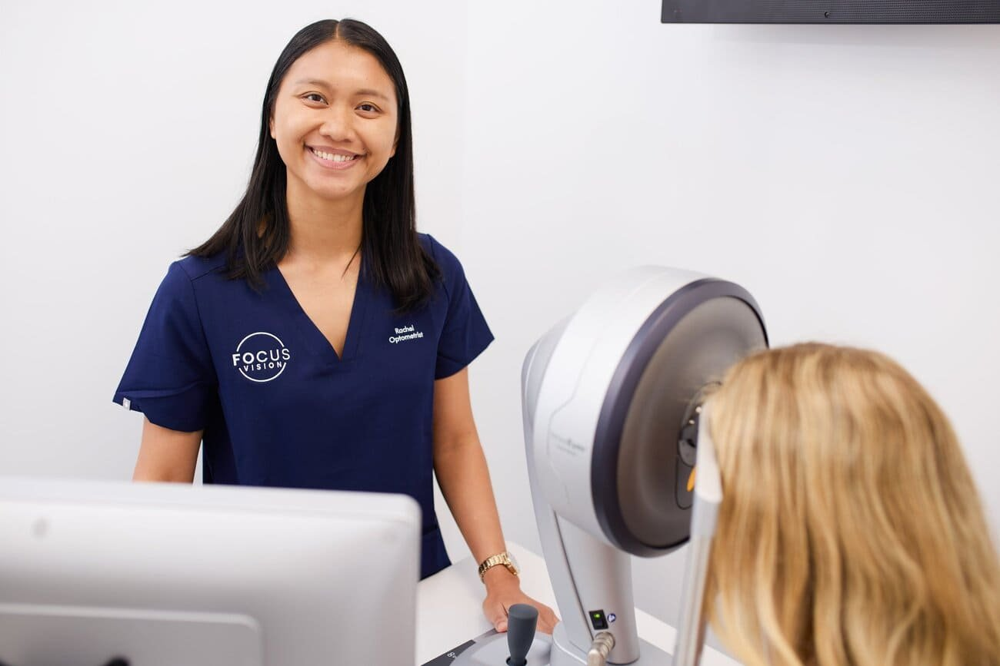
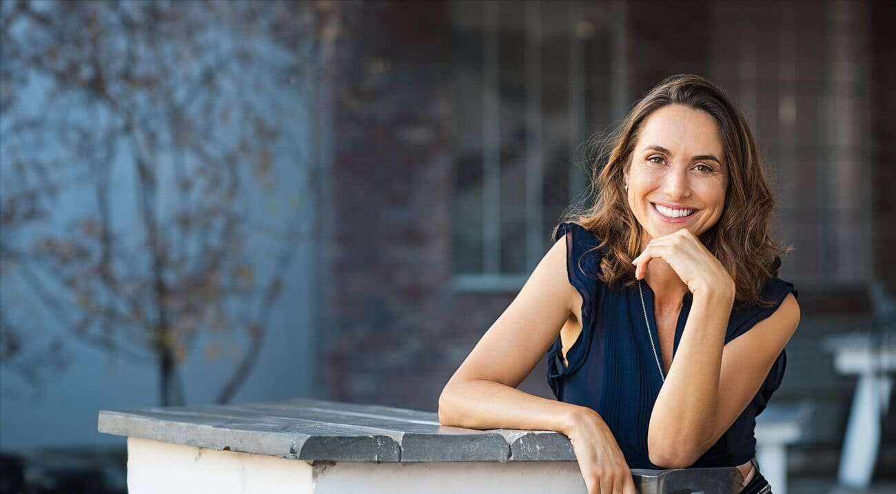

Deciding whether you’re suitable for [laser eye surgery](/vision-correction/laser-eye-surgery) is a big decision that involves various factors. Laser eye surgery has revolutionised vision correction, offering the freedom from glasses and contact lenses. It is important to note that the procedures are not a one-size-fits all solution and understanding whether you’re a good candidate for laser eye surgery requires careful consideration.

Whether you’re exploring this option for yourself or just curious about the process, this guide will provide you with the essential information. Ultimately, an examination with one of our surgeons will be necessary to fully understand whether you are suitable for laser eye surgery. Every individual’s eyes are unique, and only a comprehensive evaluation can determine the best course of action for your vision correction needs. With the insight from this guide, you will be better prepared to embark on your journey toward clearer vision.

_Our team at Focus Vision will carry out a comprehensive consultation._

## **What Does Laser Eye Surgery Resolve?**

[LASIK](/vision-correction/laser-eye-surgery) is generally most effective for individuals with mild to moderate myopia, hyperopia, or astigmatism, making it a viable option for correcting these specific vision issues. For those with higher prescriptions or other conditions that may not make them the ideal candidates for LASIK, alternative procedures like implantable contact lenses may be recommended.

## **Eligibility Criteria for Laser Eye Surgery**

Candidates for laser eye surgery must be at least 18 years old, as vision needs to stabilise before undergoing the procedure. Certain procedures such as our [implantable contact lenses](/vision-correction/implantable-contact-lens) require a minimum age of 21. This ensures that the eyes have matured sufficiently, reducing the likelihood of changes in vision after the procedure. It is essential that your prescription has remained stable for at least a year. This ensures that your vision is unlikely to change post-surgery.

## **Conditions That Might Affect Suitability for Laser Eye Surgery**

\-              Dry eyes: Pre-existing dry eye conditions might worsen after surgery.

\-              Pregnancy: Hormonal changes during pregnancy can affect vision, making surgery less predictable.

\-              Thin corneas: Thin or irregular corneas might disqualify you from LASIK, though other procedures might be possible.

\-              High prescription: Extremely high prescriptions may not be fully correctable with laser surgery.

\-              General eye health: Healthy corneas and no eye disease such as glaucoma and [cataracts](/vision-correction/cataract-surgery) are crucial.

Understanding if you’re suitable for [laser eye surgery](/vision-correction/laser-eye-surgery) involves assessing various factors, from age and vision stability to overall eye health. While LASIK is a popular choice for many, it’s not the only option available; alternatives like implantable contact lenses offer solutions for those with more complex vision needs. The key to making an informed decision lies in a thorough examination by a qualified surgeon at Focus Vision, who can recommend the most appropriate procedure based on your unique circumstances. By considering all these aspects, you can confidently move forward on your journey toward clearer vision.

## **Get In Touch**

If you're considering laser eye surgery and want to explore your options, we encourage you to take the next step. Contact us at Focus Vision, Brisbane to schedule a comprehensive consultation with one of our [experienced surgeons](/about-focus-vision).

Reach out via email at [hello@focusvision.com.au](mailto:hello@focusvision.com.au?) or give us a call on [(07) 3239 5005](tel:0732395005). We're here to help you achieve the clear vision you deserve.
