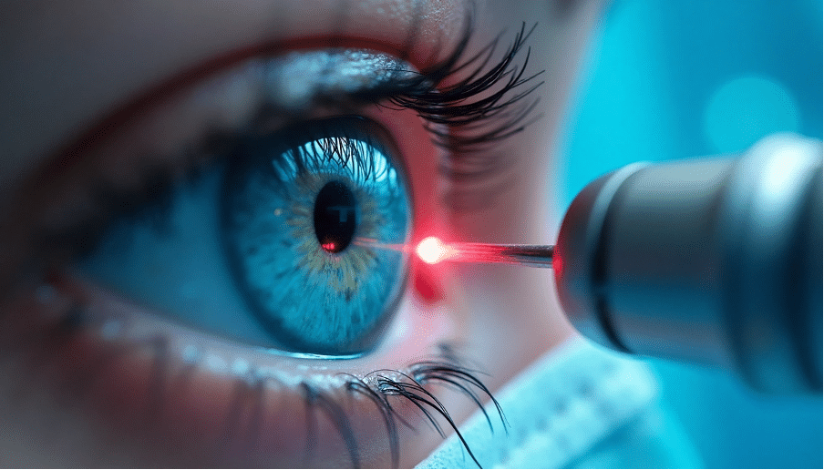
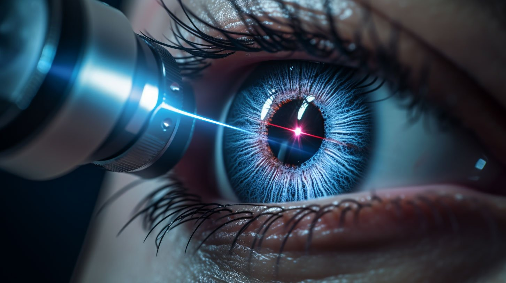
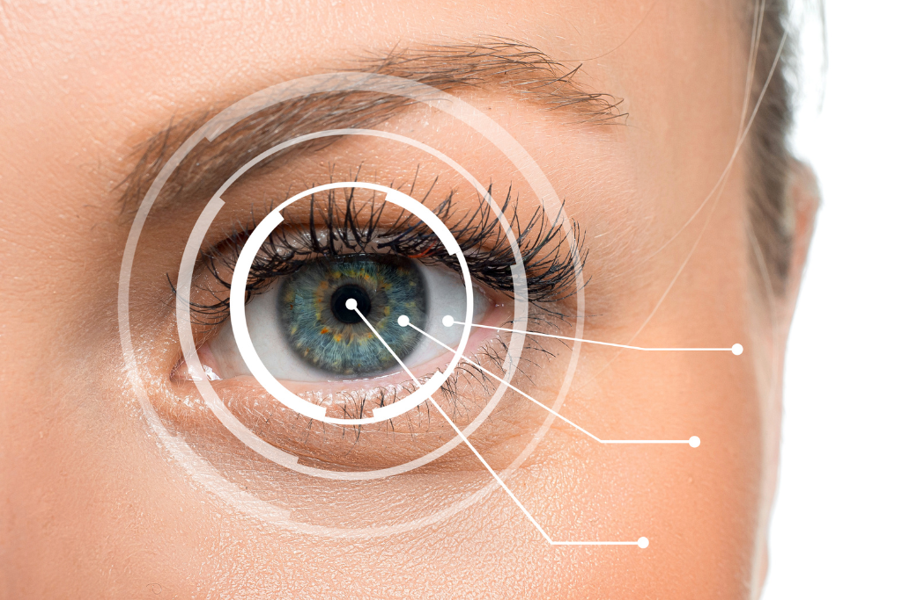

Clear eye surgery has become one of the most trusted options for people seeking freedom from glasses or contact lenses. With today’s advanced technology, patients can enjoy safer techniques, shorter recovery times, and better visual outcomes than ever before. Whether it’s laser eye surgery, refractive lens exchange, or other forms of advanced refractive correction, the goal remains the same: to achieve clear vision and long-lasting results.

This guide will walk you through what clear eye surgery involves, the techniques used, the benefits and risks, and what patients can realistically expect.

## Understanding Clear Eye Surgery

Clear eye surgery is a broad term that covers several vision correction options designed to correct vision and reduce dependence on glasses or contact lenses. The exact surgical procedure depends on your unique vision, the health of your eyes, and whether you have refractive errors such as nearsightedness, farsightedness, or astigmatism.

Unlike temporary solutions like glasses or contact lenses, refractive surgery offers long-term improvements by addressing the problem at its source. In some cases, the eye’s natural lens is reshaped or replaced, while in others, the corneal tissue called stroma is modified with a laser.

Patients often consider clear eye surgery when:

- They want to stop wearing contact lenses.
- Their vision problems interfere with work, studies, or hobbies.
- They are not satisfied with the visual quality provided by glasses.
- They want a permanent solution with significant visual improvement.

## Techniques Used in Clear Eye Surgery

Different surgical techniques are available, and the best one depends on your eye structure, medical history, and personal needs.

### LASIK Surgery (Laser-Assisted In Situ Keratomileusis):

This is the most well-known procedure, where a femtosecond laser creates a corneal flap. The surgeon then reshapes the underlying tissue to correct refractive errors. The flap is replaced, and most patients experience a fast recovery and little pain.

### Small Incision Lenticule Extraction (SMILE):

In this minimally invasive procedure, a disc-shaped piece of corneal tissue called a lenticule is removed through a small incision. The lenticule permanently alters the shape of the cornea, correcting vision with fewer risks of dry eyes compared to LASIK.

### Refractive Lens Exchange (RLE):

For patients with thin corneas or severe refractive errors, RLE is often recommended. Here, the eye’s natural lens is replaced with an artificial intraocular lens. This technique is also similar to cataract surgery and can correct multiple vision issues.

### Clear Lens Replacement (CLR):

Sometimes referred to as a lens replacement, this approach is suitable for patients who are not candidates for laser reshaping but want better lasting vision without reading glasses.

## Benefits of Clear Eye Surgery

- **Clear vision and sharp vision:** Many patients report significant visual improvement within days of surgery.
- **Fast recovery:** With advanced techniques and a minimally invasive surgical technique, most patients resume daily activities quickly.
- **Personalised care:** Clear eye surgery is tailored to your unique vision, ensuring the best possible visual outcomes.
- **Long-lasting results:** Unlike glasses or contact lenses, which need frequent updates, clear eye surgery offers stable vision and reduced dependence on corrective eyewear.
- **Better lifestyle:** Freedom to play contact sports, travel, or enjoy hobbies without the inconvenience of eyewear.

## Risks and Considerations of Clear Eye Surgery

Although considered a painless procedure for most patients, clear eye surgery is still a surgical procedure and carries some risks. An eye surgeon or eye doctor will carefully evaluate your case during an initial consultation to minimise complications.

**Potential issues include:**

- **Dry eyes:** Temporary dryness during the healing process is common.
- **Double vision or visual quality fluctuations:** Some patients may notice halos or glare at night, though these usually improve with time.
- **Increased risk of complications:** Patients with underlying eye diseases, unstable prescriptions, or previous injuries may face challenges.
- **Additional surgery:** While many patients achieve great results after one clear procedure, some may need enhancements or follow-up treatments.
- **Retinal detachment:** Rare but possible, particularly for highly myopic eyes.

Discussing these risks with your surgeon ensures you make an informed decision.

## The Patient Journey: What to Expect

Choosing clear eye surgery is not just about the surgical technique—it’s about the entire journey of care. Here’s what most patients experience:

- **Initial consultation:** The eye doctor assesses your vision issues, corneal thickness, and overall eye health. Other factors, such as age and lifestyle, are also considered.
- **Day of surgery:** The procedure usually takes less than 30 minutes. Your eyelids are kept open, and the surgeon works with advanced technology to reshape the cornea or replace the lens. Patients often describe it as a painless procedure with only a little pain or discomfort.
- **Healing process:** With the use of prescribed eye drops and proper aftercare, the recovery time is often short. Most patients see vision improvement within a few days.
- **Follow-up appointment:** Your surgeon will check your eyes, monitor visual outcomes, and ensure that the healing process is on track.

## Who Is an Ideal Candidate?

- Patients with stable vision for at least 12 months.
- People are frustrated with glasses or contact lenses.
- Those seeking vision correction options to address refractive errors like nearsightedness, farsightedness, or astigmatism.
- Individuals without active eye diseases or significant medical concerns.
- Patients with realistic expectations about visual quality and potential risks.

## Life After Clear Eye Surgery

For many patients, undergoing clear eye surgery is truly life-changing. Imagine waking up with sharp vision, no need to reach for glasses. Whether it’s being able to drive safely, enjoy contact sports, or read without aids, the impact is profound.

Patients report greater confidence, convenience, and a higher quality of life. While the need for reading glasses may still arise later in life due to natural aging of the eye, the clear procedure delivers lasting freedom from daily eyewear.

The combination of advanced technology and skilled eye surgeons means that most patients enjoy better vision than they ever had before. For those who require additional surgery, enhancements are usually straightforward, ensuring continued satisfaction.

## Final Thoughts on Clear Eye Surgery

Clear eye surgery represents one of the most effective ways to address vision problems and achieve clear vision without lifelong dependence on glasses. With procedures like LASIK eye surgery, lens replacement, and small incision lenticule extraction, patients have multiple vision correction options to choose from.

From reshaping corneal tissue called stroma with a laser reshapes approach, to replacing the eye’s natural lens with an artificial lens, the field of refractive surgery has advanced dramatically. The combination of personalised care, fast recovery, and proven visual outcomes makes this a safe and life-changing decision for the right candidate.

If you are considering this step, the best way forward is to consult an experienced eye surgeon who can evaluate your situation and recommend the most suitable approach. With careful planning and follow-up appointments, clear eye surgery offers the promise of a brighter, clearer, and more confident future.

## Personalised Care and Recovery Time: What Patients Should Know

When it comes to laser vision correction, every patient’s eyes are different. That’s why personalised care is essential throughout the treatment journey. From the initial assessment to the recovery time, an experienced surgeon will take into account your eye shape, prescription, lifestyle, and even whether you prefer to wear glasses for certain tasks. This approach ensures the chosen laser surgery or LASIK procedure aligns with your unique vision needs.

During the surgery itself, the eyelids are kept open with a gentle device so the surgeon can work with precision. In some techniques, the surgeon gently removes the top layer of tissue or reshapes the cornea with advanced lasers. The specific method chosen will determine how long healing takes, but most patients are surprised at how quickly the recovery time can be.
