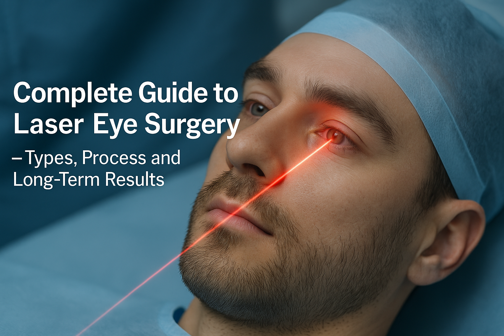

## _\-Types Process and Long-Term Results_

[Laser eye surgery](/blog/laser-eye-surgery-brisbane) is a type of refractive surgery that corrects vision problems such as nearsightedness, farsightedness, and astigmatism.

It’s an alternative to glasses or contact lenses, offering improved vision and a more convenient lifestyle.

The laser eye surgery procedure involves reshaping the cornea to correct vision by focusing light properly on the retina.

LASIK eye surgery is a popular option for vision correction, using an [excimer laser](https://en.wikipedia.org/wiki/Excimer_laser) to remove corneal tissue.

## Types of Laser Eye Surgery

LASIK surgery is a common type of laser eye surgery, suitable for most people with refractive errors.

Other [types of laser eye surgery](/blog/types-of-laser-eye-surgery) include PRK, LASEK, and CLEAR (sometimes called SMILE), each with its own benefits and risks.

Photorefractive keratectomy (PRK) is one of the common laser eye surgery procedures.Lenticule extraction (SMILE o rCLEAR) is another option available.

[Refractive lens exchange](/vision-correction/refractive-lens-exchange) (RLE) is an alternative to laser eye surgery, involving the replacement of the natural lens with an artificial one.

Laser vision correction can be used to treat a range of vision problems, including short sightedness, long sightedness, and astigmatism.

## The Laser Eye Surgery Procedure

The laser eye surgery procedure typically takes 30 minutes or less to complete.

It involves creating a thin flap in the cornea using a small blade, which is then lifted to allow the excimer laser to reshape the underlying tissue.

The corneal flap is replaced after the laser-assisted treatment, and the eye is allowed to heal naturally.

Laser eye surgery is usually painless, with most people experiencing only mild discomfort during the procedure.

## Benefits and Risks of Laser Eye Surgery

The benefits of laser eye surgery include improved vision, reduced dependence on glasses or contact lenses, and a quicker recovery time compared to other types of eye surgery.

Risks and complications of laser eye surgery include dry eyes, light sensitivity, and double vision. Patients may also experience visual disturbances such as glare and halos around bright lights, and challenges in dim light conditions.

In rare cases, laser eye surgery can result in vision loss or chronic eye discomfort. It’s essential to discuss the potential benefits and risks with an eye surgeon before undergoing laser eye surgery.

## What to Expect During the Procedure

- During the laser eye surgery procedure, you’ll be given eye drops to numb the eye and a mild sedative to help you relax.
- You’ll be asked to focus on a light during the procedure, which helps the eye surgeon to align the laser beam.
- The laser treatment itself is usually quick, taking only a few seconds to complete.
- After the procedure, you’ll be given eye drops to help with the healing process and reduce the risk of infection.

## Preparing for Laser Eye Surgery

To prepare for laser eye surgery, you’ll need to stop wearing contact lenses for a few weeks before the procedure, as they can alter the shape of your cornea.

A comprehensive eye exam is crucial before the procedure to assess your suitability and evaluate potential risk factors.

You’ll also need to avoid wearing eye makeup and avoid rubbing your eyes.

Your eye surgeon will provide you with specific instructions on how to prepare for the procedure.

It’s essential to follow these instructions carefully to ensure a smooth and successful procedure.

## Post-Surgery Care and Maintenance

After laser eye surgery, you’ll need to follow a comprehensive eye care plan to ensure proper healing and minimize the risk of complications.

This includes using eye drops to keep the eyes moist and comfortable, avoiding strenuous activities such as contact sports, and avoiding hot tubs for several weeks after surgery.

You’ll also need to attend [follow-up appointments](/contact) with your eye surgeon to monitor the healing process.

With proper care and maintenance, most people can expect to achieve improved vision and a quick recovery after laser eye surgery.

## LASIK Enhancement and Long-Term Results

- LASIK enhancement is a secondary procedure that can be used to fine-tune the results of the initial laser eye surgery.
- It’s usually necessary for people who experience a significant change in their prescription after the initial procedure.
- Long-term results of laser eye surgery are generally excellent, with most people achieving improved vision that lasts for many years. Natural changes, such as [presbyopia](/vision-correction/laser-for-reading-glasses) and [cataracts](/vision-correction/cataract-surgery), can affect the longevity of the results. Additionally, there is a risk of regression to the original prescription over time.
- However, age-related changes such as presbyopia can affect how long laser eye surgery lasts, and additional procedures may be necessary to maintain optimal vision.

## Vision Changes and Eye Health

Vision changes can occur after laser eye surgery, including dry eyes, light sensitivity, and double vision.

Other factors, such as hormonal imbalances, wound healing issues, and the technique employed during surgery, can also influence the outcome of the surgery.

These changes are usually temporary and can vary depending on the type of procedure chosen and the individual's specific circumstances. They can be managed with eye drops and other treatments.

It’s essential to maintain good eye health after laser eye surgery, including attending regular follow-up appointments and wearing protective eyewear.

By taking care of your eyes, you can help to ensure optimal vision and minimize the risk of complications.

## Refractive Lens Exchange as an Alternative

Refractive lens exchange (RLE) is a surgical procedure that offers an alternative to traditional laser eye surgery, such as LASIK, particularly for individuals who may not be ideal candidates for laser vision correction.

This procedure involves replacing the eye’s natural lens with an artificial lens implant, which can correct a variety of vision problems, including nearsightedness, farsightedness, and astigmatism.

The RLE procedure is typically performed on an outpatient basis and usually takes about 15-30 minutes per eye.

During the surgery, the eye surgeon makes a small incision in the cornea to remove the natural lens. This lens is then replaced with a customized artificial lens implant designed to address the patient’s specific vision needs.

The goal of RLE is to provide improved vision and reduce the dependence on glasses or contact lenses.

While RLE can be a highly effective solution for vision correction, it is important to be aware of the potential risks and complications.

These can include infection, inflammation, and other vision problems. As with any surgical procedure, a thorough discussion with an eye surgeon is essential to understand the benefits and risks and to determine if RLE is the right option for you.

## Eye Conditions and Laser Eye Surgery

Certain eye conditions, such as [keratoconus](/about-dr-david-gunn) and cataracts, can affect the suitability of laser eye surgery.

Identifying good candidates for laser eye surgery through a comprehensive [pre-operative evaluation](/laser-suitability-test) is crucial for achieving optimal results.

It’s essential to discuss any pre-existing eye conditions with your eye surgeon before undergoing laser eye surgery.

In some cases, laser eye surgery may not be suitable for people with certain eye conditions, and alternative treatments may be necessary.

By understanding the potential risks and limitations of laser eye surgery, you can make an informed decision about your treatment options.
