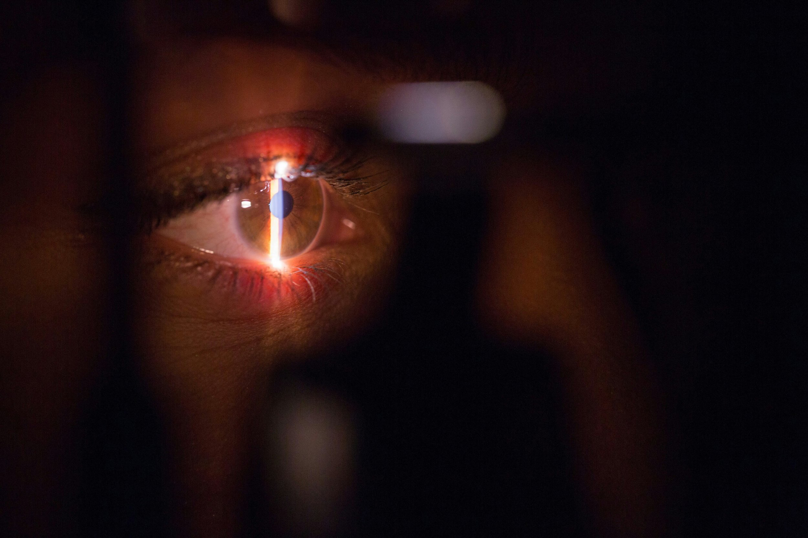

# Does BUPA Cover Laser Eye Surgery? What Australian Patients Need to Know

**Short answer:** Yes — in certain circumstances. BUPA's top-tier **Gold Ultimate Hospital cover combined with Ultimate Extras** is a notable exception in the Australian market and can provide substantial benefits towards laser eye surgery (LASIK, SMILE and PRK) once a **three-year (36-month) waiting period** has been served and the procedure is performed by a BUPA-recognised provider. Most other BUPA policies do _not_ cover elective refractive surgery. Always confirm your specific benefits with BUPA before booking.

Laser eye surgery is one of the most life-changing elective procedures available in Australia. At Focus Vision in Brisbane, it is common for new patients to ask the same sensible question on their first visit: “Does BUPA cover [laser eye surgery](https://www.focusvision.com.au/laser-eye-surgery/)?” It is a fair question, and the answer matters — substantial cover can influence when, where and how you decide to proceed.

This guide explains, in plain English, how BUPA treats laser eye surgery — including the important exception for members with Gold Ultimate Hospital and Ultimate Extras — why the rules are the way they are, what you should actually ask your fund, and how to plan the cost of surgery with confidence. It is general information only, not financial or insurance advice: BUPA changes its products from time to time, so always check your specific policy with them before making decisions.

## The BUPA Gold Ultimate + Ultimate Extras exception

BUPA stands out from most Australian private health funds because its highest-tier product combination explicitly includes benefits towards laser vision correction. If you hold, or are prepared to upgrade to, BUPA's top-tier cover, laser eye surgery can move from being a fully out-of-pocket procedure to one with meaningful health-fund support.

**The policy combination that matters:**

•      **Gold Ultimate (hospital cover)** — BUPA's highest tier of hospital cover

•      **Ultimate Extras (extras cover)** — BUPA's top-tier extras product, held alongside the hospital cover

Industry-published summaries from Australian refractive surgery providers consistently describe this combined Gold Ultimate Hospital and Ultimate Extras package as providing substantial — in some cases “full” — benefits towards laser eye surgery (including LASIK, SMILE and PRK/TransPRK), provided a number of specific conditions are met.

Key conditions to be aware of

•      **3-year (36-month) waiting period.** BUPA applies an extended waiting period to laser refractive surgery benefits. You must generally have held the eligible Gold Ultimate Hospital and Ultimate Extras cover continuously for 36 months before the surgery benefit is payable.

•      **Both hospital and extras cover are required together.** Holding only Gold Ultimate Hospital, or only Ultimate Extras, is not enough — BUPA's laser vision correction benefits draw on both products in combination.

•      **Must be performed by a BUPA-recognised provider.** Benefits are typically available when the procedure is performed by a surgeon and facility recognised by BUPA. Focus Vision's patient coordinators can help confirm provider recognition for your specific treatment plan.

•      **Annual and lifetime limits may apply.** Extras benefits in Australia almost always have per-person limits that reset or cap over time. These limits and exact benefit amounts change from policy year to policy year, and BUPA is the only authoritative source for the current figures that apply to you.

•      **Other conditions and exclusions may apply.** Pre-existing conditions, policy wording specific to when you joined BUPA, and any recent product changes can all affect the benefit payable.

**Why this matters in practice:** If you already hold BUPA Gold Ultimate Hospital with Ultimate Extras and have served the 36-month waiting period, your out-of-pocket cost for laser eye surgery may be significantly lower than the standard private fee. If you do _not_ currently hold this cover, it is worth considering the timing of an upgrade carefully: the 3-year waiting period means this is a medium-term plan rather than a short-term workaround, and you should weigh the extra premium against the surgery benefit and other features of the cover.

**Verify your exact benefits directly with BUPA.** Call BUPA with your membership number, quote the specific procedure your surgeon has recommended (for example LASIK, SMILE pro, TransPRK or PRK), and ask them to confirm the benefit payable, the waiting period remaining, and whether your chosen surgeon and facility are BUPA-recognised. Wherever possible, ask BUPA to put the answer in writing or send confirmation via the BUPA app.

## Why most other policies classify laser eye surgery as elective

In the Australian system, two separate buckets decide who pays for what.

•      **Medicare** covers medically necessary treatment. It does not cover laser eye surgery performed to correct short-sightedness (myopia), long-sightedness (hyperopia) or astigmatism in an otherwise healthy eye, because this is considered an elective refractive correction rather than treatment of disease or injury.

•      **Private health insurance hospital cover** generally mirrors the Medicare framework. Most funds pay hospital benefits for procedures that attract a Medicare Benefits Schedule (MBS) item number. Because elective LASIK, SMILE, PRK and TransPRK do not have an MBS item, most private health hospital policies exclude them.

BUPA's Gold Ultimate Hospital with Ultimate Extras combination is the notable Australian exception to this general rule. Across the rest of the market — including most BUPA products, Medibank, HCF, nib, AHM and Australian Unity — elective refractive laser eye surgery is typically not covered. The reason is structural rather than punitive: elective vision correction has been treated this way since the early days of laser refractive surgery in Australia.

## What if I don't have Gold Ultimate + Ultimate Extras?

Most BUPA members are on mid-tier or budget-tier cover rather than the top-tier Gold Ultimate Hospital and Ultimate Extras combination. If that's you, elective LASIK, SMILE and PRK are almost certainly excluded from your current policy. That does not mean your BUPA cover is irrelevant to your eye care — there are still related situations where it may contribute. Whether any of these apply to you depends on your individual policy tier and clinical need.

### Cataract surgery with refractive outcomes

[Cataract surgery](https://www.focusvision.com.au/cataract-surgery/) is a Medicare-eligible procedure. If you have cataracts and choose a premium intraocular lens (IOL) that also corrects your refractive error, the surgery itself is typically supported by Medicare and eligible private health hospital cover, while the premium lens upgrade is usually an out-of-pocket add-on. This is a very different pathway to elective LASIK, but it achieves a similar “life without glasses” outcome for suitable patients.

### Medically indicated corneal procedures

Certain procedures that use laser technology — for example, therapeutic laser treatment for scarred or diseased corneas, or cross-linking for progressive keratoconus — may be covered because they are treating a diagnosed medical condition, not simply reducing a glasses prescription.

### Optical benefits on Extras cover

Some BUPA Extras policies include optical benefits for spectacles and contact lenses. These benefits generally do not apply to laser eye surgery, but they are worth reviewing when you are comparing the lifetime cost of glasses and contacts against a one-off surgery.

**Important:** Do not assume any of the above applies to you based on this article alone. Call BUPA with your membership number, quote the specific procedure your surgeon has recommended, and ask for the answer in writing or via the BUPA app.

## How to check what your BUPA policy actually covers

A five-minute phone call can prevent a surprise on surgery day. When you contact BUPA, have two pieces of information ready: the exact procedure name recommended by your surgeon (for example, “LASIK”, “SMILE pro”, “TransPRK”, “refractive lens exchange” or “cataract surgery with premium IOL”), and any MBS item numbers your surgeon has provided on your quote.

Questions worth asking BUPA directly:

•      Is this procedure covered under my current hospital policy, and if so, at what benefit?

•      Does my policy have an exclusion for refractive or elective eye surgery?

•      Are there any waiting periods that apply to me?

•      If the procedure is partly covered, what hospital, theatre or consumables benefits apply?

•      Do I have optical benefits on Extras that I have not yet used this calendar year?

•      Can you send me the answer in writing or confirm it in my BUPA app?

At Focus Vision, our patient coordinators are used to working with BUPA and other major funds. If you send us your surgeon's quote and your fund details, we can help you understand what questions to ask and what to expect.

## Planning your out-of-pocket cost

If BUPA does not cover your procedure, the cost of laser eye surgery is paid privately. Most Australians who choose surgery do so because, amortised over the 20 to 40 years of vision they gain, the cost per year is lower than a lifetime of glasses, contact lenses, solutions and replacement frames. There are also a few legitimate ways to spread or reduce the financial impact.

### Interest-free payment plans

Many refractive clinics, including Focus Vision, offer payment plan options through approved providers, allowing the cost of surgery to be spread over 12 to 24 months rather than paid as a single lump sum.

### Early release of superannuation

The Australian Taxation Office allows early release of superannuation in limited circumstances, including certain medical treatments. Eligibility is not automatic and depends on your individual medical circumstances and the ATO's criteria. This is a pathway to discuss with an accountant or financial adviser, not something to rely on upfront.

### Private health insurance timing

If you have identified that your policy might contribute to a related procedure (such as cataract surgery), check your waiting periods, annual limits and the calendar-year reset so you can time your treatment to maximise any benefit.

### Tax considerations

The net medical expenses tax offset was phased out in Australia and is no longer available for most taxpayers. You should not plan around a tax rebate for elective laser eye surgery unless your accountant has specifically advised you of current eligibility in your situation.

## Does the type of laser eye surgery change the insurance answer?

Patients often ask whether SMILE pro, LASIK, TransPRK or ICL implantation are treated differently by BUPA. On Gold Ultimate Hospital with Ultimate Extras, benefits for laser vision correction generally apply across the major refractive techniques — the policy treats them as part of the same “laser vision correction” benefit rather than distinguishing between them. On all other BUPA tiers, they are equally treated as elective and not covered.

The cost and clinical suitability of each technique varies considerably between patients. This is why, when discussing cost, the most useful conversation is not simply “which procedure will BUPA pay for?” but “which procedure is the right one for my eyes, and what is the true all-in cost after any BUPA benefit?”. A proper refractive suitability consultation, with high-resolution corneal imaging, is the only reliable way to answer that.

[Book a consultation at Focus Vision Brisbane](https://www.focusvision.com.au/contact/)

If you are considering laser eye surgery and want a clear answer on both suitability _and_ cost — including a realistic picture of what your BUPA policy will and will not contribute — book a no-obligation suitability assessment with the Focus Vision team in Woolloongabba.

**Phone:** (07) 3239 5000   **Website:** focusvision.com.au   **Location:** Level 1, 87 Ipswich Road, Woolloongabba QLD 4102

 

_Medical disclaimer: This article is general information only and is not a substitute for individual medical, financial or insurance advice. Private health insurance products, Medicare items, and tax and superannuation rules change from time to time. Always confirm cover with BUPA directly using your membership number, and speak with your surgeon about whether a given procedure is suitable for your eyes._

_Reviewed by Dr Brendan Cronin, MBBS (Hons), FRANZCO, FWCRS — Corneal and Refractive Surgeon, Focus Vision Brisbane. Last reviewed: April 2026._

##
