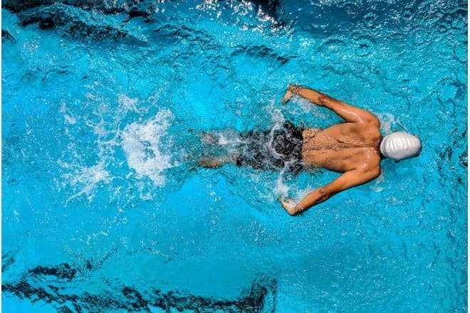

Embarking on an active lifestyle after undergoing [laser eye surgery](/vision-correction/laser-eye-surgery) is an exciting journey filled with renewed freedom and enhanced visual acuity. Whether you're a dedicated athlete, an enthusiastic gym-goer, or simply someone who loves the outdoors, the post-surgery experience opens a world of possibilities. At Focus Vision, our mission is to empower you to fully embrace your active lifestyle with confidence and optimal vision, ensuring that every moment is lived to the fullest.

## **Contact Sports**

[Laser eye surgery](/vision-correction/laser-eye-surgery) enhances safety, particularly when engaging in contact sports. In a fast-paced and high-contact environment, the presence of glasses can create additional hazards for the athlete, including shattered lenses or frames that could cause further injury. By improving visual acuity and clarity, laser eye surgery allows athletes to compete with enhanced vision and confidence, without the hindrance or safety concerns posed by traditional eyewear.

## **Swimming And Water Activities**

For individuals who [wear glasses](/vision-correction/laser-for-reading-glasses) or contact lenses, engaging in water activities can present a myriad of challenges and inconveniences. The risk of glasses slipping off or contact lenses getting splashed with water can disrupt the enjoyment of swimming, surfing, or other water-based sports. Exposing contact lenses to water can pose serious risks, as water sources such as pools, lakes, and oceans may contain harmful micro-organisms that can lead to eye infections and irritation.

Laser eye surgery can be truly life-changing for individuals who enjoy water sports by providing the freedom to fully immerse themselves without the hassle of glasses or contact lenses. Whether you prefer to leisurely enjoy the pool on holiday or actively engage in swimming, laser eye surgery at Focus Vision can provide a tailored solution to meet your specific needs and lifestyle.

## **Skiing and Snowboarding**

Engaging in winter sports like skiing and snowboarding while wearing glasses can be cumbersome and challenging, as goggles are often necessary to protect the eyes from wind, snow, and UV rays. However, the combination of glasses and goggles can frequently lead to fogging or steaming up, obstructing vision and potentially impeding performance on the slopes. In addition, glasses can be easily displaced or damaged during falls or collisions, posing safety risks to the wearer.

By eliminating potential hindrances, laser eye surgery provides skiers and snowboarders with a clear and unobstructed view of their surroundings, enhancing their overall experience on the slopes.

## **Visual Freedom**

Laser eye surgery offers those that wear glasses the freedom of clear and unobstructed vision, providing a convenient and liberating solution that enhances quality of life. At [Focus Vision](/about-focus-vision), we are enabling individuals to fully engage in their activities without the limitations of contact lenses or glasses. Whether you are seeking the convenience of [LASIK](https://en.wikipedia.org/wiki/LASIK) or the versatility of [ICL](/vision-correction/implantable-contact-lens), our team of experts is dedicated to helping you find the best match for your lifestyle. With Focus Vision, you can trust that we will guide you towards the most suitable and effective solution for achieving the visual freedom you desire.

## **Get in Touch for Laser Eye Surgery Today**

If you are considering [laser eye surgery](/vision-correction/laser-eye-surgery), reach out to us at Focus Vision and arrange a thorough consultation with one of our skilled surgeons. Contact us at [hello@focusvision.com.au](mailto:hello@focusvision.com.au?) or call us on [(07) 3239 5005](tel:0732395005).
