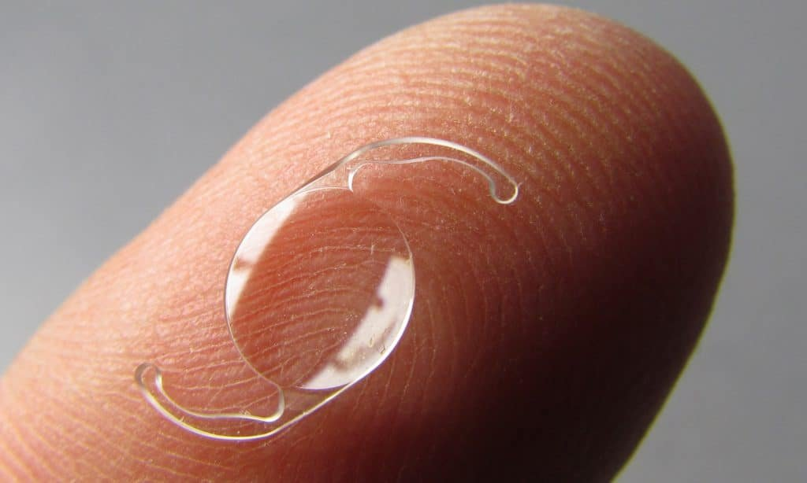
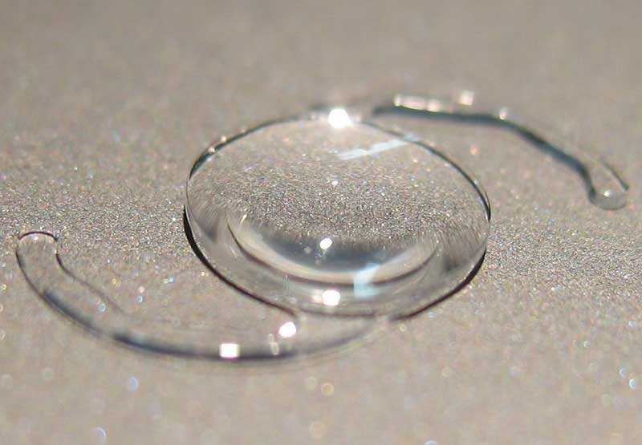

**Experience Glasses-Free Vision with the Revolutionary Rayner Galaxy IOL at Focus Vision**

Are you seeking a premium solution for vision correction that allows you to enjoy life without the need for glasses? The new **Rayner Galaxy IOL**, featuring groundbreaking [spiral optics technology](https://en.wikipedia.org/wiki/Optical_vortex), is redefining the possibilities for patients undergoing **premium cataract surgeryrefractive lens exchange**. Available now at **Focus Vision in Brisbane**, this advanced intraocular lens offers exceptional visual clarity and independence.

Rayner is a pioneering manufacturer of intraocular lenses, founded in England, UK, and is recognized as the world's first manufacturer of IOLs. The company has a longstanding history in the field of ophthalmology, with its global HQ and Ridley Innovation Centre located in Worthing, UK, featuring state-of-the-art manufacturing and research facilities. Sir Harold Ridley collaborated with Rayner to develop and implant the first intraocular lens, a groundbreaking achievement in ophthalmology. Rayner's mission is to advance ophthalmology and improve visual outcomes for patients worldwide.

### **What is the Rayner Galaxy IOL with Spiral Optics?**

The **Rayner Galaxy IOL** is a new generation intraocular lens (IOL) designed to provide patients with seamless, high-quality vision at all distances—near, intermediate, and far. It is the world’s first intraocular lens (IOL) designed with artificial intelligence. Unlike traditional multifocal or trifocal lenses, the Rayner Galaxy utilizes spiral optics technology, which distributes light more evenly across the retina.

The Rayner Galaxy is a spiral IOL developed using artificial intelligence to optimize its optical performance, resulting in improved visual outcomes and reduced visual artifacts. This innovative design enhances visual sharpness and reduces issues such as glare and halos, particularly in low-light conditions.

For patients aged **40-70 years old**, who are seeking freedom from glasses, this lens represents a significant leap forward in optical technology delivering excellent range of vision with a potential reduction in night time haloes and glare.

### **How Does Spiral Optics Technology Work?**

The **spiral optics design** of the Rayner Galaxy IOL works by creating a smooth transition of light across different focal points, improving vision quality at multiple distances. This means you can read a book, use your smartphone, or drive at night with greater ease and clarity. It achieves this **without diffractive rings** to maximise light transmission to the retina.

The development of the spiral optics technology involved extensive research and innovation, resulting in a lens that addresses both patient and clinician needs.

Spiral optics are especially beneficial for patients who want the range of a traditional multifocal lens but are keen to avoid some of the challenges with older lens designs, such as difficulty adapting or compromised night vision. The Rayner Galaxy lens is available in a full range of powers to meet diverse patient needs. Clinicians have reported best visual outcomes with this lens, and it consistently meets or exceeds patient expectations, offering a more natural and glasses-free visual experience.

### **Benefits of the Rayner Galaxy IOL**

Patients who choose the Rayner Galaxy IOL for [cataract surgery](https://www.focusvision.com.au/cataract-surgery) or **refractive lens exchange** can expect a host of benefits:

- **Glasses-Free Vision**: Enjoy independence from reading glasses, bifocals, or contact lenses.
- **Clear Vision at a range of Distances**: The lens delivers exceptional near, intermediate, and distance vision.
- **Less Night Vision Issues**: The advanced spiral optics reduce glare and halos, enhancing safety and comfort for nighttime activities.
- **Seamless Adaptation**: A smoother transition between focal points makes adapting to the lens effortless.
- **Enhanced Quality of Life**: Regain confidence and convenience with vision that supports your active lifestyle.
- **Result of Using Rayner Galaxy IOL**: Achieved improved visual clarity and a significant reduction in side effects such as halos and glare as a direct result of the lens's innovative design.

Visual outcomes have been reported as excellent by both patients and clinicians, with many sharing positive experiences and satisfaction following the procedure.

In clinical practice, the Rayner Galaxy IOL has achieved outstanding outcomes, consistently delivering high patient satisfaction and superior visual results.

### **Who is the Rayner Galaxy IOL For?**

This premium intraocular lens is ideal for:

- Patients with **cataracts** affecting their **eyes** who want the best possible vision outcomes.
- Individuals considering **refractive lens exchange** as an alternative to laser eye surgery.
- Adults aged over 45 who lead active lives and want to reduce or eliminate their dependency on glasses.

The **procedure** for implanting the Rayner Galaxy IOL is straightforward and safe for most patients, typically performed as a day procedure with a quick recovery time.

It is important to **discuss** your options with your clinician to determine if the Rayner Galaxy IOL is the right choice for your **eyes**.

### **Why Choose Focus Vision in Brisbane?**

At [Focus Vision](https://www.focusvision.com.au/about-focus-vision), we pride ourselves on offering the latest advancements in ophthalmic technology. Our experienced team, led by highly skilled surgeons, is dedicated to providing exceptional outcomes and personalized care. Focus Vision and its surgeons have been awarded for their significant contributions to ophthalmology and innovative projects, reflecting our commitment to excellence.

We collaborate closely with the university in research and training related to intraocular lenses, supporting the development of specialists and advancing eye care. The introduction of the Rayner Galaxy IOL is part of an ongoing project to advance patient care and innovation in ophthalmology. We continue to develop and improve ophthalmic solutions through strong partnerships and continuous research initiatives.

When you choose Focus Vision for your premium cataract surgery or refractive lens exchange, you benefit from:

- **Expertise in Advanced IOL Technology**: We specialize in premium lenses like the Rayner Galaxy IOL, ensuring optimal outcomes for our patients.
- **State-of-the-Art Facilities**: Our clinic in Brisbane is equipped with the latest technology to deliver safe and effective procedures.
- **Personalized Care**: We understand that every patient is unique. We tailor your treatment to suit your lifestyle and visual goals.

For more information about the Rayner Galaxy IOL, please contact your local Rayner representative, who can provide detailed information and support.

As key opinion leaders in the IOL space, our specialists had the honour to be the [first surgeons in Australia](https://www.linkedin.com/posts/drdavidgunn_galaxy-activity-7252658271574994944-CRre?utm_source=share&utm_medium=member_desktop) to implant this revolutionary new lens in 2024.

### **What to Expect During Your Journey**

The process of undergoing cataract surgery or refractive lens exchange with the Rayner Galaxy IOL is straightforward:

1. **Comprehensive Consultation**: Your journey begins with a detailed eye examination and consultation at Focus Vision, the place where patients can access this advanced technology. All required preoperative assessments are performed to ensure you are a suitable candidate and to plan your procedure.
2. **Precision Surgery**: Using cutting-edge surgical techniques, we implant the Rayner Galaxy IOL, produced by a leading manufacturer of intraocular lenses. Completing each step of the procedure is essential for optimal results and patient safety.
3. **Quick Recovery**: Most patients experience significant vision improvement within days of surgery, with minimal downtime. After surgery, it is important to review your visual outcomes with your clinician to ensure the best possible results.

_Achieve visual freedom with laser eye surgery at Focus Vision, Brisbane._

### **Book Your Consultation Today**

If you’re ready to transform your vision and embrace the benefits of the **Rayner Galaxy IOL**, contact **Focus Vision** today. Our team of experts is here to guide you through every step of your journey toward clear, glasses-free vision.

The Rayner Galaxy IOL is manufactured in West Sussex, UK, at Rayner's state-of-the-art facility, where ongoing development and manufacture of innovative ophthalmic products take place. These products are implanted in patients worldwide, and the outcomes resulted from their use have been overwhelmingly positive.

**Call us now, visit our website, or book a consultation online** to learn more about how this advanced lens technology can help you see the world more clearly. For further information about the Rayner Galaxy IOL, please email Focus Vision.

Focus Vision is proud to offer **premium intraocular lenses in Brisbane**, helping patients like you achieve freedom and clarity through cutting-edge solutions. Let us help you unlock the potential of the Rayner Galaxy IOL with spiral optics—because you deserve the best for your vision.

Achieve visual freedom with laser eye surgery at Focus Vision, Brisbane

_Dr. Gunn and Dr. Cronin at Focus Vision, Brisbane_

**Keywords**: Rayner Galaxy IOL, Spiral optics technology, Premium intraocular lenses Brisbane, Glasses-free vision after cataract surgery, Refractive lens exchange Brisbane, Advanced lens technology for cataract surgery, Premium cataract surgery Brisbane, Best intraocular lenses for vision correction

### Outcomes we measure, not just promise

A premium lens is only as good as the refractive result it delivers. Dr Brendan Cronin and Dr David Gunn audit their refractive outcomes with the free [Refractive Outcomes Analyzer](/free-refractive-outcomes-analyzer) they built and shared with the global ophthalmology community — benchmarking every result against published international standards.
