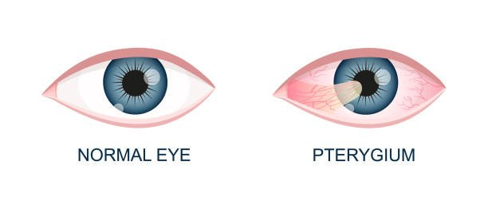
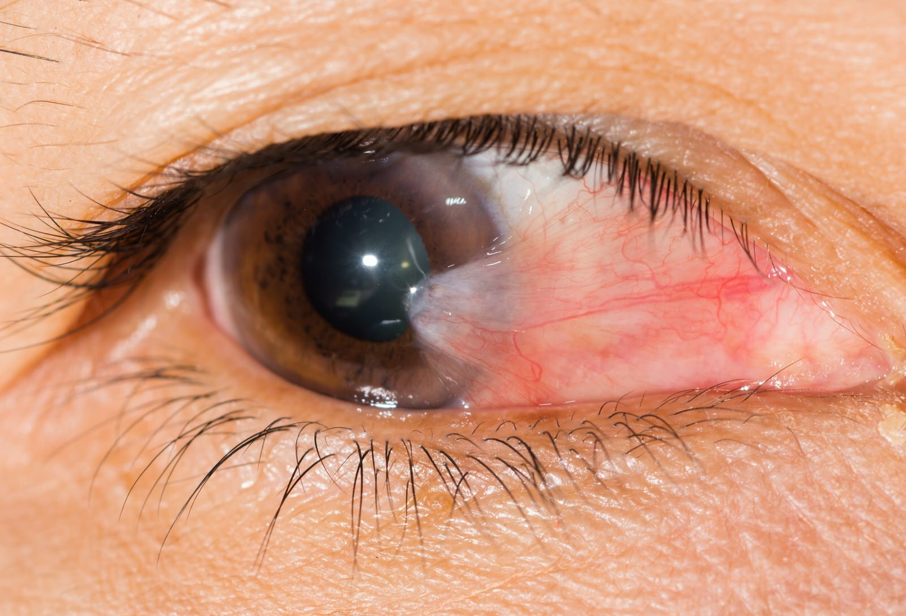
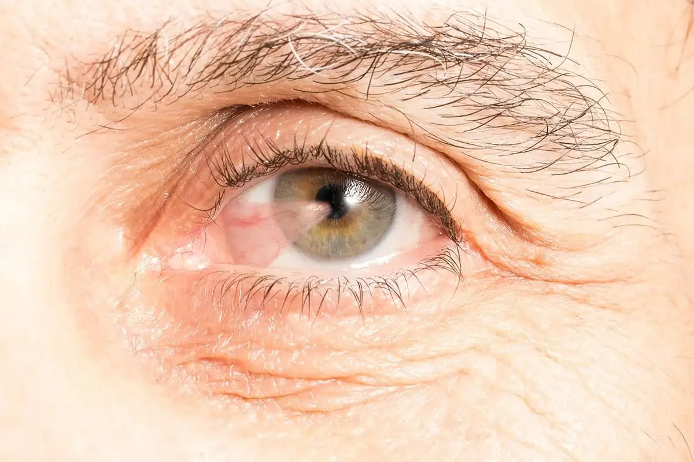
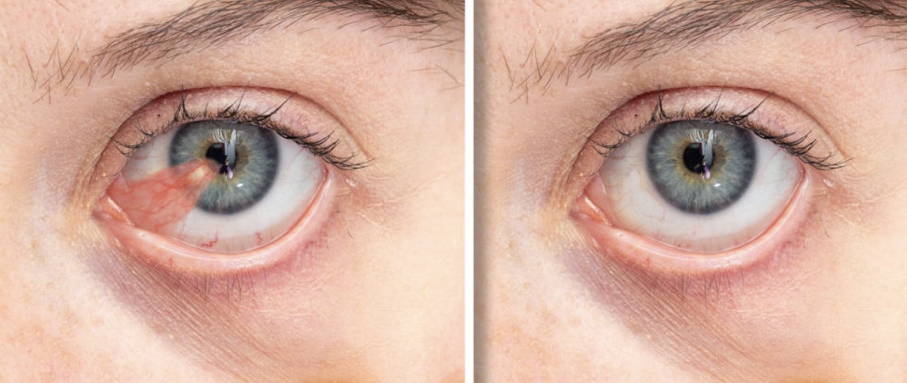
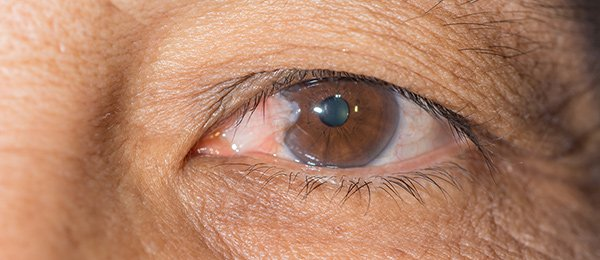

If you’ve recently had pterygium surgery or are preparing for the procedure, you’re probably wondering when you can safely get back behind the wheel. This common concern affects many patients who rely on driving for work, family responsibilities, and daily activities. Understanding the recovery timeline and safety considerations can help you plan accordingly and ensure a smooth return to normal life. Before booking your procedure, you will be provided with an advance estimate of surgery costs. These costs may be covered or partially covered by Medicare or private health insurance, depending on the type of cover you have.

Pterygium surgery involves the surgical removal of a wing-shaped growth of tissue that extends from the conjunctiva onto the cornea, often called surfer’s eye due to its association with excessive sun exposure. Pterygium is particularly common in Australia due to high UV exposure, especially among outdoor enthusiasts. It is often referred to as 'surfer's eye' because of its prevalence among surfers and people exposed to sunlight. While the procedure is generally straightforward, the healing process affects your vision temporarily, making it crucial to understand when driving becomes safe again.

Pterygium surgery is usually performed in a hospital or day surgery center. Patients are typically awake during the procedure, which is performed under local anaesthetic or sedation anaesthesia to ensure comfort. Most patients can expect to return to driving within 3-7 days after pterygium surgery, though individual recovery times vary based on several factors including healing rate, dominant eye surgery, and resolution of temporary symptoms like double vision.

## When Can You Return to Driving After Pterygium Removal or Surgery

The timeline for returning to driving after pterygium removal depends primarily on when your vision clears sufficiently and discomfort decreases to safe levels. Most patients find that driving becomes possible again between 3-7 days post-surgery, once the initial healing phase stabilizes.

During the first week following your operation, several changes occur that gradually improve your ability to drive safely:

- **Day 1**: Vision is typically functional but may remain blurry, and an eye pad usually covers the treated eye
- **Days 2-3**: The eye pad is removed during your first follow-up appointment, and vision begins clearing
- **Days 4-7**: Double vision usually resolves, making driving safer and more comfortable for most patients

It’s important to note that while vision may be functional the day after surgery for basic activities like reading or watching television, driving requires more complex visual skills including depth perception, peripheral vision, and the ability to react quickly to changing traffic conditions.

The key indicator for safe driving is your ability to comfortably read road signs and judge distances accurately. If you can perform these tasks without strain or discomfort, and your surgeon has cleared you for normal activities, driving may be appropriate.

## **When Can You Drive After Surgery?**

Several factors affect when it’s safe to drive after your procedure. These include:

- **Double Vision:** Common due to swelling, usually resolves in 1–2 weeks but may last longer with certain eye movements.
- **Eye Discomfort:** Pain, itching, or irritation can affect focus and reaction time.
- **Dominant Eye Surgery:** Recovery may take longer if surgery was on your dominant eye.
- **Healing & Medications:** Vision may blur from eye drops or sedatives, delaying readiness.
- **Binocular Vision:** Tearing or difficulty keeping both eyes open can impact depth perception.

Always follow your surgeon’s guidance for safe recovery and driving readiness.

## Vision Changes That May Impact Driving

Understanding the specific vision changes that occur after pterygium surgery helps you recognize when it’s safe to drive again.

It is normal to notice some blood or minor bleeding in the eye after surgery. This is a typical part of the healing process and may temporarily affect your vision.

### Temporary Double Vision

Double vision is perhaps the most concerning symptom for driving safety. This occurs due to swelling of the extraocular muscles from surgical manipulation and typically lasts 1-2 weeks. The condition is more noticeable when looking away from the surgery site and completely resolves as healing progresses.

### Eye Redness and Surface Irritation

Residual redness and gritty sensation commonly persist for several weeks after the procedure. While these symptoms usually aren’t severe enough to prevent all driving activity, they can serve as distractions and may worsen with environmental triggers like wind or sunlight exposure while driving.

### Refractive Changes

Surgical correction of the pterygium restores normal corneal curvature, which may result in changes to your glasses or contact lenses prescription. Some patients notice improved vision once healing is complete, while others may need updated corrective lenses to achieve optimal clarity.

### Light Sensitivity

Many patients experience photophobia for several days following surgery. This sensitivity can make driving during daylight hours uncomfortable and potentially unsafe. Wearing sunglasses typically helps manage this symptom, but severe light sensitivity should delay driving until it improves.

### Medication like Eye Drops-Induced Vision Changes

The eye drops prescribed during recovery, including antibiotics and anti-inflammatory medications, can temporarily blur vision. This effect is most noticeable immediately after application and typically clears within minutes to hours, but timing your driving around medication schedules may be necessary.

[BOOK FREE VISIT](/contact)

## Safety Considerations Before Driving

Before getting behind the wheel after pterygium surgery, perform these essential safety checks:

If you experience ongoing symptoms that interfere with safe driving, consult your ophthalmologist for appropriate treatment options.

**Vision Clarity Assessment**

Test your ability to read license plates and street signs at normal distances. If you wear glasses or contact lenses, ensure your prescription is adequate for clear distance vision. Any difficulty with these tasks indicates you should wait longer before driving.

**Peripheral Vision Check**

Assess whether swelling or lingering effects from the eye pad have affected your peripheral vision. Complete side vision is crucial for detecting approaching vehicles, pedestrians, and other road hazards.

**Reaction Time Evaluation**

Make sure you can react quickly to traffic situations without experiencing eye discomfort or vision problems. Pain or irritation that affects your concentration poses a significant safety risk.

**Light Sensitivity Management**

If you’re still experiencing significant light sensitivity, avoid driving during peak sun hours or ensure you have appropriate sunglasses available. Sudden exposure to bright light shouldn’t cause painful squinting or temporary vision loss.

**Medication Timing**

Plan your driving around your eye drop schedule to avoid periods when vision may be temporarily blurred. If you’re taking any pain medications that cause drowsiness, avoid driving until these effects wear off.

## Post-Surgery Recovery Timeline

Understanding the typical recovery progression helps set realistic expectations for when driving becomes possible. The specific surgical technique used, such as the P.E.R.F.E.C.T. technique, can influence recovery time and the risk of recurrence. During the procedure, a conjunctival graft is often used to cover the surgical site, and sutures or special techniques may be used to secure the graft and promote healing.

It is important to keep the eye clean during recovery to prevent infection and support proper healing.

On Day 1: Initial Recovery, after surgery, you will return home and should have someone accompany you for safety.

As you recover, following your surgeon’s instructions and monitoring your healing progress will help ensure a smooth return to normal activities.

### Day 1: Initial Recovery

- Vision is functional but often blurry due to the eye pad and initial healing
- Moderate pain may require analgesics for comfort
- Walking indoors is possible, but driving should be completely avoided
- Focus on rest and following post-operative instructions

### Days 2-3: Early Healing Phase

- The eye pad is typically removed at your first follow-up appointment
- Some double vision and substantial discomfort are expected
- Vision may still be blurred, and light sensitivity is common
- Most patients aren’t ready for driving during this period

### Days 4-7: Vision Stabilization

- Most patients notice significant improvement in vision and comfort
- Double vision typically resolves, paving the way for safe driving
- Many patients can return to basic activities, including driving, if other safety criteria are met
- This is when most people receive clearance from their surgeon

### Weeks 2-4: Continued Improvement

- Eye redness and irritation continue to decrease
- Steroid drops and antibiotics are still in use but less frequently
- Vision generally stabilizes and becomes suitable for all normal activities
- Contact sports and swimming remain contraindicated

### 1-3 Months: Complete Healing

- Complete tissue healing is generally achieved within about a month to three months
- Final vision assessment can be performed
- New corrective lenses may be prescribed if necessary
- All activity restrictions are typically lifted

[BOOK FREE VISIT](/contact)

## When to Delay Driving After Surgery

Avoid driving if you experience:

- **Persistent Double Vision:** Especially if it affects depth perception or reading.
- **Ongoing Pain or Discomfort:** Burning, irritation, or worsening symptoms can impair focus.
- **Sedating Medications:** Strong pain meds may slow reaction times wait until you're off them.
- **Complications:** Signs of infection or sudden vision changes require medical review first.
- **Frequent Eye Drops:** If drops blur your vision, wait until usage decreases.

Always prioritize safety and follow your doctor’s advice.

## Tips for Safe Driving During Recovery

When you’re ready to resume driving, follow these strategies for a safe return:

- Wear sunglasses: Protecting your eyes from being exposed to sunlight, wind, and dust is crucial during recovery. Sunglasses help shield your eyes from these elements, reducing irritation and supporting healing.

### Start with Familiar Routes

Begin with short trips on familiar roads during daylight hours. This reduces the cognitive load of navigation while you adjust to any lingering vision changes.

### Protect Your Healing Eye

Wear sunglasses to reduce light sensitivity and protect the healing tissue from wind and debris. UV protection is particularly important given that excessive sun exposure likely contributed to your original pterygium development.

### Keep Artificial Tears Available

Maintain a supply of lubricating drops in your car to manage dryness during longer trips. Take regular breaks to rest your eyes and apply drops as needed.

### Plan for Rest Stops

On longer drives, plan frequent stops to check for re-emergence of discomfort or vision changes. Eye strain can develop more quickly during the healing period.

### Consider a Companion

Have someone accompany you on your first few driving attempts to provide an objective assessment of your driving safety and confidence in traffic situations.

### Monitor for Symptoms

Stop driving immediately if you experience sudden vision changes, severe pain, or any symptoms that weren’t present when you started your trip.

## Follow-Up Care and Driving Clearance

Your ophthalmologist will provide individualized assessments of your visual acuity, binocular function, and ocular surface health during scheduled follow-up appointments. These visits, typically occurring within a few days of surgery and at regular intervals throughout healing, are crucial for identifying complications and managing ongoing restrictions. Follow-up visits are essential for monitoring your healing progress, and your optometrist may also be involved in your postoperative care and assessments.

Most surgeons prefer to formally clear patients for driving rather than leaving this decision entirely to patient judgment. During your appointments, discuss your specific driving needs and any concerns about vision or comfort. If you have questions between visits, don’t hesitate to contact your surgeon’s office.

The majority of postoperative complications are identified and managed during these follow-up visits. Your surgeon will monitor for signs of pterygium recurrence, infection, or other issues that could affect your vision and safety.

## Recovery Varies for Every Patient

Recovery times vary most patients can drive again within 7 days, but healing depends on whether the dominant eye was surgically removed, your individual healing rate, and how you respond to medication. Mild sedatives may occasionally delay readiness to drive by affecting alertness.

Always follow your surgeon’s lead and avoid driving until your vision is clear, you're comfortable, and can react quickly. A short delay is safer than risking an accident. With proper care, vision often improves beyond pre-surgery levels in the few weeks following recovery.

[BOOK FREE VISIT](/contact)
