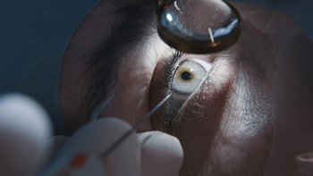
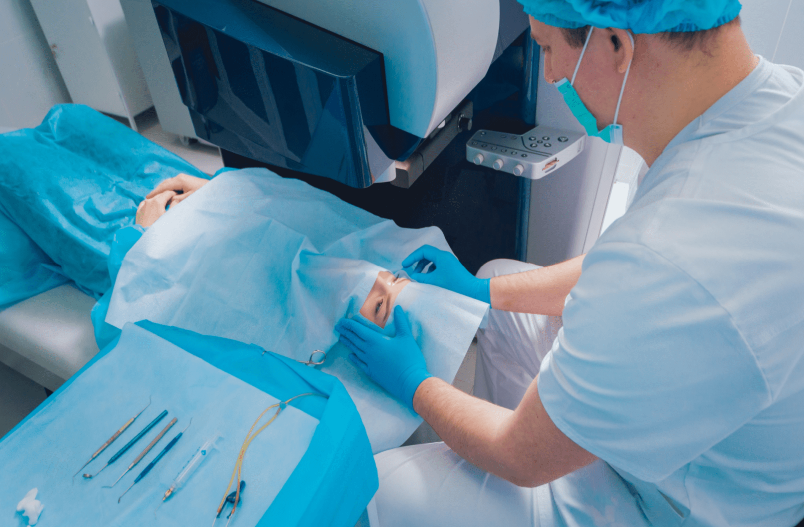

Cataract eye surgery typically takes about 15 to 30 minutes per eye, depending on individual circumstances. However, patients often wonder, “how long does cataract eye surgery take?” They should plan to spend a total of two to three hours at the surgery center to account for pre-operative preparations and post-operative recovery. This guide will walk you through the details of what to expect before, during, and after the procedure

## **Key Takeaways**

- Cataract surgery typically lasts 15 to 30 minutes per eye, with total time at the surgery center around two to three hours for preparations and recovery.
- Proper pre-operative preparation, including a comprehensive eye exam and adherence to specific instructions, is essential for a successful surgery.
- While cataract surgery is generally safe, potential risks such as infection and retinal detachment exist, necessitating thorough pre-surgery evaluations and patient education on risks.

## **The Duration of Cataract Surgery**

### **Time Spent in Surgery**

The actual time spent in the operating room for cataract surgery is quite minimal. Typically, the surgery takes about 15 to 30 minutes per eye. This timeframe includes making the incision, removing the cloudy lens, and implanting the new intraocular lens (IOL).

Despite the precision required, the procedure is usually painless and performed as an outpatient procedure, allowing patients to go home the same day.

### **Total Time at the Surgery Center**

While the surgery itself is brief, patients can expect to spend around two to three hours at the surgery center on the day of their cataract operation. This time encompasses the preparatory steps, the surgery, and the initial recovery period.

Patients will receive pre-operative instructions and post-operative care information to ensure a smooth process from start to finish.

## **Pre-Surgery Preparation**

Proper preparation is crucial for a successful cataract surgery. Patients typically undergo a comprehensive eye exam to measure the size and shape of their eyes and determine the correct intraocular lens (IOL) to be used during surgery. This exam includes various tests and scans, such as the IOL Master and corneal topography, to ensure precise measurements and optimal surgical outcomes.

### **Comprehensive Eye Exam**

The comprehensive eye exam is a critical step in preparing for cataract surgery. It involves various tests to measure the eye’s size and shape, ensuring the correct intraocular lens (IOL) is selected. An eye surgeon uses advanced devices like the IOL Master and corneal topography to provide precise measurements, while an OCT scan of the macula helps detect any potential issues that could affect vision post-surgery.

### **Pre-Operative Instructions**

Patients are typically instructed to:

- Avoid food and drink for a few hours before the procedure to reduce risks during surgery.
- Use moisturizing eye drops as recommended by surgeons.
- Follow guidelines on medication adjustments provided by surgeons.

Following these pre-operative instructions is crucial for ensuring a successful cataract surgery. Doctors often recommend cataract surgery to improve vision.

## **Administering Anaesthesia**

Cataract surgery is performed under local anaesthesia to ensure a painless experience for patients. This type of anesthesia effectively numbs the eye area while allowing patients to remain awake and aware during the procedure. The use of local anaesthesia minimizes discomfort and reduces the risk of complications, making it a preferred choice for this commonly performed surgical procedure.

### **Local Anaesthesia**

Local anaesthetic drops are applied to numb the eye surface, providing localized pain relief during cataract surgery. This topical anaesthesia ensures that patients experience minimal discomfort while the surgeon performs the procedure through a tiny incision.

The use of local anaesthetic drops is a key factor in making cataract surgery a painless surgery for the vast majority of patients.

### **Sedation Options**

Sedation options are available to further enhance patient comfort during cataract surgery. Patients may receive a mild sedative to help them relax and reduce any anxiety they may feel about the procedure. This additional comfort measure ensures that the surgery is as stress-free as possible, contributing to a positive overall experience.

## **The Surgical Procedure**

Once the cloudy lens is removed, a clear artificial lens, known as an intraocular lens (IOL), is implanted as an artificial lens implant to restore vision. The IOL is designed to mimic the natural lens’s focusing ability, providing patients with improved vision post-surgery.

### **Making the Incision**

The first step in cataract surgery is making a small corneal incision, which allows the surgeon to access the clouded natural lens. This tiny incision is a hallmark of modern cataract surgery, enabling a minimally invasive approach that promotes quicker healing and fewer complications.

The natural pressure inside the eye helps keep the incision closed after the procedure.

### **Removing the Cloudy Lens**

Phacoemulsification is the technique commonly used to remove the cloudy lens during cataract surgery. This method utilizes ultrasound waves to break up the cataractous lens into tiny fragments, which are then gently suctioned out through the small incision.

This minimally invasive approach reduces recovery time and enhances visual outcomes for patients.

### **Implanting the Artificial Lens**

After removing the cloudy lens, the surgeon implants a new lens intraocular lens (IOL) into the eye. The IOL unfolds in the eye’s space where the natural lens was located, seamlessly restoring the eye’s focusing ability.

These foldable lenses are inserted through the same small incision, ensuring a minimally invasive procedure with excellent visual results.

## **Post-Surgery Care**

### **Immediate Recovery**

Immediately after cataract surgery, patients can expect the following:

- Go home the same day, as it is typically a day surgery.
- Arrange for someone to drive them home.
- Follow their surgeon’s instructions regarding eye drops and protective measures.

An eye shield or patch is recommended at night to protect the eye during sleep, and patients should avoid rubbing their eyes to ensure proper healing.

### **Follow-Up Appointments**

Follow-up appointments are crucial for assessing the healing process and the performance of the intraocular lens (IOL). Key points about these appointments include:

- The first follow-up visit usually occurs within a day or two after surgery.
- Additional appointments are scheduled over the next few weeks.
- These visits monitor recovery and address any concerns.

Adhering to these appointments ensures that any potential issues are promptly addressed, promoting a successful recovery.

## **Factors Affecting Surgery Duration**

Several factors can influence the duration of cataract surgery. Patient-specific factors, such as age, overall health, and the presence of other ocular conditions, play a significant role in determining how long the surgery takes.

### **Complexity of the Case**

The complexity of the individual case can significantly affect the duration of cataract surgery. Surgeons may need to employ additional techniques or tools to manage these complexities while performing surgery, resulting in longer operating times.

### **Surgeon’s Experience**

The skill level and experience of the surgeon play a significant role in determining the duration of cataract surgery. More experienced surgeons typically complete the procedure faster, leading to shorter operating times and improved outcomes for patients. Research indicates that operating times decrease with accumulated experience, suggesting that surgical proficiency improves efficiency over time.

## **What to Expect After Cataract Surgery**

### **Initial Discomfort**

Initial discomfort following cataract surgery is common and typically involves mild symptoms such as:

- Light sensitivity
- A gritty sensation
- Blurred vision Patients may also feel like there is something in their eye, which is usually due to the small incision made during the procedure. Some may wonder if cataract surgery hurt, but most find the discomfort manageable.

These symptoms are temporary and should subside as the eye heals.

### **Vision Improvement Timeline**

The timeline for vision improvement after cataract surgery varies among patients. Most individuals notice an improvement in their vision within a few days, and many experience clearer vision by the next day.

However, complete recovery and optimal visual outcomes may take several weeks, especially if there were additional complexities during the surgery. Following post-operative care instructions is vital for a successful recovery.

## **Potential Risks and Complications**

Cataract surgery is typically safe and effective. However, like any surgical procedure, it does have potential risks and complications. Common complications include:

- Infection
- Bleeding
- Retinal detachment

These complications require prompt medical attention. Patients must be aware of these risks and follow their surgeon’s pre-surgery and post-surgery instructions, considering their medical history, to minimize potential issues. Even uninsured patients should prioritize proper care to reduce risks.

## **Common Complications**

Other complications include halos around bright lights, particularly noticeable at night, and issues with multifocal lenses or multifocal implants, potentially leading to vision loss, vision problems, and a clouded lens, affecting clear vision. When a cataract forms, it can significantly impact the focal point of vision.

Patients may also require glasses or wear sunglasses temporarily after surgery, especially those who opted for monofocal lenses. Monitoring and managing these complications is essential for ensuring optimal vision outscomes post-surgery, especially for those aiming to stay glasses free with premium lenses or extended depth lenses.

## **Managing Risks**

Managing risks involves several strategies, including:

- Thorough pre-surgery evaluations, including reviewing your medical history
- Continuous monitoring during and after the procedure
- Surgeons discussing potential risks, including possible surgeon fees, with patients
- Implementing minimization strategies, such as prescribing antibiotic eye drops before surgery to reduce the risk of infection.

Patients should avoid activities like wear eye makeup or wear makeup in the days around the procedure to lower infection risk. Ensuring patient safety and achieving successful outcomes are top priorities in cataract treatment.

## **Summary**

In summary, treat cataracts with surgery is a quick and highly effective procedure that can significantly improve vision and quality of life. Understanding the entire process from the duration of the surgery and pre-surgery preparation to post-surgery care, potential risks, and possible out of pocket costs can help patients make informed decisions and set realistic expectations.

While the procedure is commonly performed and generally safe, it’s crucial to follow pre-operative instructions, avoid wear eye makeup, and adhere to post-operative care guidelines to ensure the best possible outcomes. With the right preparation and care, patients—whether they use private health insurance or are uninsured patients—can look forward to a successful recovery, resume normal activities, and enjoy a brighter, clearer future.

## **Frequently Asked Questions**

- ### How long does cataract surgery take?
  Cataract surgery generally lasts between 15 to 30 minutes per eye, depending on individual factors like the choice of multifocal implants or premium lenses. This brief procedure allows for a quick recovery and restoration of vision.
- ### What should I expect after cataract surgery?
  After cataract surgery, you should expect mild discomfort, light sensitivity, and blurry vision initially, but significant improvements are likely within a few days to a few weeks. You may need to temporarily wear sunglasses, require glasses, or adjust to your new focal point, depending on lens choice.
- ### What are the potential risks and complications of cataract surgery?
  Cataract surgery carries risks such as infection, bleeding, retinal detachment, posterior capsule opacification, and sometimes double vision, which may necessitate further intervention. When a cataract occurs, it can significantly affect your vision quality.
- ### What kind of anesthesia is used during cataract surgery?
  Cataract surgery typically uses local anesthesia, primarily in the form of numbing eye drops, to ensure a painless experience. Mild sedatives may also be given. Your medical history will help determine the safest approach and minimize complications such as double vision.
- ### How long will I need to stay at the surgery center?
  You will need to stay at the surgery center for approximately two to three hours, which includes preparation, the surgery itself, and recovery time. Afterward, you’ll be advised to rest, avoid wear makeup, and gradually resume normal activities as your vision improves. Depending on your lenses and healing, you may or may not need to wear glasses for certain activities.
