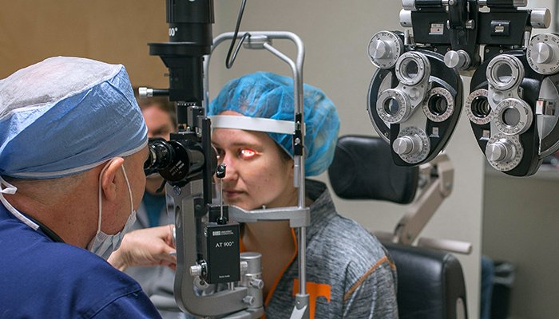
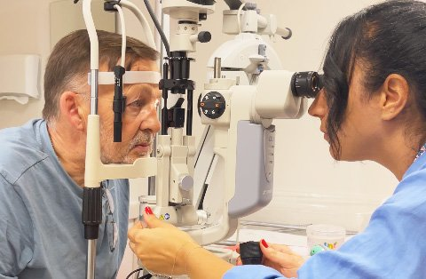
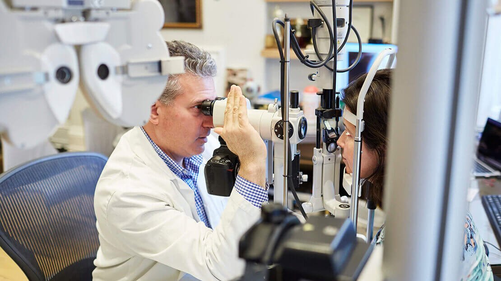
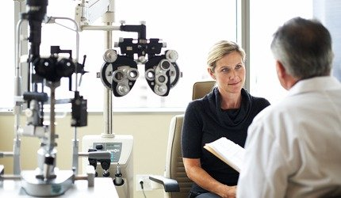
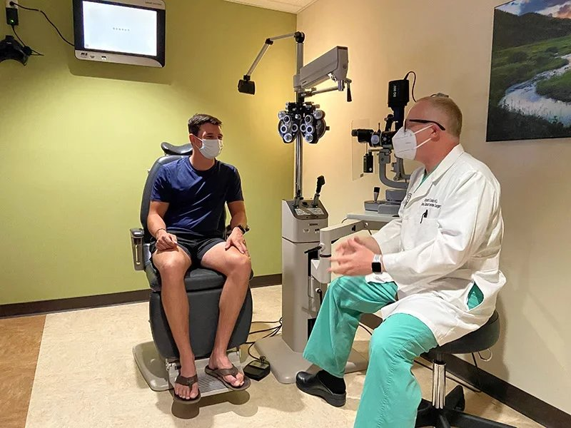

[Laser eye surgery](https://www.focusvision.com.au/laser-eye-surgery) is a widely used treatment for common vision problems like nearsightedness, farsightedness, and astigmatism. If you're considering this type of laser eye treatment, one of the first questions you might ask is: how long does eye surgery last?

The short answer is that for most people, the results are long-lasting, often permanent. However, a few personal factors can affect just how long the benefits will stay with you.

## **Is Laser Eye Surgery Permanent?**

In many cases, yes. Whether you’re undergoing LASIK surgery, photorefractive keratectomy (PRK), or small incision lenticule extraction (SMILE), the goal is to reshape the corneal tissue so that light rays focus more precisely on the retina. This typically leads to improved vision and reduces your reliance on glasses or contact lenses.

But while these changes to the eye are permanent, your vision can still shift over time due to natural [aging or new eye conditions](https://www.focusvision.com.au/blog/laser-eye-surgery-myths), not because the surgery "wears off."

## Factors That Affect Longevity

Several factors can influence the long-term success of laser vision correction procedures:

- **Age**:  
   Younger patients, especially those in their 20s or 30s, tend to get more stable, longer-lasting results. But once you reach your 40s or 50s, natural changes like presbyopia (age-related trouble with reading vision) may require you to use reading glasses again, even if you see distant objects clearly.

- **Prescription Stability**:  
   If your original prescription hasn’t changed in over a year, you're more likely to experience lasting results. A shifting prescription can mean you may need a LASIK enhancement later on.

- **Eye Health**:  
   Conditions like diabetes or chronic dry eyes can affect your outcome. That’s why a comprehensive eye exam before surgery is so important—to make sure you're a good candidate for the procedure.

- **Aging**:  
   Even after successful laser correction, age-related issues like cataracts may still occur. These aren’t caused by the surgery but can affect your vision later in life.

## **Can Your Vision Change Again?**

Yes, it’s possible, but it doesn’t happen to everyone. If you notice vision changes years after your laser eye surgery, a second laser treatment (like a LASIK enhancement) may help fine-tune the results. This is more common if your prescription wasn’t fully stable before the first procedure.

For example, it’s normal for some people to need reading glasses in their 40s, even if their distance vision is still excellent. Others may develop cataracts, which would require a separate form of treatment

## **How Long Does Laser Eye Surgery Last?**

If you're thinking about vision correction, you might wonder, how long does LASIK last? The clear answer is that results from laser eye surgery procedures like situ keratomileusis (LASIK) are generally long-term. These popular procedures reshape the cornea to correct short sightedness, long sighted vision, and astigmatism, often eliminating the need for glasses or contacts.

However, results can vary depending on a few other factors like age, eye health, and prescription stability. Over time, natural aging may cause you to develop presbyopia, which affects near range vision and may require reading glasses, even after successful LASIK.

Some LASIK patients may also need an enhancement procedure years later if their vision changes significantly. Still, most people enjoy clearer vision for many years with just one treatment.

## **Key Factors That Influence Long-Term Results**

While laser eye surgery offers clear and lasting vision for many, the results can still be affected by several key factors. Understanding these elements can help you get the best outcome from your procedure.

### Recovery and Lifestyle:

Your actions during recovery play a major role in long-term success. Avoid exposing your eyes to bright lights, especially in the first few days after surgery, as your eyes may be more sensitive than usual. Following post-surgery care instructions is essential to protect your vision.

### Hygiene and Safety:

For a short period after surgery, it’s important to avoid environments that increase the risk of infection. This includes places like swimming pools and hot tubs, which can introduce bacteria and slow the healing process.

### Personal Health and Vision Goals:

Everyone’s eyes are different, and so are their vision needs. Some people may experience stable results for years, while others might notice minor changes over time. If your vision shifts, additional treatment options may be available to correct it.

At Focus Vision, we provide detailed guidance before and after surgery to help you understand what to expect. Our team is here to support you through every step of the process and offer personalized solutions if your needs change later on.

## **Long-Lasting Results and Ongoing Care**

Laser eye surgery can be life-changing. It gives most people freedom from prescription glasses and the need to wear glasses for daily activities. While the procedure offers long-term results, it's still important to schedule follow-up appointments and regular check-ups to protect your vision over time.

At [Focus Vision in Brisbane](https://www.focusvision.com.au/home), our experienced eye surgeons are here to support you before, during, and after your procedure. We offer full aftercare and will guide you if any changes appear in your vision down the track.

Whether you’re interested in LASIK, SMILE, or another form of laser-assisted refractive surgery, we’ll help you understand your options and find the best path forward.

## **Thinking about getting laser eye surgery?**

[Book a consultation today at Focus Vision](https://www.focusvision.com.au/contact) and take the first step toward sharper, clearer vision, without the hassle of glasses or contacts.
