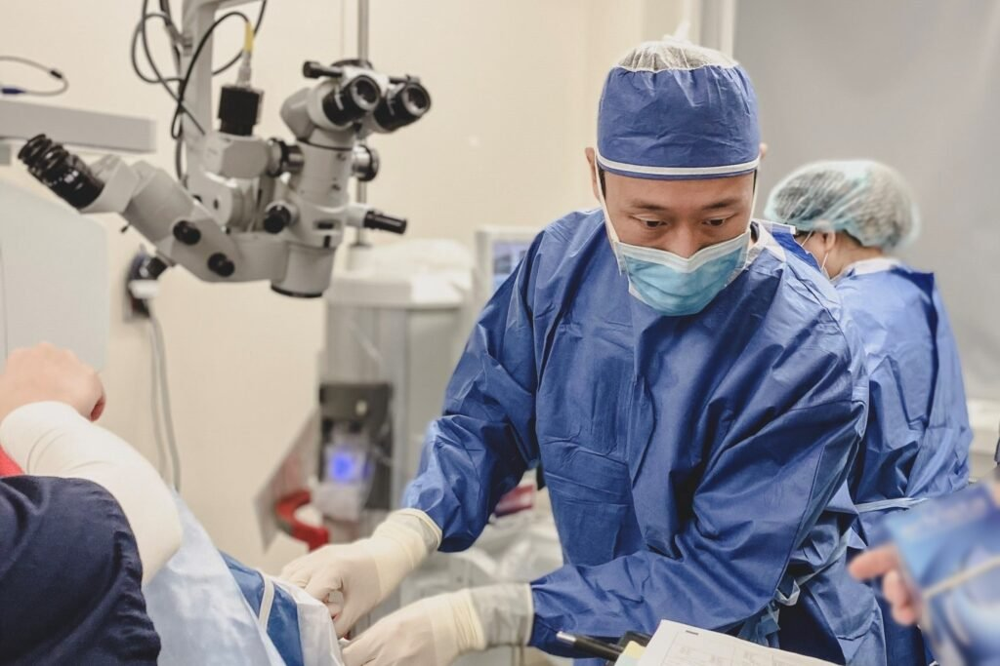

If you’re looking for an advanced alternative to laser vision correction, implantable contact lens surgery could be the perfect solution. Unlike traditional contact lenses that rest on the surface of your eye, this procedure involves placing a lens implant inside the eye for long-term correction.

Whether you’re not eligible for LASIK due to thin corneas or high prescriptions, the implantable collamer lens (ICL) offers a **permanent solution with impressive vision correction results**. In this article, we’ll explore everything you need to know about ICL surgery from how it works to recovery time and whether you're a suitable candidate.

## What Is Implantable Contact Lens (ICL) Surgery?

[Implantable contact lens surgery](https://www.focusvision.com.au/implantable-contact-lens), also known as ICL surgery, involves the insertion of a flexible lens made from purified collagen (collamer) into the eye. This lens is placed between the natural lens and the iris to correct refractive errors like myopia and astigmatism.

Unlike laser eye surgery procedures that reshape the cornea, ICL implantation does not alter your corneal tissue, preserving its natural structure. This makes it a preferred choice for individuals who may not qualify for other vision correction options due to thin corneas or dry eyes.

[BOOK A FREE CONSULT](/contact)

## How the ICL Procedure Works

The ICL procedure is typically performed as a **quick day surgery under local anaesthetic.** Anaesthetic eye drops are applied to numb the eye, ensuring minimal discomfort.

[**BOOK FREE CONSULTATION TO LEARN MORE**](https://www.focusvision.com.au/contact)

A tiny incision (self-sealing and often requiring no stitches) is made to insert the lens. Once inside, the flexible lens unfolds and is positioned correctly in front of the natural lens.

**Here’s what the typical process looks like:**

- Application of anaesthetic eye drops
- Creation of a small incision
- Insertion of the flexible lens implant
- Lens unfolds into place
- Quick recovery begins post-op

Most patients experience improved vision almost immediately and can resume normal activities within a few days.

## Who Are Suitable Candidates for ICL Surgery?

ICL implants are ideal for individuals aged 21 to 45 who have:

- High prescriptions (often too severe for LASIK surgery)
- Thin corneas unsuitable for laser vision correction
- No significant changes in prescription for at least 12 months
- Good overall eye health
- A desire for a permanent solution to correct vision

It’s also a great option for contact sports players, as the lens remains safely positioned inside the eye.

## Benefits of Implantable Contact Lenses

Implantable contact lenses offer several unique advantages over other vision correction procedures:

- Preserves corneal tissue and corneal nerves
- Reversible and removable
- Provides clearer vision with minimal complications
- Includes UV protection ICLs for long-term eye safety
- Suitable for those not eligible for laser eye surgery
- Offers pain-free recovery
- No dry eyes, unlike LASIK in some cases
- Allows a personalised treatment plan

Many patients report improved vision beyond what glasses or contacts ever provided.

[BOOK A FREE CONSULT](/contact)

## Recovery Time and Post-Operative Care

Recovery from ICL surgery is usually swift. Most patients notice clear vision within 24–48 hours. Medicated eye drops are prescribed to prevent infection and inflammation. Post-operative appointments are essential to monitor eye pressure and ensure proper healing.

**Here are a few care tips after surgery:**

- Use medicated eye drops as prescribed
- Avoid rubbing your eyes
- Attend all post-operative appointments
- Rest well and avoid strenuous activity for a few days
- Wear protective eyewear if needed

Thanks to the self-sealing incision and minimally invasive approach, most people return to work and resume normal activities within a few days.

[BOOK A FREE CONSULT](/contact)

## ICL vs Other Vision Correction Procedures

ICL surgery is often compared with LASIK surgery and other laser vision correction options. However, the key differences include:

| **Feature**                      | **ICL Surgery** | **LASIK Surgery** |
| -------------------------------- | --------------- | ----------------- |
| Reshapes cornea?                 | No              | Yes               |
| Removes tissue?                  | No              | Yes               |
| Reversible?                      | Yes             | No                |
| Ideal for thin corneas?          | Yes             | No                |
| Suitable for high prescriptions? | Yes             | Sometimes limited |

For those seeking a pain-free, long-lasting, and versatile alternative to laser procedures, ICL implantation offers an excellent solution.

[BOOK A FREE CONSULT](/contact)

## Making an Informed Decision

Choosing the right vision correction option depends on your lifestyle, prescription, and eye health. A comprehensive consultation with a vision specialist can help you determine if you’re a suitable candidate for ICL surgery.

**Ask your doctor about:**

- The health of your natural lens
- Any concerns about eye pressure
- Potential alternatives to correct refractive errors
- The long-term benefits of lens implants

## Final Thoughts

Implantable contact lens surgery offers an effective, safe, and often life-changing solution for people with high prescriptions or who aren’t eligible for LASIK. With a quick procedure, minimal discomfort, and excellent long-term vision correction results,[ICL surgery](https://www.focusvision.com.au/implantable-contact-lens) stands out as one of the best vision correction options available today.

If you're exploring your options for clearer vision, discuss ICL implantation with your ophthalmologist to see if it's right for you. From enhanced clarity to freedom from glasses, many patients find it to be a turning point in their lives.

[BOOK A FREE CONSULT](/contact)

## FAQs

### How is ICL surgery different from LASIK surgery?

ICL surgery involves placing a _clear lens_ between the iris and the natural lens without reshaping the cornea, while [LASIK surgery uses a laser to reshape the corneal tissue.](https://www.focusvision.com.au/laser-eye-surgery) This makes ICL ideal for patients with thin corneas or high prescriptions who may not be suitable candidates for LASIK.

### What is the lifespan of an implantable contact lens?

Implantable contact lenses are designed to be a _permanent solution_ and can last for decades. The _clear lens_ material used in ICLs is biocompatible and doesn’t typically degrade over time.

### What are the costs involved in ICL surgery?

The cost of ICL surgery can _vary depending_ on several factors including the clinic, surgeon’s expertise, and the type of implant used. Since it uses a _clear lens_ implant made of purified collagen, the materials contribute to the higher price point compared to other vision correction procedures.

[BOOK A FREE CONSULT](/contact)
