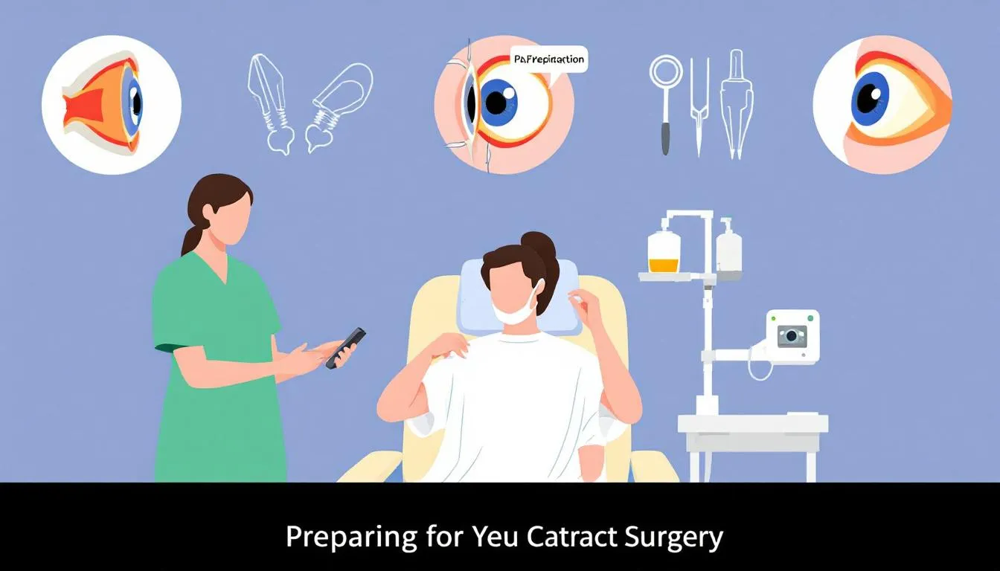

Is cataract eye surgery painful? Many patients worry about this. Thankfully, the procedure is typically painless due to local anesthesia. In this article, you’ll learn what to expect before, during, and after cataract surgery, including insights into managing any potential discomfort.

## Key Takeaways

- Cataract surgery is a common outpatient procedure that replaces the cloudy lens with a clear artificial lens, restoring vision and enhancing overall quality of life.
- The procedure typically involves local anesthesia and a light sedative, minimizing pain, and most patients only experience pressure rather than discomfort during surgery.
- Post-operative patients may experience mild discomfort and symptoms such as dryness and redness; proper management and following aftercare guidelines can ensure a smoother recovery.

## Overview of Cataract Surgery

Cataract surgery involves removing the cloudy lens from the eye and replacing it with a clear artificial lens. This is vital for those with vision loss from cataracts, which can significantly affect daily activities and quality of life. The procedure usually starts with pupil dilation and the application of local anesthesia, after which cataracts removed can restore clearer vision. Doctors often recommend this surgery to treat cataracts.

Once the eye is prepared, the cataract surgeon performs the following steps:

- Makes a tiny incision in the lens capsule to access the cloudy lens.
- Uses specialized instruments to carefully break up and remove the cloudy lens.
- Implants an intraocular lens (IOL) to replace the removed lens, allowing light to pass through and focus properly, restoring clear vision.

This outpatient procedure is usually completed within an hour, and patients can go home the same day.

After surgery, many patients notice a dramatic improvement in vision. Colors become brighter, and details sharper, making daily tasks easier and more enjoyable. Removing cataracts enhances the overall quality of life.

Cataract surgery is one of the most common and successful surgeries performed today. Beyond better vision, it offers increased independence, improved mental well-being, and a reduced risk of falls. For many, this procedure is life-changing, and doctors often recommend cataract surgery.

## Pain During Cataract Surgery

[BOOK FREE VISIT](/contact)

Many patients worry about whether cataract surgery is painful. Fortunately, most find the procedure painless, thanks to local anesthesia that numbs the eye effectively.

Patients stay awake during the procedure but may receive a mild sedative to help you relax. This combination of local anaesthesia and sedation makes the experience comfortable and pain-free. While anxiety levels and pain tolerance can vary, most patients tolerate the procedure well.

### Role of Local Anaesthetic Injection

The local anaesthetic injection is key to a painless cataract surgery. It numbs the eye, ensuring no pain during the procedure. Combined with a light sedative, it creates a comfortable setting for both the patient and the surgeon.

### Patient Experience During the Procedure

During the surgery, most patients feel only pressure, not pain, thanks to effective local anesthesia and a tiny incision. Some may experience a mild burning sensation from the dilating eye drops, but this is brief. A light sedative can further improve comfort, particularly for anxious patients, although surgery painful experiences can vary.

The entire cataract procedure is typically completed within a few hours, and patients can go home the same day. The process involves making a small incision, using ultrasound waves to break up the cloudy lens, and then removing it to allow light rays to enter the eye properly.

An artificial lens implant is then inserted to restore clear vision through a new lens. Most people find the experience to be a routine procedure with minimal discomfort, leading to successful surgeries and improved vision with a toric lens.

## Post-Surgery Discomfort

[BOOK FREE VISIT](/contact)

Post-operative discomfort is normal after cataract surgery. Common symptoms include:

- A foreign body sensation
- Grittiness
- Mild discomfort
- Redness and a bloodshot appearance
- Sensitivity to glare

These symptoms are also common but short-lived and manageable with proper care.

Minor discomfort usually lasts for one or two days and is often associated with dry eye due to impaired tear production. To manage these symptoms, patients can use prescribed eye drops, tear lubricants, and over-the-counter pain or discomfort medication.

Understanding these common post-operative experiences can help set realistic expectations and ensure a smoother recovery process.

### Managing Post-Operative Discomfort

Managing post-operative discomfort is essential for a smooth recovery. Key points to consider include:

- Patients may need to wait five minutes after using prescription drops before applying artificial tears.
- Artificial tears used should preferably be without preservatives to treat mild dryness.
- Redness or bloodshot eyes are normal but should be monitored if accompanied by pain.

Following these guidelines and using recommended treatments can significantly reduce swelling and discomfort during recovery. This proactive approach minimizes pain, ensuring successful surgeries and quicker healing.

### When to Contact Your Eye Surgeon

Although most post-operative symptoms are mild and temporary, knowing when to contact your eye surgeon is important. Contact your ophthalmologist if you experience:

- Pain that persists or worsens
- Persistent blurry vision
- Swelling
- Unexpected pain

Early intervention can prevent complications and ensure optimal recovery.

## Benefits of Cataract Surgery

[BOOK FREE VISIT](/contact)

Cataract surgery offers benefits beyond improved vision, including:

- Enhanced color perception
- Better night vision, making daily activities easier and more enjoyable
- Transformation for those with blurry vision and increased glare

Many patients also report improved mental well-being post-surgery. Clearer vision can reduce anxiety and depression, enhancing quality of life. Increased independence is another benefit, as patients can engage in daily activities with more confidence to improve vision and address potential vision problems.

Cataract surgery offers several benefits:

- It can reduce the risk of falls, especially in older adults.
- By restoring the ability to drive and perform job duties, it can facilitate ongoing employment.
- Improved vision leads to increased physical activity and enjoyment of outdoor activities.

These points highlight the comprehensive benefits of the procedure.

## Possible Complications and Risks

Despite its high success rate, cataract surgery carries risks, as do all surgical procedures. Complications can include:

- swelling
- infection
- bleeding
- drooping eyelid

Patients with pre-existing eye disease face a higher risk of complications.

Serious conditions like retinal detachment and glaucoma can also occur. Discuss these potential risks with your cataract surgeon to be fully informed and prepared.

Understanding that these complications are rare and manageable can help alleviate any concerns.

## Preparing for Cataract Surgery

[BOOK FREE VISIT](/contact)

Proper preparation is of utmost importance for a successful cataract operation. Patients usually attend pre-surgery consultations and tests to assess eye health and suitability for the surgical or invasive procedure. Refrain from wearing contact lenses in the affected eye for three days before the surgery, as the cloudy natural lens needs to be properly evaluated.

An ophthalmologist, or eye doctor, typically performs cataract surgery an invasive procedure that carries risks, such as infection or bleeding — on an outpatient basis, taking less than an hour. On surgery day, patients should wear comfortable, loose-fitting clothing and bring non-prescription sunglasses or an eye shield to protect their eyes from bright lights afterward.

To minimize infection risks, avoid makeup, perfume, and jewelry on surgery day. Adhering to these guidelines ensures a smooth procedure, reducing the risk of serious medical conditions, and resulting in improved vision and a successful outcome.

### Recovery and Aftercare

The recovery period after cataract surgery is vital for a smooth healing process as the eye heals. Most people can resume usual activities like reading, using a computer, and watching TV within a few hours, although some initial blurriness may occur. Wait two weeks before swimming to minimize infection risks, as water exposure during healing could lead to debilitating pain or complications.

Avoid eye treatments like warm compresses for at least a week after surgery to prevent pressure on the eye. An eye patch or shield may be recommended while sleeping to protect the eye as it heals. Wait 2 to 3 weeks before testing new vision prescriptions to allow stabilization. Adhering to these aftercare guidelines ensures a safe and effective recovery.

### Summary

In conclusion, cataract surgery is a highly effective surgical or invasive procedure with numerous benefits, including improved vision and enhanced quality of life. While the thought of eye surgery may be intimidating, understanding the procedure, pain management, and recovery can help alleviate concerns. It is worth noting that cataracts are a leading cause of vision loss, often related to aging or macular degeneration, and the surgery addresses the cloudy natural lens to restore clarity. With proper preparation and aftercare, patients can look forward to a successful outcome and a brighter, clearer future.

### Frequently Asked Questions

### Is cataract surgery painful?

Cataract surgery is typically painless, as local anesthesia is utilized, allowing patients to experience pressure rather than pain during the surgical or invasive procedure.

### What can I expect during cataract surgery?

You can expect cataract surgery to be performed under local anesthesia, often with mild sedation, involving the removal of the cloudy natural lens and its replacement with an artificial lens implant. This invasive procedure carries risks, so your surgeon will explain precautions and benefits beforehand.

### How long does it take to recover from cataract surgery?

Most individuals can resume usual activities shortly after cataract surgery, while full recovery and vision stabilization usually take a few weeks as the eye heals.

### What are the possible complications of cataract surgery?

Complications of cataract surgery may include swelling, infection, bleeding, and retinal detachment. These are rare but can be serious medical conditions, and it is essential to discuss these potential risks with your cataract surgeon.

### How should I prepare for cataract surgery?

To prepare for cataract surgery, you should attend all pre-surgery consultations, refrain from wearing contact lenses for three days before the procedure, and avoid wearing makeup and jewelry on the day of surgery. Bringing an eye shield or sunglasses is also recommended for postoperative protection.

[BOOK FREE VISIT](/contact)
