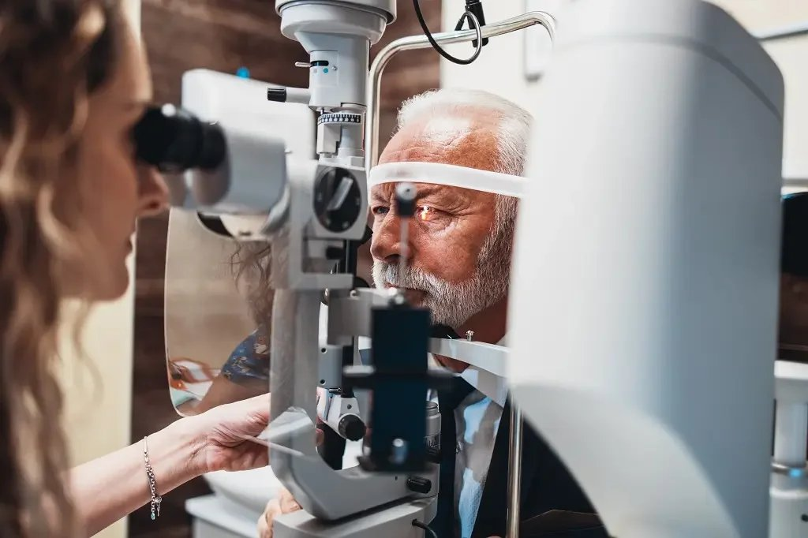

If you're thinking about [laser eye surgery](https://www.focusvision.com.au/laser-eye-surgery) procedures, one of the first questions that probably comes to mind is: Does laser eye surgery hurt? Feeling anxious about a surgical or invasive procedure, especially one involving your eyes, is completely normal. But the reassuring news is that laser vision correction is typically a safe and effective procedure designed to keep you comfortable every step of the way.

At Focus Vision, we understand how important it is for our patients to feel confident and at ease. That’s why we take extra care to ensure your experience is smooth, supportive, and as pain-free as possible, from your first consultation to full recovery.

## **Before the Surgery at Focus Vision**

Before your laser eye surgery, your eyes are prepared using anaesthetic eye drops (also called anaesthetic drops) to completely numb the surface. These drops prevent any sensation of pain during the procedure. While you might feel a bit of pressure or slight touch, it’s not painful at all.

If you’re nervous before the procedure, don’t worry, our [caring clinical team](https://www.focusvision.com.au/our-team) will talk you through everything. In some cases, a mild sedative can be offered to help you feel calm and relaxed. This is part of ensuring you're ready for the medical procedure, both physically and mentally.

All preparation is overseen by an appropriately qualified health practitioner, so you’re in safe hands from the start.

## **During the Procedure**

The entire surgery usually takes less than 20 minutes for both eyes. Whether you’re getting LASIK laser eye surgery, PRK [surgery](https://www.focusvision.com.au/about-dr-david-gunn), or another form of refractive surgery, the technology used, such as the excimer laser, ensures precision and speed.

In LASIK procedures, your surgeon creates a small [flap in the cornea](https://en.wikipedia.org/wiki/Cornea). Some patients report a bit of mild pressure at this stage, but thanks to the lasik surgery anaesthesia, it’s not painful. The laser assisted reshaping of the cornea is quick and efficient, often described as feeling like a warm sensation or seeing flashes of light.

Throughout the laser treatment, your experienced surgeon will guide you step by step. The experience is usually strange but not uncomfortable, and certainly not something most people describe as painful.

## **After the Surgery**

Once the laser surgery is complete and the numbing eye drops applied during the procedure begin to wear off, it’s normal to experience mild discomfort. This may feel like a gritty or burning sensation, dryness, watery eyes, or light sensitivity, similar to having an eyelash in your eye. These symptoms are mild and usually last only a few hours to 48 hours, depending on your individual recovery period.

You’ll be given lubricating artificial tears, a protective eye shield, and personalised recovery instructions by our clinical team. It’s important to rest your eyes, avoid screen time, and stay away from bright lights right after the surgical procedure.

## **A Pain-Free Journey to Better Vision**

While it’s understandable to feel nervous about a surgical procedure involving your eyes, laser eye surgery at Focus Vision Brisbane is designed to prioritise patient comfort. Whether you choose PRK surgery, LASIK, or another form of refractive surgery, every step is managed with precision and care.

In LASIK, a corneal flap is created using a femtosecond laser, and then corneal tissue is reshaped with an excimer laser to improve vision. Some patients wonder, “Does LASIK hurt?” or Is Laser Eye Surgery Painful? and the answer is reassuring: thanks to effective numbing drops, most patients feel only slight pressure, not pain.

The clear vision you gain, without needing to wear glasses or contact lenses, makes the process worthwhile for the vast majority of patients. The discomfort is minor, temporary, and managed with expert aftercare.

If you're in Brisbane or the surrounding areas and are considering laser eye surgery procedures, you can trust our team to deliver a safe and effective procedure tailored to your needs.

📞 Call us on [(07) 3239 5005](tel:0732395005) or 📧 email [hello@focusvision.co.au](mailto:hello@focusvision.co.au) to schedule your consultation and take your first step toward sharper, glasses-free sight.
