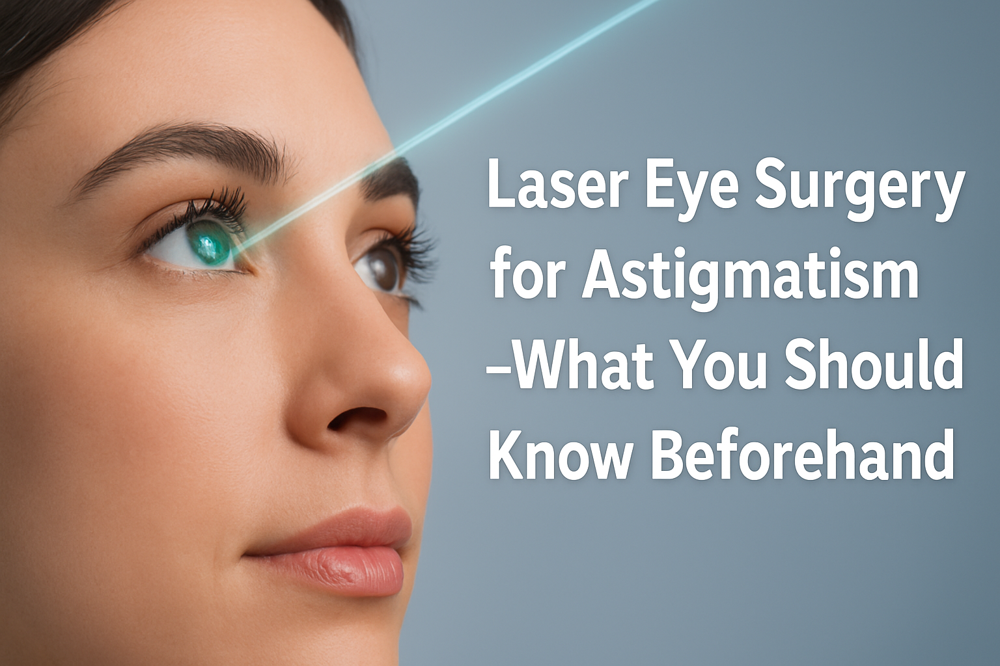

## _\- What You Should Know Beforehand_

## Introduction to Astigmatism

[Astigmatism](/vision-correction/laser-eye-surgery) is a refractive error that causes blurred or distorted vision due to an irregular shape of the cornea. Blurry vision is a significant symptom that can affect quality of life, especially in children.

Astigmatism occurs when the cornea or lens inside the eye is irregularly shaped, affecting the way light enters the eye.

Astigmatism can be found on its own or in combination with short-sightedness or long-sightedness.

Uncorrected astigmatism can cause blurred vision at all distances, eye strain, and headaches. An eye doctor can diagnose astigmatism during a routine eye exam.

## Understanding Astigmatism Correction

[Laser eye surgery](/vision-correction/laser-eye-surgery) is a popular option for correcting astigmatism, using laser vision correction procedures to reshape the cornea.

The eligibility criteria for laser eye surgery for astigmatism include factors such as age, the severity of astigmatism, and stable vision prescriptions, and potential candidates are advised to book consultations to assess their suitability.

Other options for correcting astigmatism include glasses, contact lenses, or refractive surgery.

Laser eye surgery can correct astigmatism by removing corneal tissue to improve vision.

Laser eye surgery can effectively fix astigmatism by reshaping the cornea for better light focus and correct vision.

The goal of astigmatism correction is to improve vision and reduce or eliminate blurry or distorted vision.

Astigmatism correction can be achieved through various laser vision correction procedures, including [LASIK surgery](/vision-correction/ray-tracing-lasik/).

## Eye Surgery Options

- LASIK surgery is a type of refractive surgery that uses an excimer laser to reshape the cornea. Situ keratomileusis is a popular choice for correcting astigmatism.
- Photorefractive keratectomy (PRK) is another type of laser eye surgery that can correct astigmatism.
- CLEAR stands for Corneal Lenticule Extraction for Advanced Refractive correction. It is essentially another name or branding variation for the SMILE procedure, a minimally invasive type of laser eye surgery.
- Lens exchange surgery is an option for patients with astigmatism who are not suitable for laser eye surgery. Refractive lens exchange is a significant alternative for patients considering vision correction.
- Cataract surgery can also correct astigmatism, especially for patients with [cataracts](/vision-correction/cataract-surgery).

## Laser Assisted Technology

Laser assisted technology, such as the [femtosecond laser](/blog/allotex-allogenic-corneal-inlay-for-presbyopia-a-minimally-invasive-solution), is used in laser eye surgery to create a thin flap in the cornea.

Corneal thickness is a crucial factor in determining the suitability of patients for laser vision correction procedures.

The excimer laser is used to reshape the cornea and correct astigmatism. Laser eye surgery works by precisely reshaping the cornea to correct astigmatism, using methods like LASIK and PRK.

Laser eye surgery uses advanced technology to improve vision and reduce the risk of surgical complications. Laser assisted technology has improved the safety and effectiveness of laser eye surgery.

The use of laser assisted technology has reduced the risk of complications and improved outcomes.

## Correcting Astigmatism

Correcting astigmatism with laser eye surgery involves removing corneal tissue to improve vision.

It is crucial to identify the most suitable treatment for each patient through a comprehensive eye assessment.

The procedure is typically quick and minimally invasive, with most patients experiencing improved vision within a few weeks.

Correcting astigmatism can reduce eye strain, improve vision, and eliminate the need for glasses or contact lenses. Astigmatism correction can be achieved through various laser vision correction procedures, including LASIK surgery and PRK. These procedures effectively treat astigmatism by reshaping the cornea to improve vision clarity.

The goal of correcting astigmatism is to improve vision and reduce or eliminate blurry or distorted vision.

## Fixing Astigmatism

Fixing astigmatism with laser eye surgery is a safe and effective procedure for many patients. The procedure involves using a laser to reshape the cornea and improve vision.

Candidates should have stable vision and overall healthy eyes to qualify for the procedure. Fixing astigmatism can reduce the risk of vision problems and improve overall eye health.

Laser eye surgery is a popular option for fixing astigmatism, with many patients experiencing improved vision and reduced eye strain.

Reshaping the cornea helps focus light rays properly on the retina, reducing blurry or distorted vision. Fixing astigmatism can improve the quality of life for patients with blurry or distorted vision.

## Laser Eye Surgery

Laser eye surgery is a popular option for correcting astigmatism and other vision problems. The procedure involves using a laser to reshape the cornea and improve vision.

Laser eye surgery is a safe and effective procedure for many patients, with most experiencing improved vision within a few weeks.

However, it is important to understand the risk factors associated with astigmatism, as some individuals may be born with the condition while others may develop it later in life.

Additionally, any invasive procedure carries risks, and patients should seek a second opinion from a qualified health practitioner before moving forward.

Laser eye surgery can reduce the risk of vision problems and improve overall eye health. The goal of laser eye surgery is to improve vision and reduce or eliminate blurry or distorted vision.

### Laser Eye Surgery Fix

Laser eye surgery is a highly effective treatment for astigmatism, offering a permanent solution to blurry or distorted vision.

The procedure involves reshaping the cornea to correct the irregular curvature that causes astigmatism. By removing or reshaping corneal tissue, laser eye surgery can improve vision and reduce dependence on glasses or contact lenses.

With advancements in medical technology, laser eye surgery has become a safe and effective procedure for many individuals. This type of eye surgery not only enhances vision but also significantly improves the quality of life for those struggling with vision problems.

Whether you are tired of dealing with prescription glasses or contact lenses, laser eye surgery could be the solution you’ve been looking for.

## Recovery and Post-Surgery Care

- Recovery from laser eye surgery is typically quick, with most patients experiencing improved vision within a few weeks.
- Post-surgery care involves following the eye surgeon’s instructions and attending follow-up appointments.
- Patients may experience some discomfort or dryness after the procedure, but this is usually temporary.
- Proper care and [follow-up appointments](/contact) are crucial for a smooth recovery and to minimize the risk of complications.
- Patients should avoid contact sports and other activities that may irritate the eyes during the healing process.

## Risks and Complications

- As with any surgical or invasive procedure, there are risks and complications associated with laser eye surgery.
- These risks include infection, dry eye, and visual disturbances.
- However, the risk of complications is low, and most patients experience improved vision and reduced eye strain after the procedure.
- Patients should discuss the potential risks and complications with their eye surgeon before undergoing the procedure.
- It is essential to choose an appropriately qualified health practitioner to minimize the risk of complications.

## Cost and Insurance

- The cost of laser eye surgery varies depending on the procedure and the eye surgeon.
- Some [insurance plans](/costs) may cover part or all of the cost of laser eye surgery.
- Patients should check with their insurance provider to see if they are covered.
- The cost of laser eye surgery is a significant investment, but it can improve the quality of life for patients with blurry or distorted vision.
- Patients should consider the long-term benefits of laser eye surgery when evaluating the cost.

## Choosing an Eye Surgeon

- Choosing an eye surgeon is an important decision, and patients should research and compare different options.
- Patients should look for an eye surgeon who is experienced and qualified to perform laser eye surgery.
- The eye surgeon should have a good reputation and a high success rate.
- Patients should ask questions and discuss their options with the eye surgeon before undergoing the procedure.
- It is essential to choose an eye surgeon who is an appropriately qualified health practitioner.
