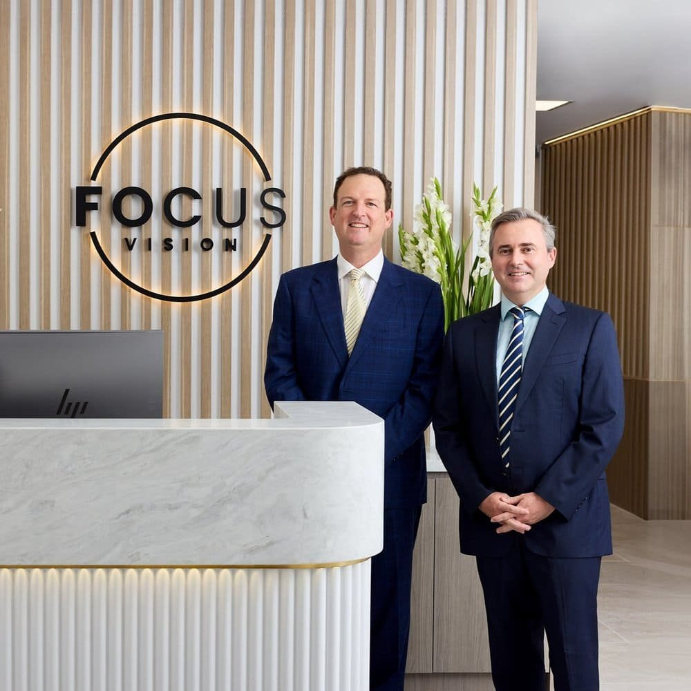

Welcome to [Focus Vision](/about-focus-vision), Brisbane’s trusted ophthalmology clinic dedicated to providing top-quality eye care and laser eye surgery. Our [experienced team](/our-team) of eye specialists offers a range of services, from comprehensive eye exams to advanced treatments for vision correction and eye conditions. Whether you are seeking solutions for common vision issues or specialised care, we are here to help you achieve optimal eye health and clear vision. At Focus Vision, your sight is our priority.

## **Our Experts**

[Dr. Gunn](/about-dr-david-gunn) is the co-founder of Focus Vision with Dr. Cronin and practices at the prestigious Queensland Eye Institute in Brisbane, Australia. Dr Gunn grew up in Brisbane and graduated from the University of Queensland Bachelor of Science and Medicine programs with First Class Honours. He undertook eye surgery training in Queensland and was awarded the prestigious K.G. Howsam medal for the highest results in the Australian and New Zealand final ophthalmology examinations.

[Dr. Cronin](/about-dr-brendan-cronin), co-founder of Focus Vision, grew up on the Gold Coast and completed his medical and ophthalmic training at the University of Queensland, graduating with honours. After completing his ophthalmic training in Brisbane, he pursued subspecialty training in Corneal, Refractive, and Anterior Segment Surgery at the renowned Manchester Royal Eye Hospital in the UK.

An accomplished researcher, Dr. Cronin has published numerous groundbreaking articles in international ophthalmology journals and is a member of The European Society of Cataract and Refractive Surgery and The Cornea Society.

## **Our Services**

At Focus Vision, we offer a wide range of advanced eye care services to meet your vision correction needs. Our experienced team specialises in state-of-the-art treatments designed to improve your sight and enhance your quality of life. Our services include:

·      **LASIK and PRK** – Safe and effective laser eye surgery options to correct vision issues like [myopia](https://en.wikipedia.org/wiki/Myopia), hyperopia, and astigmatism.

·      **Implantable contact lenses (ICLs’)** – A permanent, reversible solution for those who may not be candidates for laser surgery.

·      **Laser Eye Surgery Brisbane** – Designed to reduce the need for reading glasses by correcting presbyopia.

·      **Refractive Lens Exchange (RLE)** – A procedure that replaces the eye’s natural lens with an artificial one to correct vision and prevent cataracts.

·      **Premium Cataract Surgery** – Advanced cataract treatment using premium intraocular lenses for clear, sharp vision post-surgery.

Our personalised approach ensures you receive the highest standard of care, tailored to your unique vision needs and lifestyle. We prioritise your comfort, safety, and long-term eye health. With expert guidance and state-of-the-art technology, we’re committed to helping you achieve your best vision possible.

## **Our Values**

At Focus Vision, we understand that every person and every eye condition is unique. Your vision is precious, and your needs are our top priority. We are committed to providing world-class, customised vision correction treatments, delivered by Australia’s leading [laser eye specialists](/about-focus-vision). Let us guide you on your journey to clearer vision.

## **Get In Touch**

If you have any questions or queries on laser eye surgery in Brisbane, do not hesitate to get in touch today. Our team of experts is here to help you with all your vision needs. Call us on (07) 3239 5005 or email us at [hello@focusvision.com.au](mailto:hello@focusvision.com.au?).
