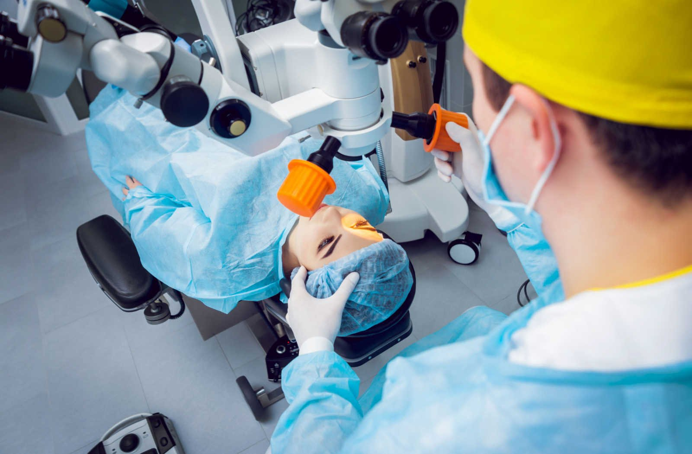
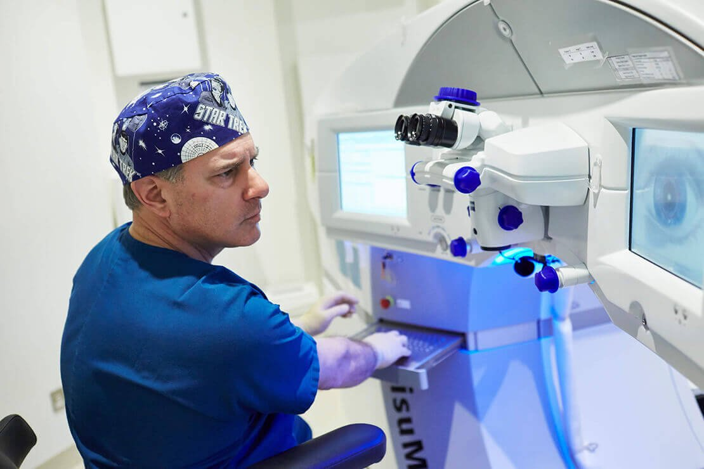
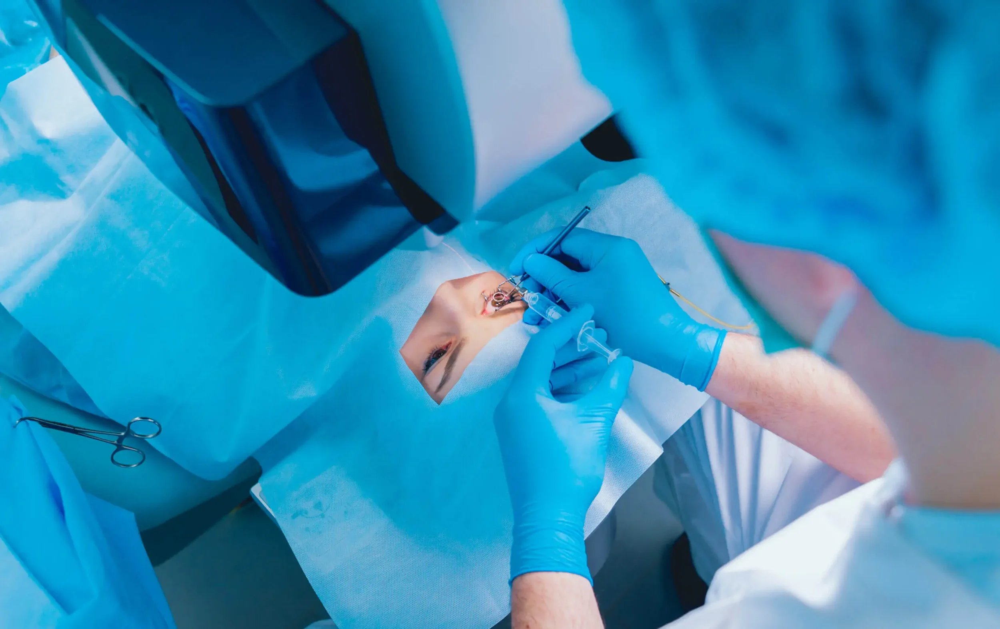
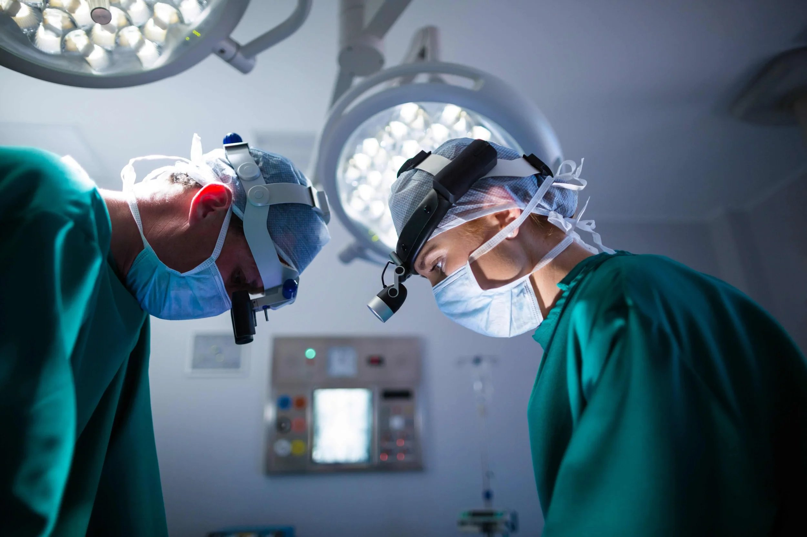

If you’re considering vision correction abroad, eye surgery in Thailand has become one of the most popular choices among international patients. The laser eye surgery cost Thailand typically ranges between **70,000 and 140,000 Thai Baht (฿) for both eyes**. Rounded for clarity, that’s approximately **$2,200 to $4,400 USD**. This makes it considerably more affordable compared to Western countries, where similar procedures often cost $5,000 to $6,000 USD or more.

For many international patients, this cost includes the surgical procedure, comprehensive eye examination, and post-operative care. What we have noticed at Focus Vision is that many patients who have gotten eye surger abroad come to us after complications have set in. Now there are people who have had great success with abroad laser eye surgeries but because you are dealing with the eye it is best that you choose a place you can easily visit for the next 8 weeks.

If you are planning to stay in Thailand for 8 weeks after laser eye surgery, the overall costs will include flights from Brisbane, accommodation, daily living expenses, transportation, insurance, and some post-operative supplies. The actual budget depends on whether you choose a budget, midrange, or comfort style of travel and living. Below is an itemized breakdown of the main expenses in Australian dollars (AUD).

### Estimated Costs for 8 Weeks in Thailand (AUD)

**1) Flights (Brisbane ↔ Bangkok, round-trip economy):**

- Low season / sale fares: 300 – 700
- Regular fares: 500 – 900

**2) Accommodation (56 nights):**

- Budget guesthouse/private room: 1,120 – 2,240 (20–40 per night)
- Midrange 1-bedroom apartment: 1,900 – 3,800 (monthly rental ~20,000–40,000 THB)
- Comfortable 3★–4★ hotel: 5,600 – 8,400 (100–150 per night)

**3) Food & daily spending (56 days):**

- Budget: 560 (10 per day)
- Mid: 1,400 (25 per day)
- Comfort: 2,800 (50 per day)

**4) Local transport (taxis, Grab, BTS/metro):**

- Budget: 112 (2 per day)
- Mid: 392 (7 per day)
- Comfort: 840 (15 per day)

**5) Mobile data / SIM card (60 days):** 57 – 76

**6) Travel insurance (8 weeks, medical + cancellation):** 150 – 450

**7) Post-op supplies (eye drops, glasses, meds):** 20 – 200

**8) Optional contingency (local ophthalmologist consult):** 50 – 200

### Example Total Budgets (AUD)

- **Budget style:** ~2,400
- **Midrange:** ~5,300
- **Comfort:** ~13,600

[BOOK FREE CONSULT](/contact)

## Why Consider Laser Eye Surgery in Thailand?

Thailand has built a strong reputation for offering medical services that rival some of the best Australian clinics and European centers. Many international patients are attracted by:

- **Affordable pricing**: With the total cost often less than half of what is charged in Western countries, Thailand is a cost-effective option.
- **Experienced surgeons**: Most ophthalmologists undergo international training and have a record of successful procedures using advanced technology.
- **Comprehensive care**: From pre-operative consultation to follow-up care, patients receive detailed attention to ensure optimal healing and reduced potential risks.
- **Medical tourism infrastructure**: With world-class hospitals, translators, and dedicated patient coordinators, the entire process is seamless for those traveling abroad.

## Types of Laser Eye Surgery Available in Thailand

Thailand offers a range of laser vision correction procedures tailored to different vision correction needs.

### LASIK Surgery

This popular laser-assisted technique involves creating a thin flap in the cornea’s outer layer using a femtosecond laser, followed by reshaping the underlying corneal tissue with excimer lasers. The LASIK procedure is fast, with most patients regaining clear vision within a few days.

### SMILE (Small Incision Lenticule Extraction)

Unlike LASIK, SMILE does not create a large corneal flap. Instead, a small incision is made, reducing the risk of flap complications and making it suitable for patients with thinner corneas. Patients report less risk of dry eye syndrome and faster healing.

### CLEAR Eye Surgery

A newer alternative using advanced laser technology, CLEAR offers precision and safety comparable to SMILE. It is currently available in select clinics across Thailand and is considered a life-changing procedure for many international patients.

### PRK (Photorefractive Keratectomy)

Recommended for patients unsuitable for LASIK, PRK reshapes the cornea’s outer layer without creating a flap. Healing may take several weeks, but it is effective for long-term vision problems.

### Refractive Lens Exchange

For patients with severe refractive errors or presbyopia, refractive lens exchange replaces the natural lens with an artificial one. While not strictly a laser eye surgery, it is offered in Thailand as part of comprehensive vision correction options.

## Factors Affecting Laser Eye Surgery Cost in Thailand

Several variables influence the laser eye surgery cost in Thailand:

- **Type of surgery**: The type of surgery you undergo, such as LASIK, SMILE, PRK, or refractive lens exchange, affects the total price.
- **Clinic location and reputation**: Well-known hospitals in Bangkok may charge more than smaller clinics.
- **Surgeon’s expertise**: Highly experienced ophthalmologists with international credentials may charge higher fees.
- **Technology used**: The inclusion of femtosecond lasers, excimer lasers, and other advanced technologies can affect pricing.
- **Follow-up appointments and prescribed eye drops**: Post-operative expenses, such as monitoring healing and using medications, also contribute to the total cost.
- **Patient’s eye health**: Factors such as corneal thickness, pre-existing vision problems, or whether you are a good candidate for flap-based surgery can alter the recommended procedure and overall cost.

## Recovery, Post-Operative Care, and Patient Safety

Most patients undergoing LASIK eye surgery or similar procedures in Thailand experience rapid recovery. However, the timeline can vary:

- LASIK: Clear vision is typically achieved within a few weeks, with many patients noticing improvement after just 24–48 hours.
- SMILE and CLEAR: Healing may take slightly longer, but usually results in fewer flap complications and less double vision.
- PRK: Requires several weeks of recovery, as the cornea’s outer layer regenerates.

During recovery, patients are prescribed eye drops to prevent infection and reduce inflammation. Regular follow-up care ensures that potential risks such as infection, dry eyes, or glare are minimized. Clinics emphasize patient safety by scheduling follow-up appointments and encouraging patients to attend every session.

It is essential to follow your appropriately qualified health practitioner’s advice and avoid rubbing your eyes during the healing period to ensure optimal results.

## Insurance, Risks, and Making an Informed Decision

Since laser eye surgery is considered an elective surgical or invasive procedure, it is generally not covered by insurance. Whether in Thailand or with Australian clinics, patients are usually required to pay out of pocket. However, the lower cost of eye surgery in Thailand often offsets this.

Like any surgical procedure, laser-assisted vision correction carries potential risks. These include:

- Dry eyes
- Flap complications (with LASIK)
- Double vision or glare in rare cases
- Delayed healing or need for enhancement procedures

The good news is that most patients report high satisfaction, significant improvement in vision, and lasting results. With careful selection of an experienced surgeon and proper post-operative care, the risks are minimized.

Making an informed decision involves a comprehensive eye examination, pre-operative consultation, and discussion with your eye doctor about the best option for your vision correction needs.

[BOOK FREE CONSULT](/contact)

## What to Expect During the Actual Procedure

Before undergoing laser treatment, patients begin with an initial consultation. This step is crucial because it allows the eye doctor to evaluate your overall eye health, measure corneal thickness, and confirm whether you are a good candidate for surgery. During this stage, patients also discuss their vision correction needs and receive clear information about what the laser eye surgery offers in terms of outcomes and recovery.

On the day of the surgery, patients are given local anaesthesia in the form of numbing eye drops, ensuring comfort throughout the process. The surgeon then performs the actual procedure using advanced laser technology designed to correct vision errors such as myopia, hyperopia, or astigmatism.

Like any medical treatment, an invasive procedure carries risks, and patients are advised of these beforehand. Common concerns include temporary dry eyes, mild discomfort, or light sensitivity. However, with proper follow-up care and adherence to prescribed eye drops, most patients recover quickly and enjoy lasting improvements in their sight.

## Comparing Thailand with Other Countries

When comparing the laser eye surgery cost in Thailand with Australia laser eye surgery or procedures in other Western nations, the difference is striking. While medical services in Australia maintain excellent standards, eye surgery in Thailand often provides equally advanced care at nearly half the price.

**For example:**

- **Australia**: $6,000–$8,000 USD for LASIK or SMILE
- **Thailand**: $2,200–$4,400 USD for LASIK, SMILE, or CLEAR

In addition, many patients highlight the advantages of Thailand’s medical tourism infrastructure, shorter wait times, and personalized attention. With comprehensive care and successful procedures, Thailand continues to attract many international patients seeking affordable yet safe options for laser vision correction.

## Final Thoughts: Is Laser Eye Surgery in Thailand Worth It?

For patients seeking desired vision correction, Thailand offers a compelling combination of affordability, advanced technology, and experienced surgeons. The laser eye surgery cost in Thailand—ranging from 70,000 to 140,000 Baht—makes it possible for many to experience a life-changing procedure without compromising on quality.

Whether you are considering LASIK surgery, SMILE, or other laser-assisted procedures, Thailand provides world-class health care with an emphasis on patient safety, follow-up care, and long-term outcomes.

Ultimately, undergoing surgery in Thailand is about more than cost savings; it’s about receiving comprehensive care, minimizing potential risks, and ensuring lasting results for your eye health. With the right preparation, consultation, and surgeon, laser eye surgery in Thailand can significantly improve vision and provide a new level of independence from glasses or contact lenses.
