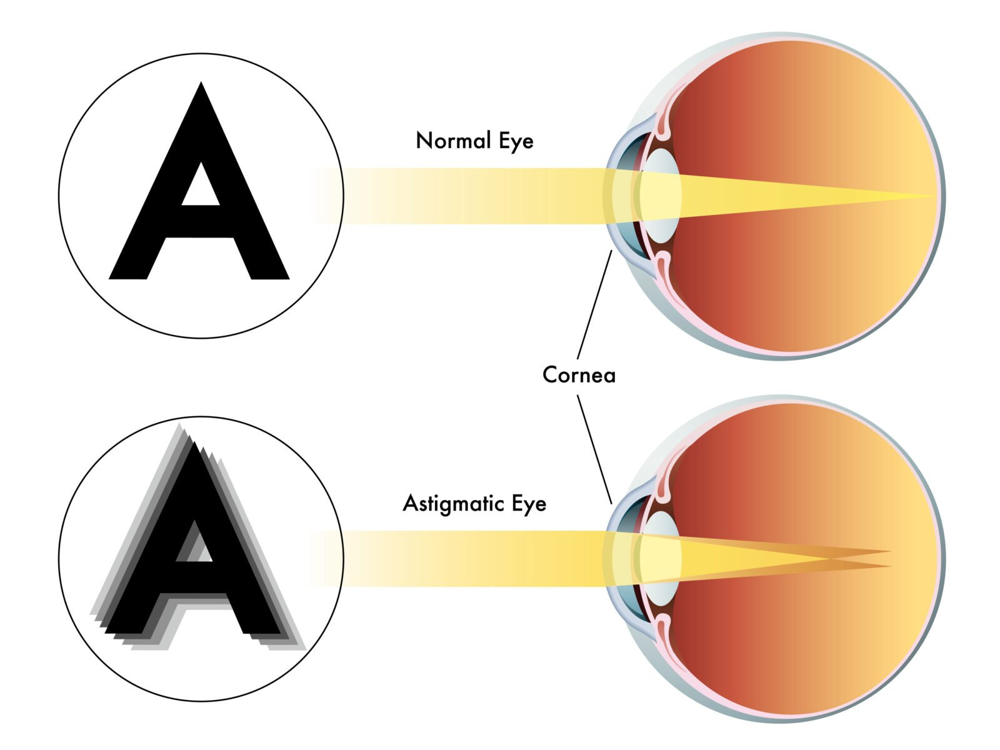
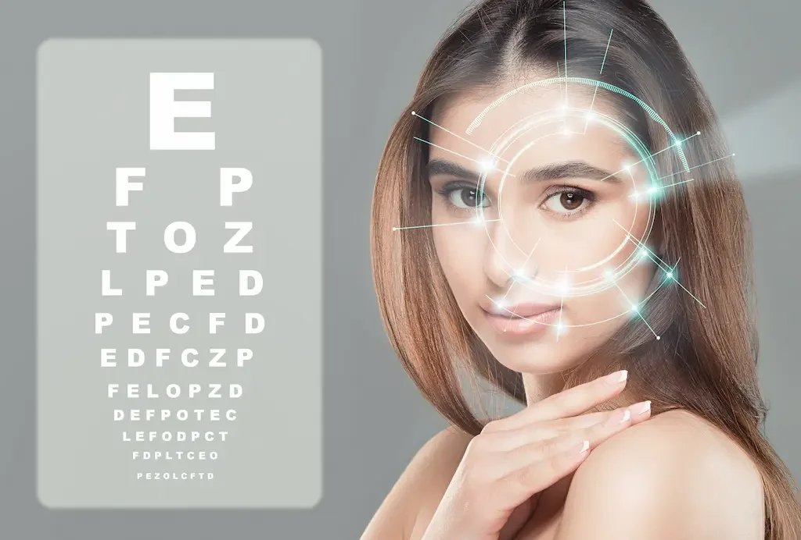

Astigmatism is one of the most common refractive errors, affecting millions of people worldwide. It occurs when the cornea or natural lens has an irregular curvature, causing light to bend unevenly and resulting in blurred or distorted vision. While glasses or contact lenses can correct astigmatism, many patients today look for a more permanent solution that eliminates daily dependence on visual aids.

This is where the laser eye surgery for astigmatism pros and cons becomes an important discussion, helping patients weigh the life-changing benefits against the possible risks before making a decision. With advancements in medical technology, procedures such as LASIK eye surgery, small incision lenticule extraction, and photorefractive keratectomy have made it possible to correct astigmatism effectively.

However, like any surgical or invasive procedure, astigmatism laser treatments carry both advantages and disadvantages. This comprehensive guide explores the pros and cons of laser eye surgery for astigmatism, helping you make an informed decision alongside an appropriately qualified health practitioner.

## Understanding Astigmatism and Its Symptoms

Astigmatism occurs when the cornea or natural lens has an irregular shape instead of being perfectly round. This irregularly shaped cornea or lenticular astigmatism bends light in such a way that it fails to focus clearly on the retina. The result is blurry vision that can affect both near and distance sight.

**Common symptoms of astigmatism include:**

- Blurred or distorted vision at all distances
- Light sensitivity and difficulty with bright lights
- Eye strain after reading or using digital devices
- Frequent headaches linked to vision problems

For most patients, these symptoms are first managed with wearing glasses or contact lenses, but for some, laser vision correction provides a more lasting option.

[BOOK FREE CONSULT](/contact)

## How Laser Eye Surgery Works in Treating Astigmatism

Modern refractive surgery techniques reshape the corneal tissue to correct how light enters the eye. Different methods are used depending on the corneal thickness, eye health, and the degree of corneal astigmatism.

- **LASIK surgery:** Uses a femtosecond laser to create a thin flap in the cornea, followed by reshaping with an excimer laser. This is the most popular method for astigmatism correction and offers rapid recovery.
- **Small incision lenticule extraction (SMILE):** A minimally invasive technique where a small lenticule of corneal tissue is removed through a tiny incision. It is especially useful for patients with thin corneas or those involved in contact sports.
- **Photorefractive keratectomy (PRK) and LASEK:** These methods involve reshaping the eye’s surface without creating a flap, making them suitable for people with thin corneas or certain medical conditions.
- **Refractive lens exchange:** In cases of high myopic astigmatism, long-sightedness, or when the natural lens causes distortion, surgeons may replace it with an artificial intraocular lens.

Each surgical procedure comes with benefits and potential risks, so an eye specialist or experienced surgeon should carefully assess which method is safest for your situation.

## **The Pros of Astigmatism Laser Eye Surgery**

Choosing laser eye surgery can provide significant lifestyle and vision improvements.

Benefits include:

- **Improved vision:** Many patients report a significant improvement in clarity, often achieving clear vision without glasses.
- **More permanent solution:** Unlike glasses or lenses, laser reshaping offers lasting results.
- **Rapid recovery:** Especially with LASIK eye surgery, most patients experience functional vision within a few weeks.
- **Safe procedure with advanced technology:** The use of femtosecond and excimer lasers ensures precision.
- **Freedom from glasses or contact lenses:** Ideal for active individuals and those involved in contact sports.
- **Treatment options for multiple refractive errors:** Surgery can address astigmatism, short-sightedness, and long-sightedness at the same time.

## The Cons of Astigmatism Laser Eye Surgery

Despite its effectiveness, astigmatism laser eye surgery is not without drawbacks.

**Challenges include:**

- **Invasive procedure carries risks:** Like any surgical or invasive procedure, there’s a small risk of infection, complications, or vision loss.
- **Temporary discomfort:** Patients may experience light sensitivity, dry eyes, or mild pain in the few weeks after surgery.
- **Not suitable for everyone:** Those with medical conditions, thin corneas, or unstable prescriptions may not qualify.
- **Cost:** Compared to wearing glasses, surgery can be more expensive upfront.
- **Potential side effects:** Some people report halos, glare around bright lights, or difficulty driving at night.
- **Need for a second opinion:** Consulting more than one eye surgeon ensures you choose the best treatment options.

## Patient Safety and the Role of the Surgeon

When considering surgery, working with an appropriately qualified health practitioner is essential. An experienced surgeon evaluates your corneal thickness, eye health, and other factors before recommending treatment.

The use of numbing eye drops during surgery ensures minimal pain, while precision from femtosecond laser technology reduces complications. Still, because an invasive procedure carries risks, patients are encouraged to seek a second opinion to confirm suitability.

## What to Expect During and After Surgery

- **During the actual procedure:** The eye is numbed with drops, and the eye surgeon uses a femtosecond laser or excimer laser to reshape the cornea.
- **Recovery process:** Most patients experience temporary discomfort, such as mild burning or tearing, which typically improves within a few weeks.
- **Follow-up visits:** Essential for monitoring eye health, ensuring proper healing, and preventing complications.

[BOOK FREE CONSULT](/contact)

## Making an Informed Decision

Ultimately, whether you pursue astigmatism laser eye surgery depends on your vision needs, eye health, and willingness to accept the pros and cons. While most patients achieve significant improvement, the decision should be based on a careful discussion with an eye specialist.

If you have common refractive errors such as myopic astigmatism, long-sightedness, short-sightedness, or even other refractive errors, laser procedures may provide lasting clear vision. However, patients who have had an eye injury or who do not have generally healthy eyes may need alternative treatment options or further medical evaluation before surgery.

Every surgical procedure involves potential risks, but with an appropriately qualified health practitioner guiding you, you can weigh the benefits against the risks to make a truly informed decision.
