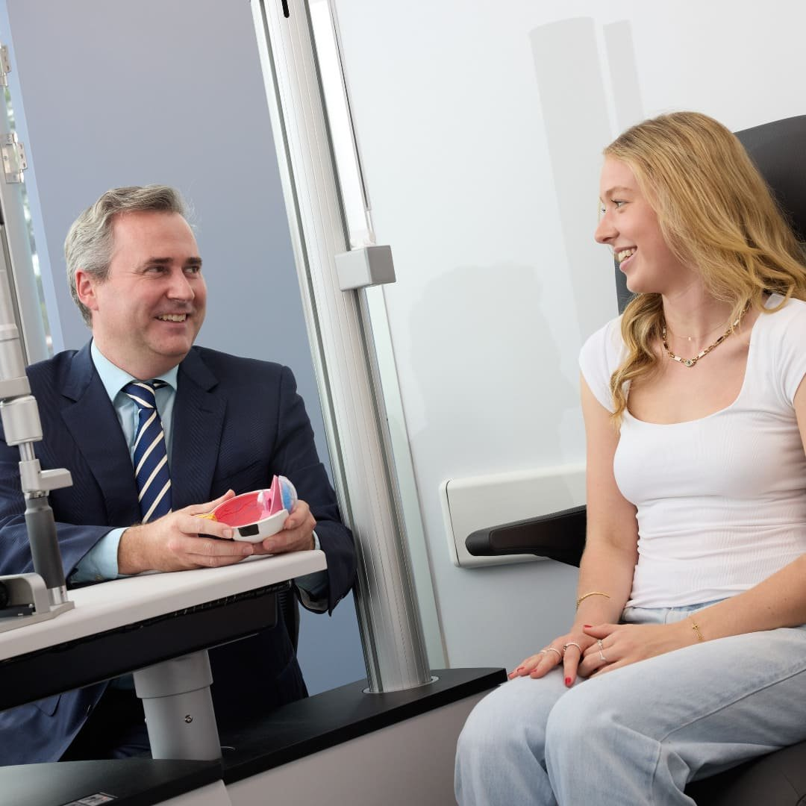

[Laser eye surgery](/vision-correction/laser-eye-surgery), especially LASIK, has become one of the most sought-after solutions for those looking to correct their vision. Despite its popularity, there are still many misconceptions surrounding the procedure. At Focus Vision, we believe that understanding the facts can help patients make more informed decisions. To help you separate fact from fiction, we’ve compiled a list of common laser eye surgery myths and the truth behind them.

### **Myth 1: Laser Eye Surgery Is Extremely Painful**

One of the most common myths about laser eye surgery is that it’s a painful procedure. The truth is, laser eye surgery is generally not painful. Before the procedure, your eye surgeon will apply numbing eye drops to ensure you feel no discomfort during the surgery itself. While you may experience some mild pressure or discomfort, most patients report feeling little to no pain. After the procedure, some people experience a mild scratching sensation or dryness, but this typically resolves within a few hours.

### **Myth 2: Laser Eye Surgery is Only for People with Severe Vision Problems**

Many people believe that laser eye surgery is only for those with severe vision problems, such as very high prescriptions. In reality, laser eye surgery is effective for a wide range of vision conditions, including nearsightedness (myopia), farsightedness (hyperopia), and astigmatism. Even individuals with moderate prescriptions can benefit from LASIK. Advances in technology have also expanded the range of conditions that can be treated. Your surgeon will assess your individual needs and determine if laser eye surgery is right for you, no matter the severity of your vision issue.

### **Myth 3: Laser Eye Surgery Doesn’t Work for Older People**

Another misconception is that laser eye surgery is only suitable for younger individuals. While it’s true that age can influence certain aspects of eye health, people over 40 can still benefit from laser eye surgery. In fact, many older adults who have been dependent on glasses or contacts for years find that LASIK or other laser procedures can significantly improve their vision.

### **Myth 4: LASIK Can Cause Permanent Night Vision Problems**

A common concern is that laser eye surgery will cause permanent night vision issues, such as halos or glare. While it’s true that some patients may experience these side effects temporarily, they are typically short-lived and improve over time. Most modern [LASIK](/blog?tag=LASIK) technologies have significantly reduced the incidence of night vision disturbances.

### **Myth 5: The Results of Laser Eye Surgery Are Not Permanent**

Some people believe that the effects of laser eye surgery wear off after a few years. The truth is that LASIK results are typically long-lasting, with the majority of patients experiencing 20/25 vision or better for many years following the procedure. However, it’s important to remember that your eyes will still age naturally over time.

### **Laser Eye Surgery at Focus Vision**

[Laser eye surgery](/vision-correction/laser-eye-surgery) has been helping people achieve clear, unaided vision for decades, and it’s only becoming more advanced. At Focus Vision, we believe in providing accurate information so our patients can make the best decision for their eye health. If you’re considering laser eye surgery, we encourage you to schedule a consultation to discuss your options, debunk any myths, and learn more about how the procedure can benefit you.

Are you ready to see clearly without glasses or contacts? [Contact Focus Vision](/contact), Brisbane’s leading laser eye surgery clinic today and let us guide you toward a clearer future!
