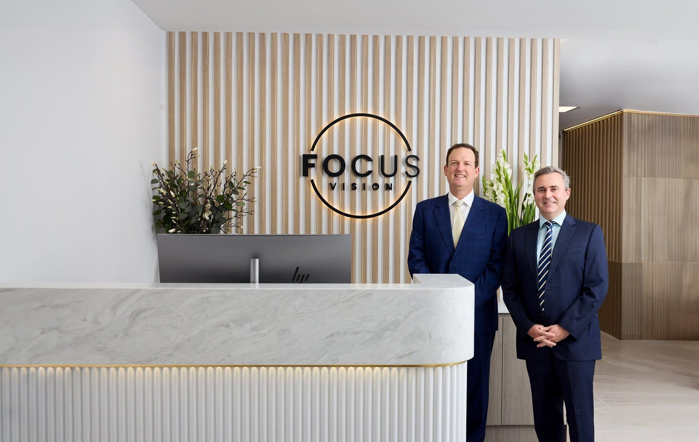

[Laser eye surgery](/vision-correction/laser-eye-surgery) provides a revolutionary solution for individuals dependent on [reading glasses](/vision-correction/laser-for-reading-glasses). As age-related changes like presbyopia make focusing on close objects difficult, laser eye surgery offers a way to regain clear near vision. By precisely reshaping the cornea, this procedure allows many to read and perform other close-up tasks without the hassle of glasses. Embrace the freedom and improved quality of life that comes with clearer, unaided vision.

## **Presbyopia**

[Presbyopia](https://en.wikipedia.org/wiki/Presbyopia) is a natural, age-related condition where the eye gradually loses its ability to focus on close objects. This usually becomes noticeable in people around their 40s or 50s. The condition occurs because the lens inside the eye becomes less flexible over time, making it harder to change shape and focus on near tasks like reading or using a smartphone. Presbyopia is a common reason why people eventually need reading glasses.

## **Laser Blended Vision**

[Laser Blended Vision surgery](/vision-correction/laser-for-reading-glasses) is an advanced procedure designed to correct presbyopia, the age-related condition that affects near vision. This surgery works by using a laser to reshape the cornea in each eye to create a subtle difference in focus between them. Typically, one eye is optimised for distance vision, while the other is adjusted for near vision. The brain then blends these two visual inputs, allowing the patient to see clearly at various distances without the need for reading glasses. Though it might seem unusual to have your eyes set differently, most people find it feels quite natural. You can test this effect beforehand using contact lenses, either with your local optometrist or with our team at [Focus Vision](/about-focus-vision), Brisbane.

This technique offers a more natural visual experience compared to traditional monovision, where the difference between the eyes is more pronounced. Laser Blended Vision is customisable, taking into account the patient’s specific visual needs and lifestyle. The result is improved depth perception, a broader range of clear vision, and greater overall satisfaction. It’s an effective, minimally invasive solution for those looking to reduce their dependence on glasses.

## **Laser Blended vs LASIK**

Laser Blended Vision surgery differs from LASIK primarily in its approach to correcting presbyopia. While LASIK typically corrects vision by reshaping the cornea for either near or distance vision in both eyes, Laser Blended Vision creates a subtle difference between the eyes—one for near and the other for distance vision. This allows the brain to blend the images, providing clear vision across multiple distances. LASIK is often used for general refractive errors like myopia or hyperopia, while Laser Blended Vision specifically targets age-related near vision loss, offering a more tailored solution for presbyopia.

## **Are You Considering Laser Blended Vision?**

Ideal candidates for a Laser Blended Vision treatment should:

- Possess good overall eye health
- Have had a stable glasses prescription for at least one year
- Be motivated to reduce or eliminate their need for reading glasses or bifocals
- Be free from other eye conditions, such as cataracts. If cataracts are present, premium cataract surgery with multifocal lens implantation is a more suitable option.

## **Get In Touch**

If you're ready to improve your vision and reduce your dependence on reading glasses, contact Focus Vision today. Our expert team of [ophthalmologists in Brisbane](/our-team) is here to help you explore your options and answer any questions you may have about Laser Blended Vision.

Reach out to us on [(07) 3239 5000](tel:0732395000) or email us at [hello@focusvision.com.au](mailto:hello@focusvision.com.au?) to schedule your consultation and take the first step towards clearer, more youthful vision.
