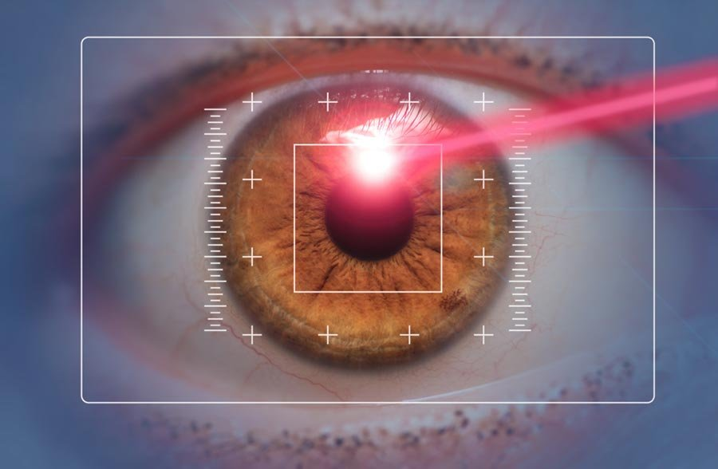
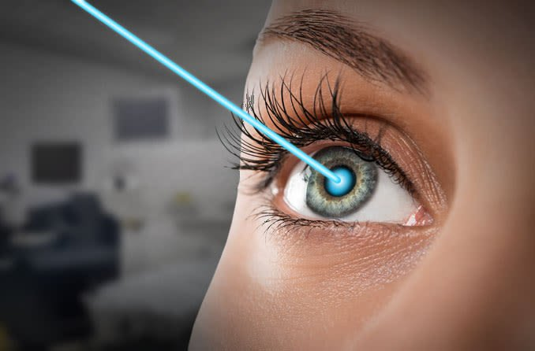
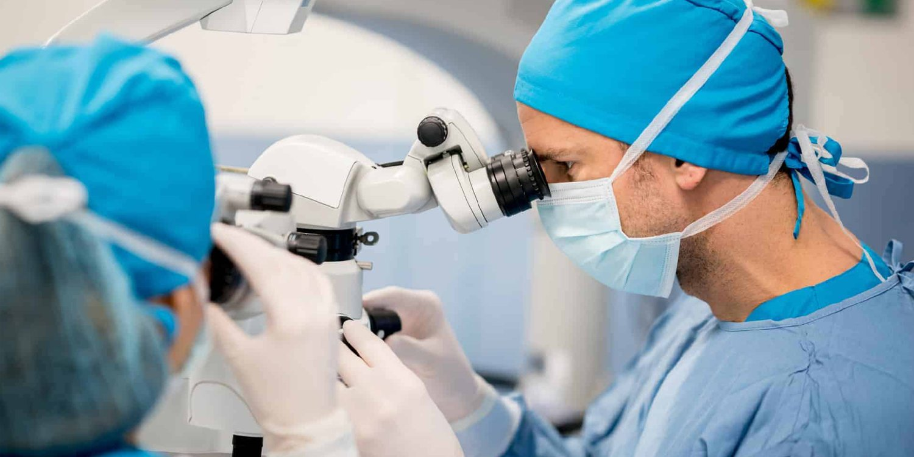
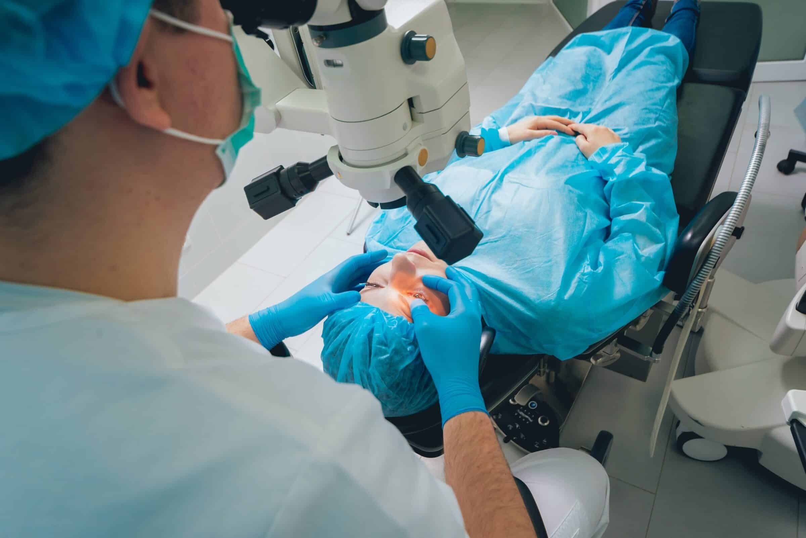
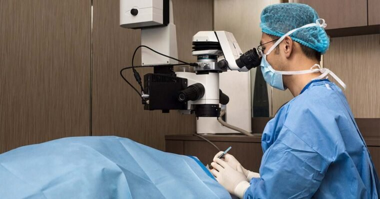

LASIK eye surgery is a popular and effective laser correction method used to treat various vision problems. But before undergoing laser eye surgery, one of the most common questions is: What is the ideal age for LASIK surgery?

Whether you're a young adult considering corrective surgery or someone older exploring options beyond glasses or contact lenses, understanding the age range, requirements, and potential risks involved is essential for making informed decisions.

In this article, we’ll explore the minimum age, upper age limit, and what makes a person a good candidate for LASIK. We’ll also look at alternatives for certain age groups and how overall eye health, vision needs, and medical history affect eligibility.

## What Is the Minimum Age for LASIK?

Most experienced LASIK surgeons recommend a minimum age of 18 years. That’s because the eyes of young adults are still developing, and performing laser surgery too early can result in unstable vision.

LASIK requires a stable prescription for at least a year to ensure lasting results and reduce the need for repeat procedures. Hormonal changes during adolescence can also affect the eyes, making the vision fluctuate.

So, even if someone meets the minimum age requirement, a thorough evaluation by an eye doctor is necessary to confirm that their prescription has remained stable.

[BOOK A FREE CONSULT](/contact)

## What Is the Best Age for LASIK?

The best age for LASIK surgery is generally between 20 and 40 years. This age group typically has healthy eyes, a stable vision prescription, and fewer age-related issues like presbyopia (also called age-related farsightedness) or cataracts.

During this period, people are often tired of wearing glasses or contact lenses, especially if they play sports, have active lifestyles, or do close-up tasks.

Vision correction procedures like LASIK can offer crystal clear vision for both distance vision and close-up vision, especially for those with severe refractive errors like myopia or astigmatism.

## LASIK in Middle Age: What to Consider in Your 40s and 50s

People in their 40s and 50s may still qualify for LASIK, but realistic expectations are crucial. At this stage, the natural lens inside the eye begins to lose flexibility, leading to age-related farsightedness, which affects close-up tasks like reading.

This is when many start needing reading glasses, even if their distance vision is good. While LASIK can still correct distant objects, it may not eliminate the need for glasses entirely.

In such cases, some eye surgeons may recommend alternatives like refractive lens exchange (RLE), where the natural lens is replaced with an artificial lens, a similar procedure to cataract surgery.

[BOOK A FREE CONSULT](/contact)

## Is There an Upper Age Limit for LASIK?

There is no strict upper age limit, but candidates over 60 need more careful screening. Age-related eye diseases such as glaucoma, macular degeneration, or cataracts may reduce the effectiveness of LASIK or make it unsafe. A comprehensive eye exam is essential to evaluate underlying tissue, the cornea’s surface, and overall visual outcomes.

If the cornea is too thin or irregular, or if the person has thinner corneas due to age or health conditions, other minimally invasive procedures may be better suited.

It’s also important to consider overall health, including medical conditions such as diabetes or autoimmune diseases, which can interfere with the healing process.

[BOOK A FREE CONSULT](/contact)

## Who Is a Good Candidate for LASIK?

To be a good candidate for LASIK, individuals should meet the following criteria:

- Be 18 years or older with a stable prescription for at least a year
- Have healthy eyes and no active eye diseases
- Not be pregnant or breastfeeding (due to hormonal changes)
- Have a stable vision prescription
- Have realistic expectations about outcomes
- Not suffer from dry eye syndrome or corneal diseases
- Not have an extremely thin cornea’s surface

A detailed consultation with an eye doctor is necessary to review family history, medical conditions, and vision goals.

## LASIK Alternatives for Older Adults

For those who don’t qualify for LASIK due to age or eye health, several other vision correction procedures are available:

- **Refractive Lens Exchange (RLE):** Ideal for those over 50, especially if signs of cataract surgery are developing. It involves replacing the natural lens with an artificial lens.
- **PRK (Photorefractive Keratectomy):** A laser surgery suitable for people with thinner corneas or those involved in high-impact sports.
- **Implantable Collamer Lenses (ICLs):** Best for severe refractive errors in younger adults who are not LASIK candidates.

## LASIK and Lifestyle Benefits

Many people choose LASIK to avoid wearing glasses or contact lenses, especially if their career or hobbies require crystal clear vision. Athletes, travelers, or those who play sports benefit greatly from laser correction, as it simplifies their lifestyle and eliminates dependency on eyewear.

Improved distance vision also enhances daily activities like driving and watching TV. However, LASIK won’t prevent the natural aging of the eye, and some may still need reading glasses in later years.

## Risks and Considerations

Like any undergoing surgery, LASIK carries potential risks:

- Blurry vision during the early healing process
- Dry eyes and glare
- Under-correction or over-correction
- Difficulty seeing close up after surgery
- In rare cases, vision loss

These risks are minimized when the procedure is performed by an experienced LASIK surgeon after a thorough evaluation of the patient's medical history and overall eye health.

## Final Thoughts

LASIK Age Limit: What You Need to Know is more than just a question of numbers it's about understanding your eyes, your health, and your vision goals. While the minimum age for LASIK is typically 18 with a stable prescription, the best age for most people falls between 20 and 40. During this period, most patients enjoy optimal outcomes and a high likelihood of achieving perfect vision.

That said, LASIK can still be a safe and effective option beyond 40, provided you undergo a thorough evaluation by an experienced LASIK surgeon. Alternatives like refractive lens exchange or cataract surgery may be better suited for older adults or those with specific medical conditions.

## FAQs

### Can LASIK give you perfect vision?

While LASIK significantly improves eyesight, it's important to have realistic expectations. LASIK can correct vision to near perfect vision (20/20) for many, especially those with mild to moderate refractive errors.

### Do most patients achieve long-term results with LASIK?

Yes, most patients experience long-lasting results after undergoing LASIK surgery, especially when performed by an experienced LASIK surgeon. Those with a stable vision prescription and no underlying eye diseases are more likely to benefit from clear, lasting distance vision.

### Is LASIK the best option to achieve perfect vision at any age?

LASIK is an excellent option for many, but not all age groups. While it can provide perfect vision for most patients in their 20s to 40s, it may not fully correct close-up vision in older adults. In such cases, procedures like refractive lens exchange or cataract surgery may be better suited depending on the individual’s overall eye health and vision needs.

[BOOK A FREE CONSULT](/contact)
