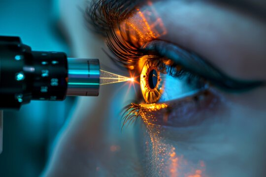
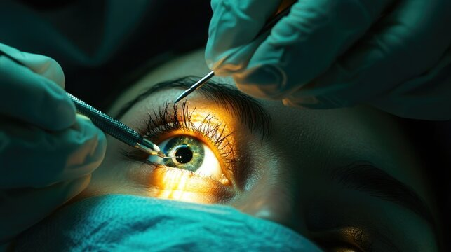
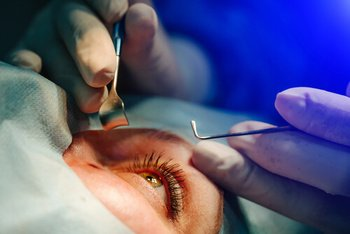
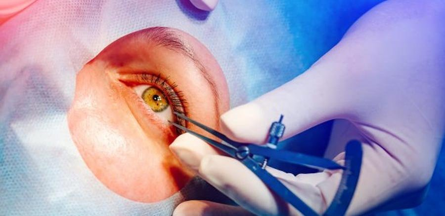
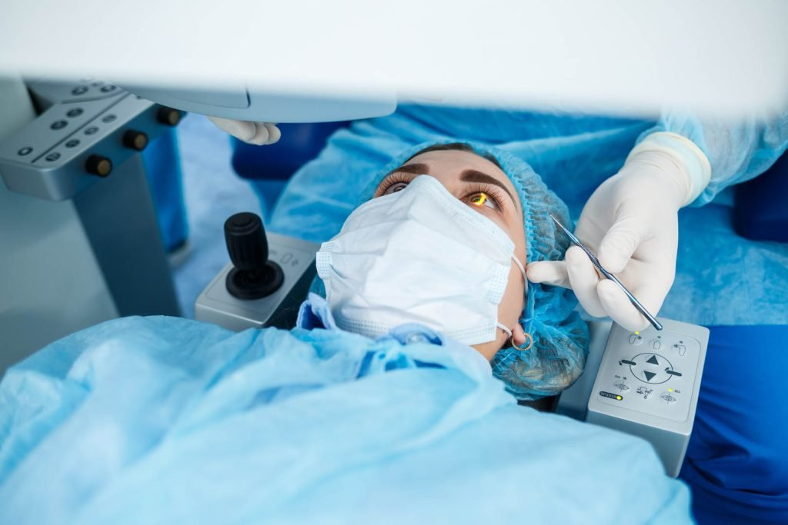

Laser-Assisted in Situ Keratomileusis, more commonly known as LASIK, is one of the most popular procedures for correcting vision problems. From those who wear glasses and contact lenses to individuals struggling with astigmatism or other refractive errors, LASIK eye surgery promises the potential of clear vision without the need for external aids.

But how successful is the LASIK procedure, and what results should you realistically expect? This comprehensive guide dives deep into the LASIK success rate, including clinical studies, risk factors, and patient experiences.

We’ll also cover common complications, surgical outcomes, and the factors that impact the sharpest possible vision after surgery. Whether you're considering refractive surgery or simply exploring your options, here’s everything you need to know.

[BOOK FREE VISIT](/contact)

## Understanding the LASIK Procedure

LASIK surgery is a type of laser eye treatment designed to correct refractive errors like myopia (nearsightedness), hyperopia (farsightedness), and astigmatism. The procedure involves reshaping the corneal tissue using an excimer laser, allowing light to properly focus on the retina.

A critical step in LASIK is creating a corneal flap, which is lifted to allow laser reshaping beneath. This laser-assisted method is considered an elective procedure but has become the go-to solution for those seeking freedom from corrective lenses.

## LASIK Success Rate: What the Studies Say

### Clinical Success and Statistics

According to multiple clinical studies, LASIK patients report high satisfaction and excellent visual outcomes. On average:

- 95% of patients achieve 20/40 vision or better.
- 85% to 90% of patients reach 20/20 vision, considered excellent vision.
- Overall patient satisfaction rates exceed 95%, making it one of the most successful laser eye procedures available.

These outcomes vary depending on other factors like prescription strength, corneal thickness, and pre-existing eye disease.

[BOOK FREE VISIT](/contact)

### Visual Acuity Improvements

The goal of LASIK is to enhance visual acuity, the clarity and sharpness of vision. After LASIK, many patients report seeing more clearly than they ever did with corrective lenses.

In particular, patients with a high degree of refractive error often see the most dramatic improvements, although they may not always achieve perfect vision.

That said, many patients can perform daily activities like reading, driving, or watching TV without needing to wear glasses or contact lenses.

[BOOK FREE VISIT](/contact)

## Factors Affecting LASIK Success

Not all outcomes are the same. The success rate can vary based on:

### 1\. Good Candidates

- Patients with stable prescriptions for at least 12 months.
- Individuals without underlying eye disease or thin corneas.
- Those over 18 years old with fully developed eyes.

### 2\. Corneal Shape and Thickness

The LASIK procedure requires a minimum corneal thickness to safely create a corneal flap. Patients with thin corneas may not qualify or may be directed to alternative options like photorefractive keratectomy (PRK) or refractive lens exchange.

### 3\. Pre-existing Vision Problems

Severe astigmatism, extreme nearsightedness, or irregular corneas can reduce the effectiveness of LASIK. However, even in these cases, partial correction can still improve quality of life.

### 4\. Lifestyle Considerations

Active individuals involved in contact sports may be at risk of displacing the corneal flap. In such cases, surface-based procedures like PRK may be recommended.

## Common Complications and Side Effects

### Temporary Side Effects

After the procedure, it's normal to experience:

- Blurred vision for a few hours to days.
- Mild light sensitivity, especially at night.
- Dryness in the eye area, requiring artificial tears.
- A gritty or burning sensation.

These symptoms usually subside during the healing process, aided by prescribed eye drops and protective eyewear.

### Surgical Complications

Though rare, LASIK may lead to:

- Eye infection
- Corneal ectasia (thinning of the cornea)
- Irregular astigmatism
- Poor night vision, especially night driving

These complications are more likely in patients who were not good candidates for LASIK to begin with.

[BOOK FREE VISIT](/contact)

## What to Expect After LASIK

### The Healing Process

Recovery typically takes a few weeks. Most patients return to work within 24–48 hours. Here’s a brief timeline:

- **Day 1–2**: Initial discomfort, numbing drops, and eye drops are used.
- **Week 1**: Vision stabilizes; avoid hot tubs, makeup, and swimming.
- **Month 1**: Most restrictions lifted; vision problems like glare reduce.
- **Month 3–6:** Final visual outcomes evident.

Avoid touching or rubbing the eye area during recovery and follow all instructions from your eye surgeon.

## Comparing LASIK to Other Vision Correction Options

### LASIK vs. PRK

Both use an excimer laser to reshape the corneal tissue, but PRK removes the surface layer rather than creating a corneal flap. PRK has a longer healing time but may be better for those with thin corneas or active lifestyles.

### LASIK vs. Refractive Lens Exchange

Refractive lens exchange (RLE) replaces the natural lens with an artificial one. This is ideal for older patients or those with presbyopia (difficulty seeing close up objects).

## Realistic Expectations for LASIK Patients

### Corrected Vision, Not Always Perfect Vision

While many achieve clear vision, not everyone attains 20/20. You may still need reading glasses for small print or night driving. The key benefit is reduced dependence on corrective tools.

### Risk vs. Reward

Despite being an elective procedure, LASIK carries risk, like any surgery. However, the overall patient satisfaction rate and long-term benefits often outweigh the rare surgical complications.

## Lifestyle Improvements After LASIK

Many LASIK patients find new freedom in everyday activities:

- No more fumbling for glasses.
- Engaging in contact sports without worry.
- Traveling without packing contact lenses or solution.
- Clearer vision upon waking up.

These benefits contribute significantly to quality of life and are a big reason why many patients choose the laser eye procedure.

## The Role of the Eye Surgeon and Eye Doctor

Choosing a highly experienced eye surgeon is crucial. Ask your eye doctor about:

- Their experience with laser eye surgery
- Equipment used, including laser assisted technology
- Success rate and common complications
- Tailored recommendations for your eye shape and visual acuity

## Enhancing Your LASIK Outcome

Here are tips to boost your chances of success:

### Before Surgery

- Discuss your full medical history.
- Stop wearing contact lenses a week prior.
- Get evaluated for eye disease or other disqualifying factors.

### After Surgery

- Use prescribed eye drops as directed.
- Avoid rubbing your eyes.
- Follow all follow-up appointments.

## LASIK Success Rate by Demographic and Eye Condition

### Astigmatism

Patients with mild to moderate astigmatism generally see excellent results. Severe astigmatism may require enhancement or additional treatment.

### Age Considerations

- **Young adults (18–30)** often get the best results with stable prescriptions.
- **Middle-aged patients** may eventually require reading glasses due to presbyopia.
- **Older adults** may be better suited for refractive lens exchange.

## Who Should Avoid LASIK?

LASIK may not be right for you if:

- You have eye disease like glaucoma or keratoconus.
- You suffer from uncontrolled diabetes or autoimmune disorders.
- You have thin corneas or scarring.
- You’re pregnant or nursing.

Always consult with an eye doctor for a personalized assessment.

## Final Thoughts: What You Can Expect

LASIK surgery offers remarkable vision correction potential for the right candidates. While it’s not a miracle cure, it significantly improves visual acuity and overall quality of life. With over two decades of development, the procedure has proven to be safe, effective, and life-changing for millions.

When considering LASIK Success Rate: What to Expect, it’s clear that most patients experience excellent results, reduced dependence on corrective lenses, and a renewed sense of visual freedom.

## FAQs About LASIK Success Rate

### What is the average success rate of LASIK?

Over 95% of LASIK patients achieve 20/40 vision or better, and around 85–90% reach 20/20 vision. Results depend on your prescription, corneal thickness, and eye health. Most patients enjoy significant improvements in visual acuity and reduced reliance on glasses or contact lenses.

### Is LASIK safe in the long term?

Yes, LASIK is safe long-term when performed on suitable candidates. Most patients experience stable vision for years with minimal complications. Rarely, issues like corneal ectasia or vision regression may occur. Dry eyes and night glare are common but usually temporary.

### Will I need glasses again after LASIK?

You may need reading glasses later in life due to age-related vision changes like presbyopia. While LASIK reduces or eliminates the need for corrective lenses, it doesn’t prevent natural changes in the eyes. Some patients with high prescriptions or night vision issues might still need glasses occasionally, but most enjoy clear, unaided vision for many daily tasks.

## Conclusion

LASIK isn’t just a laser surgery it’s a transformative experience that frees you from glasses, improves confidence, and sharpens your view of the world. Understanding the LASIK success rate and managing expectations is the first step toward making an informed decision. With proper evaluation, a skilled eye surgeon, and post-operative care, you could be well on your way to the sharpest possible vision.

[BOOK FREE VISIT](/contact)

### Outcomes we measure, not just promise

Success rates should be measured, not assumed. Dr Brendan Cronin and Dr David Gunn audit their refractive outcomes with the free [Refractive Outcomes Analyzer](/free-refractive-outcomes-analyzer) they built and shared with the global ophthalmology community — benchmarking every result against published international standards.
