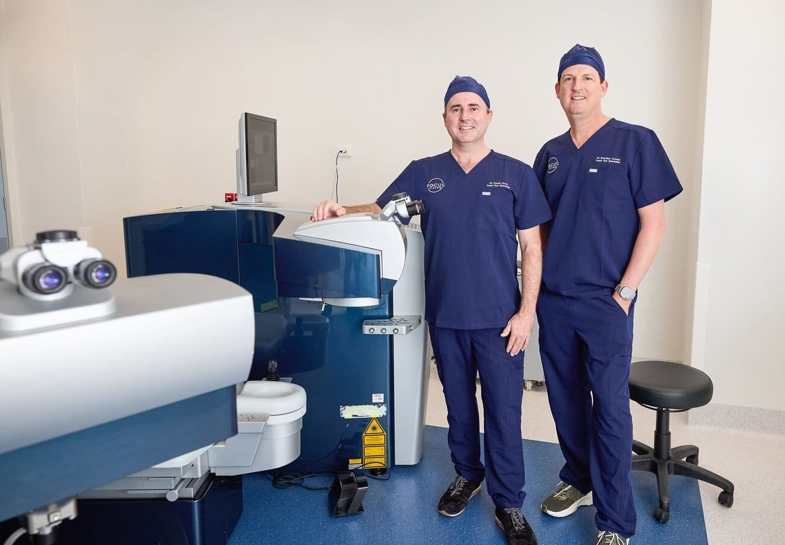

### Laser Eye Surgery in Brisbane: Discover CLEAR and the Future of Vision Correction

If you're considering [**laser eye surgery**](/vision-correction/laser-eye-surgery) **in Brisbane**, you're likely searching for the best procedure to improve your vision and free yourself from glasses or contact lenses. From traditional methods like **PRK** and **LASIK** to cutting-edge options like **CLEAR** and **SMILE**, the world of laser vision correction has evolved significantly. Understanding the differences between these procedures can help you make an informed decision about which option is right for you.

In this post, we’ll explore the three generations of laser eye surgery and focus on the benefits of CLEAR, one of the latest and most advanced technologies for vision correction.

### The Three Generations of Laser Eye Surgery

Laser eye surgery has come a long way in recent years, offering patients in Brisbane safer, more precise, and less invasive options to correct their vision. Here’s a look at the evolution of these procedures:

#### 1\. PRK (Photorefractive Keratectomy)

PRK was the first form of laser eye surgery. During PRK, the outer layer of the cornea is removed, and the underlying tissue is reshaped using an excimer laser. Although effective, PRK has a longer recovery period compared to newer procedures. It’s often recommended for individuals with thinner corneas or those who are not good candidates for LASIK.

#### 2\. LASIK (Laser-Assisted In Situ Keratomileusis)

[LASIK](https://en.wikipedia.org/wiki/LASIK) has become a household name when it comes to laser eye surgery. This procedure involves creating a thin flap in the cornea, using a laser or a microkeratome, then reshaping the underlying tissue with an excimer laser. LASIK offers a quicker recovery than PRK along with similar excellent vision correction results, but it does involve creating a corneal flap, which may not be suitable for everyone.

#### 3\. LALEX (Laser-Assisted Lenticule EXtraction)

The latest generation in laser eye surgery is **LALEX**. This goes by different brand names such as [**CLEAR**](https://crstodayeurope.com/articles/clear-lenticule-extraction/clinical-impressions-after-3-years-of-experience-with-clear/), [**SMILE**](https://www.zeiss.com/vision-care/en/eye-surgery/vision-correction-surgery/smile-laser-eye-surgery.html), [**SmartSight**](https://www.eye-tech-solutions.com/smartsight) and [**SILK**](https://digital.mivision.com.au/collections/mivision-journal-october-2023/the-launch-of-elita-silk). These procedures are minimally invasive, using a femtosecond laser to create and remove a lenticule (a small piece of tissue) from the cornea, thereby reshaping it and correcting vision errors. These advanced techniques are designed to provide similar recovery, more precision, and increased safety compared to traditional LASIK or PRK.

### CLEAR vs. SMILE: Cutting-Edge Laser Eye Surgery in Brisbane

If you're exploring **laser eye surgery options in Brisbane**, you’ve probably come across two of the most advanced procedures available today: **CLEAR** and **SMILE**. Both of these techniques fall under the **LALEX** category and offer exciting new ways to improve vision with minimal discomfort and downtime. At [Focus Vision](/about-focus-vision) we have invested in the CLEAR procedure.

#### What is CLEAR?

**CLEAR** (Corneal Lenticule Extraction for Advanced Refractive Surgery) is a state-of-the-art vision correction procedure powered by **Ziemer’s Swiss femtosecond laser technology**. The laser creates a precise lenticule inside the cornea, which is then removed through a small incision, reshaping the cornea and correcting refractive errors like myopia and astigmatism.

CLEAR is highly precise, minimally invasive, and offers several benefits:

- **No corneal flap**: Unlike LASIK, CLEAR doesn’t require the creation of a corneal flap, making it a safer and less invasive option.
- **Fast recovery**: Most patients experience significant vision improvement within a day or two, with minimal discomfort.
- **Broad applicabilion**: CLEAR is suitable for a wide range of refractive errors, including those with high degrees of myopia.
- **Low rates of dry eye**: As CLEAR does not involve creation of a flap, less nerves are interrupted by the procedure and it is rarer to see dry eye issues.

#### What is SMILE?

**SMILE** (Small Incision Lenticule Extraction) is another modern vision correction technique similar to CLEAR. Like CLEAR, SMILE involves creating a lenticule within the cornea using a femtosecond laser that is removed through a small incision. SMILE was the first generation of LALEX released by Zeiss in 2016. The CLEAR laser platform has much lower energy per spot than the SMILE platform which could potentially lead to smoother interfaces and faster recovery. CLEAR also has digital centration and cyclotorsion control which is superior to SMILE.

Both CLEAR and SMILE are excellent options for those who want a minimally invasive procedure with faster recovery times compared to LASIK.

<iframe
  width="100%"
  height="415"
  src="https://www.youtube-nocookie.com/embed/YbiK7RrRVUI?si=CQ2ScMCOty4mZI73"
  title="YouTube video player"
  frameborder="0"
  allow="accelerometer; autoplay; clipboard-write; encrypted-media; gyroscope; picture-in-picture; web-share"
  referrerpolicy="strict-origin-when-cross-origin"
  allowfullscreen
></iframe>

### Why Choose CLEAR for Laser Eye Surgery in Brisbane?

CLEAR is quickly becoming one of the most popular choices for people seeking laser eye surgery in Brisbane. Here’s why:

1. **Minimally Invasive**: CLEAR doesn’t require the creation of a flap like LASIK, meaning less tissue is disrupted. This translates to a more comfortable experience with quicker healing times.
2. **Increased Safety and Precision**: Ziemer’s femtosecond laser technology used in CLEAR offers unparalleled accuracy, ensuring the best possible outcomes with minimal risk of complications.
3. **Fast Recovery**: Thanks to the small incision and minimally invasive nature of CLEAR, most patients are back to their normal routines within 24 to 48 hours.
4. **Suitable for a Wide Range of Vision Problems**: CLEAR is effective in treating a broad range of refractive errors, including high ranges of myopia and moderate astigmatism.
5. **Long-Lasting Results**: Patients who undergo CLEAR experience stable, long-term vision correction with a very low likelihood of needing retreatment.

### Is CLEAR Right for You?

If you’re considering laser eye surgery in Brisbane and want the most advanced, minimally invasive option available, CLEAR could be the perfect choice. CLEAR is ideal for individuals who:

- Are over 18 years old
- Have a stable vision prescription
- Want to correct myopia or astigmatism
- Desire a fast recovery with minimal discomfort

## Contact Focus Vision Today and Experience Clear Vision with CLEAR in Brisbane

Experience the life-changing benefits of laser eye surgery at Focus Vision, Brisbane's leading private eye clinic. Take the first step towards clear, crisp vision and freedom from glasses and contacts by scheduling a consultation with our expert team of eye specialists. With cutting-edge technology and personalised treatment plans, we guarantee exceptional results tailored to your unique needs.

The future of laser eye surgery is here with **CLEAR**, the advanced procedure powered by **Ziemer’s femtosecond laser technology**. Whether you’re tired of dealing with glasses or contacts, or simply looking for the best **laser eye surgery in Brisbane**, CLEAR offers unparalleled safety, precision, and comfort.

Take the next step toward better vision today! Contact the team at Focus Vision to schedule a consultation and find out if CLEAR is right for you. Call us on [**(07) 3239 5005**](tel:0732395005) or email us at [**hello@focusvision.com.au**](mailto:hello@focusvision.com.au?subject=Contact%20from%20Website) to book your free assessment today.

**Keywords**: Laser eye surgery Brisbane, CLEAR laser eye surgery, SMILE surgery Brisbane, LASIK Brisbane, PRK Brisbane, LALEX procedure, Ziemer femtosecond laser, vision correction Brisbane, myopia treatment Brisbane, hyperopia surgery Brisbane, best laser eye surgery in Brisbane.
