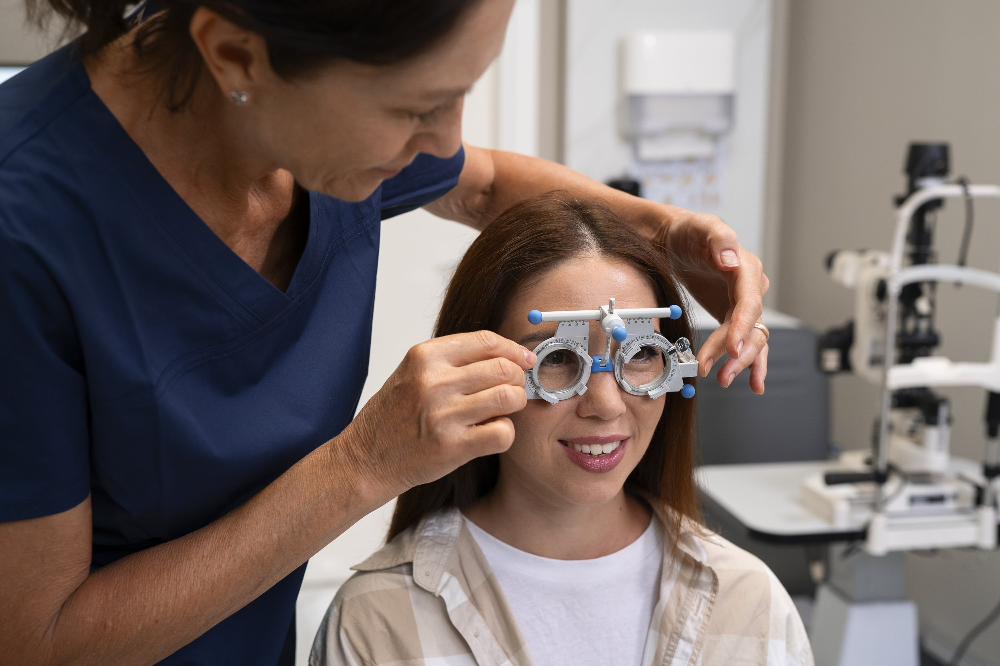
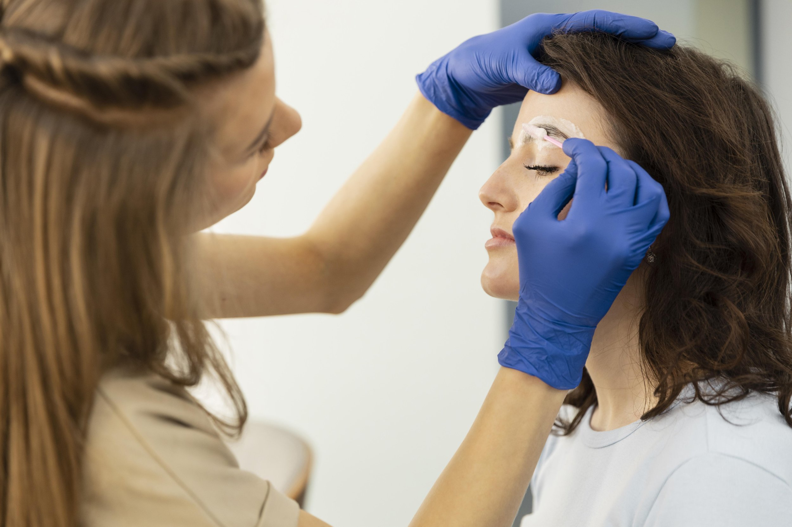

Presbyopia treatment has become increasingly important as many adults experience this common age-related vision problem. Presbyopia occurs when the natural lens of the eye loses its flexibility, making it difficult to focus on nearby objects or perform other close up tasks. This condition typically develops around middle age and affects nearly everyone to some degree. Fortunately, there are a variety of presbyopia treatment options available that can help restore clear vision and reduce eye strain.

## Understanding Presbyopia and Its Causes

Presbyopia is an age related farsightedness that happens because the lens of the eye gradually loses its ability to change shape and focus light on the retina. This loss of focusing power makes it challenging to see close up or read small print without assistance. Unlike other refractive errors such as nearsightedness or astigmatism, presbyopia specifically affects near vision while distance vision usually remains clear initially.

The risk factors for developing presbyopia include age, family history, and overall eye health. Most people begin to notice symptoms in their early to mid-40s, although the condition can progress differently depending on individual factors. Blurred vision when looking at nearby objects and visible horizontal lines when reading are common indicators that presbyopia is developing.

## Non-Surgical Presbyopia Treatment Options

For those experiencing mild to moderate presbyopia, wearing glasses or contact lenses remains the most straightforward way to correct vision. Prescription reading glasses or over the counter glasses designed for close up tasks can provide immediate relief from eye strain and blurred vision. Multifocal glasses, which have different lens powers in one pair, allow for clear vision at multiple distances without the need to switch between glasses.

Contact lenses offer another popular non-surgical presbyopia treatment. Multifocal contact lenses have zones for both distance vision and near vision, enabling wearers to see clearly without additional eyewear. Bifocal contact lenses are a type of multifocal lens that specifically divides the lens into two distinct areas for distance and near focus. Monovision contact lenses provide an alternative approach by correcting one eye for distance vision and the other for near vision, allowing the brain to adapt and combine the images for functional vision.

Wearing monovision contact lenses can take some adjustment, especially for those new to contact lenses, but many find them effective in reducing dependence on glasses or multiple pairs of lenses. Eye doctors typically perform a refraction assessment to determine the best contact lens prescription and fit for each individual.

[Book Appointment Free Assessment Free Checkup](/contact)

## Surgical Procedures to Correct Presbyopia

For individuals seeking a more permanent solution, presbyopia surgery and other surgical procedures offer promising options. Refractive surgery techniques such as laser eye surgery or LASIK surgery can sometimes be modified to address presbyopia by reshaping the cornea to improve near focus.

Refractive lens exchange, also known as lens exchange or lens implants, involves replacing the eye’s natural lens with an artificial lens or synthetic lens designed to restore focusing ability at multiple distances. This procedure is similar to cataract surgery, where the cloudy natural lens is removed and replaced with an intraocular lens. Unlike traditional cataract surgery, refractive lens exchange is performed primarily to correct presbyopia and other refractive errors before cataracts develop.

Multifocal intraocular lenses used in lens exchange surgeries provide high quality vision by allowing light to be focused at different distances simultaneously. Corneal inlays are another surgical option where a small device is implanted in the cornea to improve near vision without affecting distance vision significantly.

Eye specialists carefully evaluate candidates for presbyopia surgery based on factors such as eye health, the presence of other refractive errors, and individual lifestyle needs. While these surgical procedures carry some risks, they can significantly reduce the need for glasses or contact lenses and improve overall visual function.

[Book Appointment Free Assessment Free Checkup](/contact)

## Choosing the Right Presbyopia Treatment for You

Deciding on the best presbyopia treatment depends on several factors including the severity of presbyopia, lifestyle preferences, and eye health. For many, starting with corrective lenses such as multifocal glasses or contact lenses is a practical first step. Regular eye exams and consultations with an eye doctor are essential to monitor changes in vision and adjust prescriptions accordingly.

Those interested in more permanent solutions should discuss presbyopia surgery options with an eye specialist who can perform a comprehensive eye exam and refraction assessment. Understanding the benefits and risks of each treatment option will help ensure the best outcome for maintaining clear, comfortable vision.

In summary, presbyopia treatment has evolved to offer numerous effective solutions ranging from prescription reading glasses and multifocal contact lenses to advanced surgical procedures like refractive lens exchange and laser surgery. By addressing presbyopia early and choosing the right vision correction method, individuals can continue to enjoy high quality vision and reduce the impact of age related farsightedness on daily activities.

[Book Appointment Free Assessment Free Checkup](/contact)
