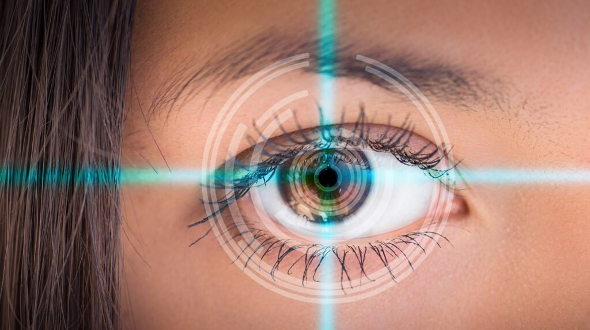
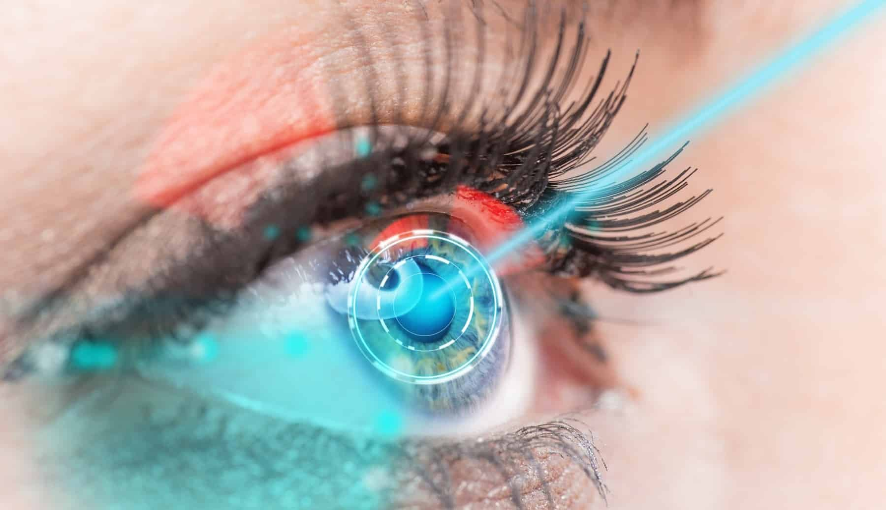
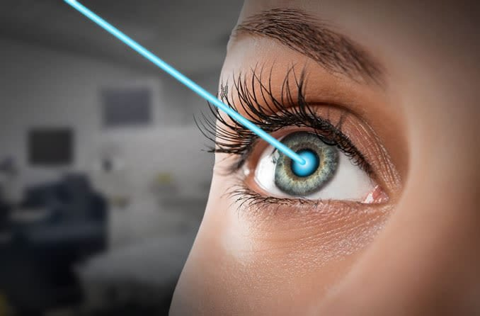
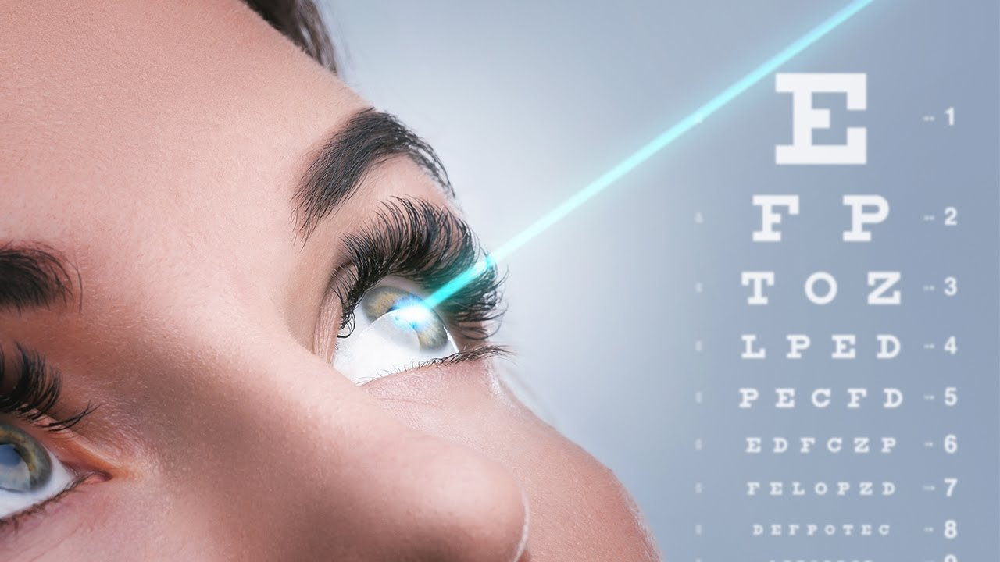

When weighing up the options for laser eye surgery in Australia, many patients first hear about SMILE (Small Incision Lenticule Extraction). While SMILE has been popular in recent years, it is worth noting that the average SMILE laser eye surgery cost ranges between **$3,000 and $4,000 per eye.** At Focus Vision in Brisbane, we often guide patients toward CLEAR eye surgery instead, as it offers a safer, more precise, and versatile alternative.

CLEAR surgery uses advanced laser technology to deliver sharper accuracy, faster recovery, and a reduced risk of dry eye compared to SMILE. Importantly, it is suitable for a wider range of prescriptions, including patients with thinner corneas. For many patients, CLEAR provides not only better value but also more reliable long-term outcomes. While SMILE involves a keyhole incision and the removal of corneal tissue, CLEAR minimises disruption to the eye’s natural structure, improving both safety and comfort.

## How CLEAR Eye Surgery Works

CLEAR is a laser refractive surgery designed to correct common refractive errors such as short-sightedness, long-sightedness, and astigmatism. Unlike SMILE, which relies on a small incision and lenticule removal, CLEAR uses a femtosecond laser to create an ultra-precise treatment zone. An excimer laser then reshapes the cornea with exceptional accuracy.

This combination of laser-assisted technology ensures that patients achieve clear vision with minimal disruption to the corneal structure. The absence of a large corneal flap (as in LASIK) or deeper keyhole incision (as in SMILE) means faster healing and reduced risk of complications.

In essence, CLEAR takes the best of modern laser eye treatment technology and applies it with even greater precision.

[GET FREE CONSULT](/contact)

## Benefits of CLEAR Compared to Other Procedures

Patients often ask why CLEAR is increasingly preferred over SMILE or LASIK. Some of the key benefits include:

- **Faster recovery**: Many patients notice improvements in their vision within 24–48 hours, with fewer side effects such as blurry vision or dry eyes.
- **Broader suitability**: CLEAR can treat a wider range of prescriptions and is appropriate for those who may not qualify for SMILE or LASIK laser eye surgery.
- **Reduced complications**: By avoiding large incisions or a traditional corneal flap, CLEAR lowers risks linked to exposed corneal tissue and post-operative discomfort.
- **Long-term stability**: Because the underlying corneal tissue remains more intact, there is greater structural strength and reduced risk of regression over time.
- **Comfort and safety**: With advanced technology and precise control, CLEAR ensures a safer surgical procedure performed by an appropriately qualified health practitioner.

## CLEAR vs LASIK vs SMILE

While LASIK eye surgery has been the gold standard for decades, and SMILE is widely marketed, CLEAR is emerging as the most advanced choice.

- **LASIK procedure**: Involves creating a thin flap on the cornea, lifting it, and reshaping the focusing power with an excimer laser. It delivers quick results but carries a small risk of flap-related complications.
- **SMILE procedure**: Uses a keyhole incision and lenticule removal, avoiding a flap but is limited in suitability for higher prescriptions and causes some patients to experience prolonged blurred vision.
- **CLEAR procedure**: Combines the precision of LASIK with the minimally invasive benefits of SMILE, offering the best of both worlds—clear vision, reduced risk of dry eyes, and suitability for more patients.

This is why many patients and the most accomplished surgeons now consider CLEAR the leading option in laser refractive surgery.

## Cost of CLEAR vs SMILE and LASIK

When considering eye surgery, cost is often a major factor. In Australia, the smile eye surgery cost typically ranges from $3,000–$4,000 per eye, while lasik cost is usually similar.

CLEAR is competitively priced at Focus Vision, offering greater value given its advantages. It is important to look beyond the upfront cost and consider potential hidden costs, such as:

- Consultation fees
- Follow-up visits or follow-up appointments
- Possible enhancement procedures if vision regresses
- Cost of ongoing eye drops and management of side effects

Unlike glasses or implantable contact lenses, CLEAR is a one-time expense that delivers lasting visual freedom.

## Recovery Expectations After CLEAR Surgery

Most patients are surprised at how quickly they recover after CLEAR. While some experience mild blurry vision or dryness immediately after, these usually resolve within days. Vision often stabilises rapidly, with many returning to work and daily activities in just a few days.

Clear aftercare is essential for protecting long-term results. This includes:

- Using prescribed eye drops regularly
- Attending scheduled follow-up visits
- Avoiding swimming or dusty environments during the early healing phase

By following your surgeon’s advice, you maximise both comfort and outcomes.

## Risks and Considerations

Every surgical or invasive procedure carries some risks, and CLEAR is no exception. Potential risks may include temporary dryness, light sensitivity, or mild visual disturbances such as halos or glare. However, serious complications are rare, particularly when performed by an experienced ophthalmologist.

Patients should always ensure their surgeon has extensive training, access to advanced technology, and proven surgeon experience. At Focus Vision, our team includes some of the most accomplished surgeons in Australia, giving patients confidence in their choice.

## The Role of Initial Consultation and Eye Health

Before undergoing any laser vision correction procedure, it is essential to schedule an initial consultation. This assessment allows your surgeon to check your overall eye health, prescription stability, and suitability for surgery. Factors such as corneal thickness, tear film quality, and general medical history all play an important role in deciding whether CLEAR, LASIK, or small incision lenticular extraction (SMILE) is the right choice.

The consultation also gives patients the chance to ask questions about laser surgery, understand the steps involved in the initial surgery, and learn about recovery expectations. At Focus Vision, we make this the focal point of the patient journey, ensuring every individual feels informed and supported.

[GET FREE CONSULT](/contact)

## Why Laser Surgery is a Smart Long-Term Investment

Investing in laser treatment is about more than improving sight—it’s about long-term quality of life. By correcting refractive errors, procedures like CLEAR allow patients to reduce or eliminate their reliance on glasses and contact lenses. The result is greater freedom, enhanced confidence, and fewer day-to-day frustrations.

Unlike spectacles or lenses, which can wear out or need frequent replacement, laser vision correction is a one-time expense that continues to deliver benefits for decades. When balanced against the procedure cost, CLEAR stands out as a reliable, safe, and effective way to achieve lasting independence from corrective eyewear.

## Who Makes a Good Candidate?

Not everyone is suited to SMILE, LASIK, or even PRK (photorefractive keratectomy). CLEAR, however, covers a broader spectrum of patients. You may be a suitable candidate if you:

- Are over 18 with stable vision
- Have healthy eyes free from serious disease
- Struggle with wearing glasses or wear contact lenses daily
- Have short-sightedness, long-sightedness, or astigmatism
- Desire long-term visual freedom without ongoing reliance on corrective lenses

Those with other conditions may still benefit from alternative treatments such as cataract surgery or cataract treatment, which our clinic also provides.

## Payment Options and Support

At Focus Vision Brisbane, we understand that cost is a significant consideration. That’s why we offer:

- Flexible payment plans and payment options
- Guidance on claiming with your health fund or private health insurance policies
- Information on waiting periods for cover
- Free assessments to determine candidacy

This ensures that many patients can access the treatment they need without unnecessary financial stress.

## Conclusion

Choosing the right laser eye surgery procedure is about more than comparing the procedure cost. While the cost of laser eye surgery may seem high, it is a lifetime investment in clear vision and independence from glasses or contact lenses.

At Focus Vision Brisbane, our team of dedicated specialists provides personalised guidance, whether you’re considering LASIK surgery, SMILE, or CLEAR. For many patients, CLEAR stands out as the safest, most advanced, and most cost-effective path toward lasting visual freedom.
