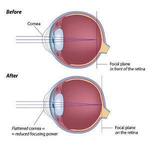
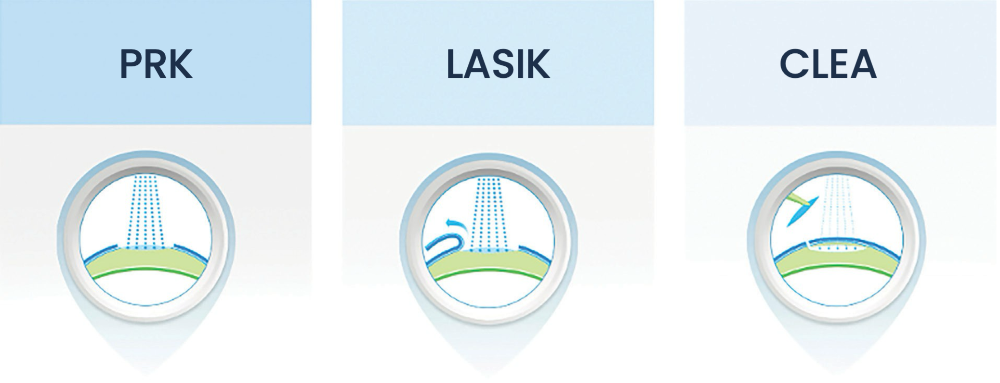
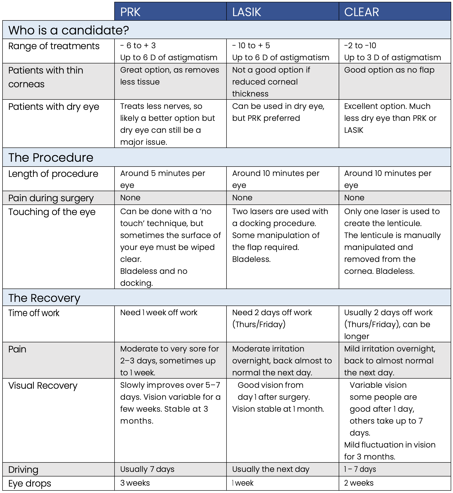
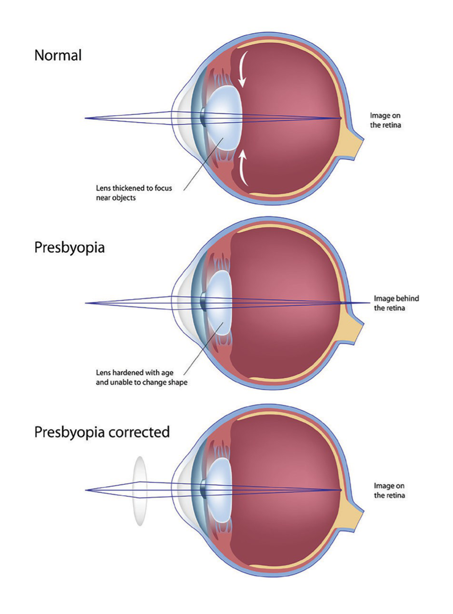
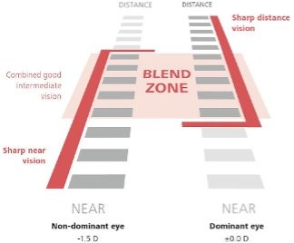
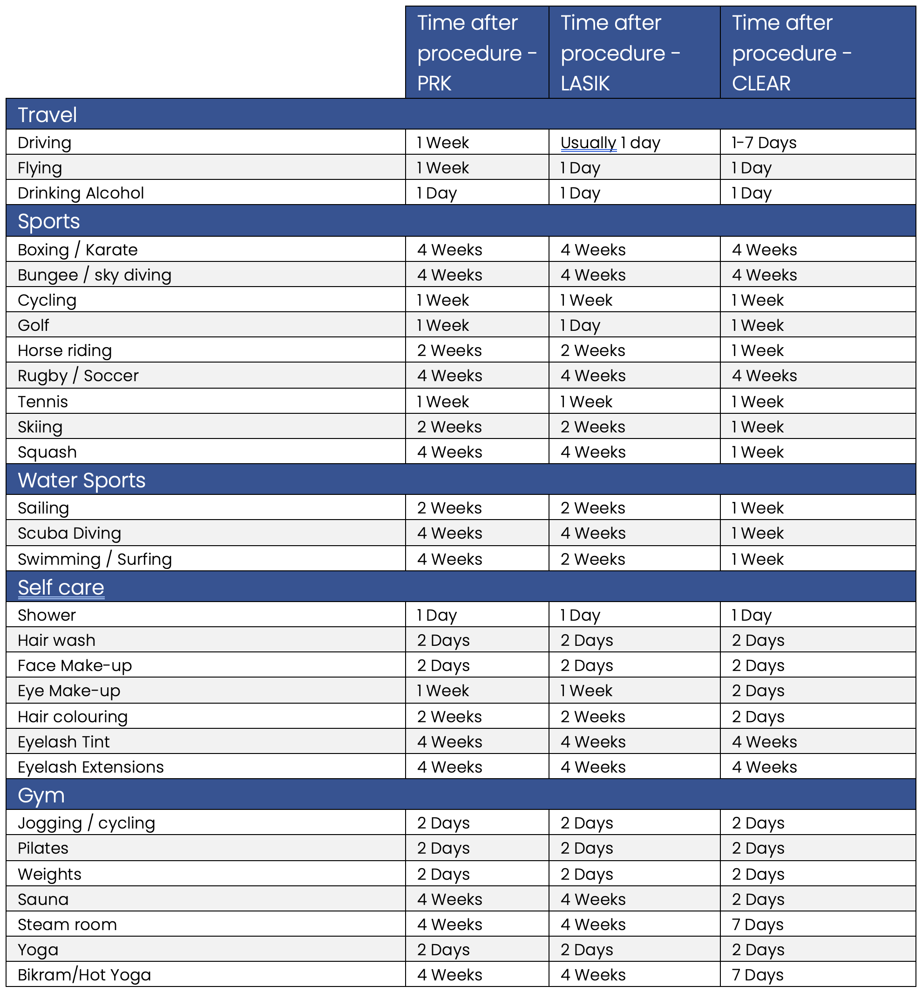

**LASER REFRACTIVE EYE SURGERY**

What is laser eye surgery?

Laser eye surgery offers people the potential to be free from spectacles. It has been widely available to patients worldwide since the early 1990s. Focus Vision is proud to be able to offer patients laser eye surgery with the only hospital-based laser in Queensland.

HOW DOES IT WORK?

All types of [laser eye surgery](/vision-correction/laser-eye-surgery) work on the same principle – reshaping the clear window at the front of your eye called the cornea. Your cornea looks coloured, but the colouring is actually inside the eye and is called the iris. The cornea is the most important focusing component of your eye. Laser eye surgery reshapes your cornea to make it microscopically flatter or steeper to incorporate your glasses script. The laser does this by removing an extremely precise amount of tissue.

The laser can treat myopia (short sightedness), hyperopia (far sightedness) and astigmatism.

**What types of laser can I have?**

There are 3 major types of laser eye surgery; PRK, LASIK and Lenticule extraction/CLEAR.

There is no “safest” procedure as each type has different risks and benefits. Thankfully, modern laser vision correction is one of the safest medical procedures available. Some patients are better suited to one procedure over another.

PRK and LASIK are performed on the same type of laser called an “excimer” laser. Both procedures involve your cornea being microscopically reshaped by the laser.

In LASIK, a flap of tissue from the surface of your cornea is formed with a “Femtosecond” laser and lifted to expose the underlying tissue. This deeper corneal tissue is then reshaped with an “Excimer” laser. The flap is then replaced. The eye is generally uncomfortable overnight but patients see well the next day.

While the recovery from LASIK is very fast, the potential downside is that the creation of the flap can have very rare complications. In PRK there is no flap of tissue created. Instead, the surface layer of cells of the cornea (epithelium) are removed either manually or with the laser itself. The surface of the cornea is then reshaped with the “Excimer” laser to incorporate the strength of your glasses. The recovery from PRK is slower than LASIK and your eye will be very sore for a few days. However, the eye is left stronger with no risk of complications related to having a flap created.

[Lenticule extraction](https://en.wikipedia.org/wiki/Small_incision_lenticule_extraction) is the latest form of laser eye surgery. It goes by a number of brand names including CLEAR, Smile, SmartSight and Silk. For all of these procedures the technique is to use the laser to create a lenticule (lens) within the cornea that is removed through a small incision.

**About your procedure**

**More about laser eye surgery**

DO I HAVE TO BE AWAKE?

Laser eye surgery is painless and very fast. You will be offered a mild sedative before the surgery to relax you. Most patients are pleasantly surprised by how easy & simple the process is.

WHAT IF MY EYE MOVES DURING SURGERY?

The laser has amazing technology to track and reshape your eye, even when it is moving. You will have a scan in the clinic to analyse the details of your iris. This data is then imported into the laser. When you lie down under the laser it will then detect your iris and register whether it is your left or right eye. Once the laser starts, it tracks the movement of your eye 1050 times per second and adjusts for any movements that you make. If you move too much, the laser will stop until your eye returns to the correct position.

HEALTH FUNDS

Normally, health funds will not cover the cost of laser eye surgery; however, some health funds will offer a rebate, and some will cover most of the cost as a part of your ‘extras’ cover if you have it. You will need to discuss this with your health fund.

ARE THERE ALTERNATIVES TO LASER EYE SURGERY?

There are alternatives to laser eye surgery that may still be able to help you to be free from glasses.

ORTHOKERATOLOGY (ORTHO-K)

This involves wearing a contact lens while you sleep that reshapes your cornea to give you good vision throughout the day without glasses Ortho-k is great for people with eyes that are too dry for normal contact lenses.

MODERN CONTACT LENSES

We now have many different contact lens types and materials available to choose from. Just because you are allergic to or cannot tolerate one type of contact lens does not mean you won’t be able to tolerate another type extremely well.

IMPLANTABLE COLLAMER LENSES (ICL)

These are a better option for patients with very high prescriptions , dry eye, or corneal problems that mean they aren’t a good candidate for laser.

REFRACTIVE LENS EXCHANGE (RLE)

This is usually avoided until you are mid 40’s to 50 as your lens is still functional before this age.

**Laser eye surgery when you are over 40**

(ONLY READ THIS SECTION IF YOU ARE 40 YEARS OR OLDER)

Once you reach the age of 40, we need to consider the ageing of your eyes when we plan laser eye surgery. In the eye of a 20 year old, muscles around the lens constrict and the lens changes shape to bring the focus from the distance to near. As the lens ages, this ability starts to degrade. In the early 40’s, most people find that they have to hold whatever they are reading further and further away to see it. By the age of 45, most people can’t read at near anymore without the help of reading glasses. This problem is called “presbyopia” and it is related to the aging of the lens. If we simply laser both of your eyes to give clear distance vision, you will need reading glasses. There is no effective treatment or exercise that can help your natural lens to change focus again.

HOW CAN I READ AGAIN?

For most people they simply buy a pair of reading glasses. For people who are already in glasses, they will change to graduated or bifocal glasses and look through the bottom to read. However many people find reading glasses annoying or don’t like how they feel and appear.

CAN I FIX THIS PROBLEM WITHOUT GLASSES?

Contact lenses can be used to create an effect called “blended vision” or “monovision”. This is where the dominant eye (usually the right eye in a right-handed person) is focussed at distance and the non-dominant eye is set for reading. Although this sounds strange, most people really like the effect and adapt very quickly. Others however find the difference between their eyes uncomfortable.

The stronger the contact lens in the near seeing eye, the better the reading vision, but the more patients will notice blur for distance and depth perception may be affected. After many years perfecting this method, modern blended vision tends to aim for around -1.50D

correction in the near eye that gives a focus distance of around 70cm. If you like the effect of blended vision in contact lenses, this power can be made permanent in the eye with laser eye surgery (LASIK, PRK, CLEAR or ICL) so contacts aren’t required.

**Laser blended vision**

(ONLY READ THIS SECTION IF YOU ARE 40 YEARS OR OLDER)

I HAVEN’T TRIED BLENDED VISION BEFORE, HOW DO I KNOW IF I WILL LIKE IT?

If you already use blended vision in [contact lenses](/vision-correction/implantable-contact-lens) then we can proceed straight to laser. If you haven’t tried blended vision we will perform a contact lens trial for you here at Focus Vision. We may have the contact lenses to do this on the same day as your assessment, or we may need to order them specially in if you have astigmatism. We would recommend spending at least a few hours in the contact lenses to make sure you like the effect. Do some near work, look in the distance and it is a good idea to try driving or being in a car.

You are trying to check a number of things:

1.           That you feel okay with the cross blur between your eyes.

2.          That your depth perception is not affected (it usually isn’t affected at the powers we use).

3.          That there is enough reading vision with the power we have put in your near eye.

Once you are happy with the result you can call the clinic or email: hello@focusvision.com.au to book in for your surgery. If you do not like the effect, the other option is to avoid laser and undergo a refractive lens exchange with implantation of multifocal intraocular lenses.

Our optometrist will discuss this option with you if you are a candidate.

ARE THERE ANY OTHER OPTIONS SUCH AS LENS SURGERY?

If you are under 50, laser eye surgery is usually a better option than lens surgery. Exchanging your lens for a multifocal intraocular lens is usually a better option over the age of 60. Between 50 and 60 years old what is best is a case by case basis. For some patients (particularly long sighted or hyperopic) it may be better to do implantable contact lens or lens exchange surgery rather than laser from the late 30’s onwards.

Laser blended vision: The right eye is set for distance focus, and the left eye is set for 70cm focal range. Together, the eyes have a range of focus where the vision is blended to give a continuous range.

**Before the day of your surgery**

TIME OFF FOR PRK

You should plan to take 1 week off work. Your eye will be too uncomfortable to do anything other than rest and relax for two to three days after surgery. People who have the procedure on a Thursday will generally be back at work on the Wednesday or Thursday the next week. At this stage many will have mildly irritated eyes and slightly blurred vision.

You will not be able to drive until you see one of our team at your one week visit. At this stage 19 out of 20 people can drive. About 1 in 20 people still need another week or two before they can drive. Some patients will take slightly longer to recover and if you have a very demanding job, planning to take the whole next week off can make things easier for you.

Reading computer screens or phones will be a bit challenging for a few weeks after surgery while the eyes recover. This is completely normal and should resolve.

TIME OFF FOR CLEAR

You should plan to take a few days off after your procedure. People who have the procedure on a Thursday or Friday will generally be back at work on the Monday but many people find that their vision fluctuates significantly for that week so you do need to factor that into your work. Some patients will take longer to recover and if you have a very demanding job, planning to take the whole next week off can make things easier for you.

TIME OFF FOR LASIK

You will need two days off. One for the procedure and the next day (for your post op check). Normally you can drive home from this appointment.

WILL I NEED HELP AT HOME?

You will have sore eyes and blurred vision after surgery so it is a great idea if you have someone around who can assist you for a few days after PRK or just overnight if after LASIK. You must have a carer with you to take you home after the procedure.

PREPARATION & CONTACT LENSES

You must be out of your contact lenses for 7 days prior to both your initial assessment in clinic and your laser surgery. Don’t worry, if you have worn your lenses within 7 days of your initial review appointment we can just arrange to get you back to recheck the measurements. If you wear hard contact lenses or “ortho-k” then you will need to be out of the lenses for longer.

POST OP DROPS

You will be given your post-op drops on the day of surgery. There will be payment details in the package.

**On the day of your procedure**

You cannot drive yourself home on the day of your surgery. You must have a carer or responsible adult with you on the day of your operation. They will need to accompany you home. Your carer does not have to wait at the day theatre for the entire time that you are there – the staff can just call them when you are ready to be collected. Please remind the person collecting you to leave their mobile phone on.

When you arrive at the day surgery you will first be checked in by one of the administration staff. They will check all of your contact details and information. A nurse will then take you to an interview room where your medical history will be checked, your consent form reviewed and any questions that you may have will be answered. At this point you will put a gown and shoe covers on over your normal clothes.

**LASIK**

**About your LASIK procedure**

- The LASIK procedure will take 25 minutes in total, but you should plan on being in the hospital for 2 hours.
- You will be lying flat on a comfortable bed.
- Your eye will be numbed with local anaesthetic drops and a small clip called a speculum will be placed on your eyelids to stop your eye from closing in the procedure.
- LASIK involves two different lasers that are side-by-side. The first creates the flap in your cornea and the second reshapes your cornea to mirror the strength of your glasses.
- For the flap creation, the laser will lower onto your eye. You will feel some firm pressure and your vision will go dark for a few moments. This is the laser forming the flap After the flap is created your vision will be very blurry.
- The bed will then move under the second laser that reshapes the cornea.
- The flap will then be gently lifted by your surgeon. You may feel some slight touching on the surface but no pain from this.
- You will then see a green blinking light that you need to focus on.
- The laser treatment will then start - you will hear a noise from the machine and see lots of lights - just keep looking at the green and hold as still as you can. You will feel no pain at all.
- As the laser treats your eye, you may smell a burning odour. Don’t worry, nothing is on fire. That is just the laser treating your eye and it will only last for a few moments.
- After the procedure, your surgeon will check you and then clear plastic goggles will be placed over your eyes so that you do not rub them. You must wear these overnight.
- You will be taken to the recovery room where the nurses will go through all of your postoperative information.
- Start using your drops as soon as you get home.

WHEN YOU GET HOME

- You will be able to see but things won’t be clear yet.
- It is important to keep wearing the shields that first day.
- When you get home your eyes may be streaming with tears and feel scratchy, it is a good idea to have a sleep - you will feel much better when you wake up.

After your LASIK procedure

DURING THE DAY

- You will have some [post-operative sunglasses](/vision-correction/laser-for-reading-glasses) in your pack. These are not the world’s most stylish eyewear, so feel free to wear your own! When you are outside, wearing sunglasses is a great way to remind you to not rub your eyes.
- Many people get some clear safety glasses to wear when they are inside.
- You don’t have to wear sunglasses after LASIK, but they do protect your eyes and the skin around your eyes from the harmful effects of UV radiation.

AT NIGHT

- You should wear your eye shields when you sleep for seven days after the surgery.
- You will have a roll of micropore tape with your postoperative pack. Many people use this to tape secure the eye shields so that they do not dislodge and become uncomfortable overnight.

EYE RUBBING & POST-OP GLASSES

It is EXTREMELY important that you do not rub your eyes for seven days after the surgery. Using post-operative glasses or eye shields makes this much easier.

LASIK: Follow-Up Appointments & Typical Recovery

1 day post-op appointment

80% visual recovery. We like to see you the next day after LASIK to check that your flap is looking good and nothing has moved that first night.

You will be able to see, but not perfectly yet. You will be seeing haloes at night and ghosting on screens and your phone. Reading at near may feel a bit difficult for the first week or two. This is normal and will resolve.

1 week post-op appointment

90% visual recovery. Some fluctuation in vision at this stage is normal. Keep your eyes lubricated regularly to speed the healing. Fluctuating vision is due to dry eyes at this stage – lubricate them regularly.

You can generally drive to this appointment.

3 month post-op appointment

100% visual recovery. Dryness may be more of an issue now. Keep using your lubricants and continue your omega-3 capsules if you decided to take them. Generally, this is your last appointment. If you do not reside in Brisbane, this appointment can be arranged with your local optometrist

**PRK**

About your PRK procedure

- The PRK procedure will take 10–20 minutes in total, but you should plan on being in the hospital for two hours.
- Sometimes an icepack will be placed over your eyes before the laser or after the procedure for a few minutes. Icepacks are great for post-operative pain relief.
- Your eye will be numbed with local anaesthetic drops and a small clip called a speculum will be placed on your eyelids to stop your eye from closing in the procedure.
- The surface layer of cells (epithelium) will be removed from your cornea by either being manually wiped away or else by the laser. It takes 3–4 days for these surface cells to regrow. Your eye will be sore for these few days. You will be much more comfortable with the eye closed.
- As the laser treats your eye, you may smell a burning odour. Don’t worry, nothing is on fire. That is just the laser treating your eye and it will only last for a few moments.
- The laser part of the procedure rarely takes more than 60 seconds.
- For the actual laser part, you will see blinking lights up inside the machine, with a green light in the centre. Your Doctor will ask you to look at this light as much as possible and to try and keep still.
- You should not experience any pain at all during the procedure.
- At the end of the procedure a small disc soaked in medication will be placed onto your cornea for about 20 seconds.
- After this, a very cold solution is applied to your eye. It only feels cold for a few seconds.
- You will be taken to the recovery room where the nurses will go through all of your postoperative information.
- Keeping both eyes closed and keeping yourself occupied with audiobooks, music or podcasts is generally the best way to stay comfortable after the procedure.
- A special bandage contact lens will have been placed on your eye at the end of the procedure. If this falls out, do not try to replace it – just throw it away. If the lens is too uncomfortable, you are welcome to remove it yourself or call Focus Vision to come in and have it removed. You do not need an eye pad or covering.
- Once you get home, start taking the pain medication you have been given and try to get some rest. It is better to start the pain medication before you get the pain.
- Make sure you use all of the eye drops religiously. This includes the lubricating drops – they are extremely important, especially in the first week. Even if your eye is watering, you still need them.

After your PRK procedure

**DON’T**

- Forget your medications
- Rub your eyes

**DO**

- Follow the instructions in this booklet
- Report any sudden change in vision, severe pain or other concerns to us immediately
- Wear your sunglasses religiously. (This only applied to PRK not LASIK)

SUNGLASSES AFTER PRK

You MUST wear your sunglasses whenever you go outside for the first three weeks, even if it is just to check the mailbox or put clothes on the line. After that initial three-week period, you should wear your sunglasses most of the time that you are outside, for a total of three months. Failure to wear these can result in an abnormal scarring reaction in your cornea.

WHAT ARE APPROPRIATE SUNGLASSES?

- The pair you will be given in your post- operative pack.
- A pair of good quality sunglasses, either wrap around or with thick sides (not aviators), that meet the Australia UV400 guidelines
- Your optometrist will normally be able to recommend a very good pair.

PRK: Follow-Up Appointments & Typical Recovery

**1 week post-op appointment**

80% visual recovery. Pain should be gone but the eye may be mildly irritated. Some fluctuation in vision at this stage is normal. Using your lubricating drops regularly is critical to having good vision at your

1-week appointment. The more you use your lubricating drops the faster you will recover. Some people even do them hourly when they are awake.

**3 month post-op appointment**

95% visual recovery. Dryness may be more of an issue now.

Keep using your lubricants and continue your omega-3 capsules

if you decided to take them. 100% recovery over the next few months.

This is usually your last visit if all is going well. If you do not reside in Brisbane, this visit can be performed with your local optometrist.

**CLEAR**

About your CLEAR Procedure

- The CLEAR procedure will take about 25 minutes in total, but you should plan on being in the hospital for 2 to 3 hours to accommodate your admission and recovery time.
- You will be lying flat on a comfortable bed.
- Your eye will be numbed with local anaesthetic drops and a small clip called a speculum will be placed on your eyelids to stop your eye from closing in the procedure.
- CLEAR involves a laser that reshapes your cornea by creating a small lens (lenticule) of tissue in your cornea that is remove to correct your vision without glasses. This lenticule is removed through a very small incision.
- For the lenticule creation, the laser will lower onto your eye. You will feel some firm pressure and your vision will go dark for approximately one minute. This is the laser forming the lenticule. After this is created your vision will be very blurry.
- Next, a microscope and delicate instruments are used to separate and remove the lenticule out through a keyhole incision. This is not painful but you will feel gentle manipulation on the surface.
- After the procedure clear plastic goggles will be placed over your eyes so that you do not rub them. You must wear these overnight.
- You will be taken to the recovery room where the nurses will go through all of your postoperative information.
- Start using your drops as soon as you get home.

WHEN YOU GET HOME

- You will be able to see but things definitely won’t be clear yet. Most people find their vision to be very misty for 24 hours. Remember your vision will fluctuate significantly for approximately 7 days.
- It is important to keep wearing the shields that first day.
- When you get home your eyes may be streaming with tears and feel scratchy, it is a good idea to have a sleep - you will feel much better when you wake up.

After your CLEAR procedure

DURING THE DAY

- You will have some post-operative sunglasses in your pack. These are not the world’s most stylish eyewear, so feel free to wear your own! When you are outside, wearing sunglasses is a great way to remind you to not rub your eyes. You don’t have to wear sunglasses after CLEAR, but they do protect your eyes and the skin around your eyes from the harmful effects of UV radiation.

AT NIGHT

- You should wear your eye shields when you sleep for two days after the surgery.
- You will have a roll of micropore tape with your postoperative pack. Many people use this to tape secure the eye shields so that they do not dislodge and become uncomfortable overnight.

EYE RUBBING & POST-OP GLASSES

Avoiding eye rubbing after CLEAR is not as critical as it is post LASIK but ideally it is best if you can avoid rubbing your eyes for 7 days.

CLEAR Follow-up appointments & Typical Recovery

**1 day post-op appointment**

80% visual recovery. You will be able to see, but definitely not perfectly yet. You will be seeing haloes at night and ghosting on screens and your phone. Reading at near may feel a bit difficult for the first week or two. This is normal and will resolve. Expect your vision to fluctuate significantly for the first week.

Do not drive to this appointment.

**1 week post op appointment**

80+% visual recovery. Some fluctuation in vision at this stage is normal but it is rare for it to interfere with your day to day functions. You can normally drive to this appointment.

**3 month post-op appointment**

100% visual recovery. Generally, this is your last appointment. If you do not reside in Brisbane, this appointment can be arranged with your local optometrist.

**Resuming normal activities**

The following is a list of activities & the suggested duration to leave post-op before resuming them.

**EVERYONE GETS DRY EYES AFTER LASER EYE SURGERY.**

Treating dry eyes appropriately is vital to a good recovery. The main issue with dryness is that your eyes rarely actually feel dry. Some people will feel this as a dry scratchy sensation, but most people notice it as blurred vision. This is because the nerves in your cornea will be disrupted by the laser treatment, so they will not actually sense the dryness and will not send the message to your brain that you need to make more tears. The dry eyes then make your tears salty. The salty tears make your eyes dryer, and a vicious circle is created that continues to get worse if you do not treat it religiously.

Your corneal nerves will regenerate after approximately three months, but you MUST use your lubricants as prescribed in this period.

Taking a high-quality omega-3 supplement starting one week prior to your surgery and continuing it for two months afterwards has been shown to speed your recovery and reduce the post-operative dry eye.

FOCUS VISION recommend that you purchase a high-quality omega-3 supplement, such as:

- Lacritec: [www.lacritec.com.au](http://www.lacritec.com.au/)
- If you are vegetarian, then use an algae based omega-3 supplement.

REMEMBER: Dry and sore eyes can be a permanent problem after laser eye surgery. Anything you can do to reduce the problem is a good idea!
