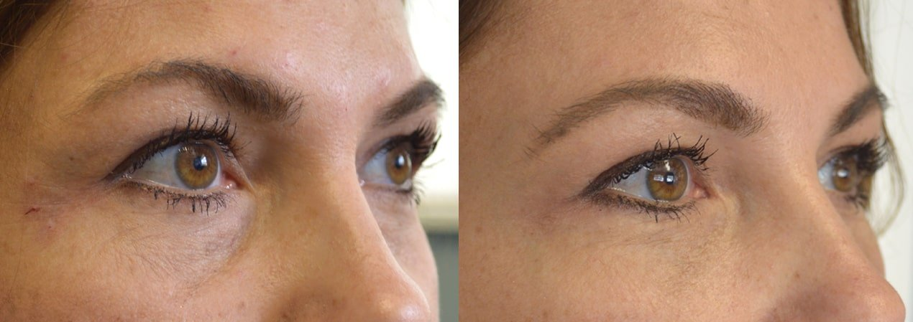
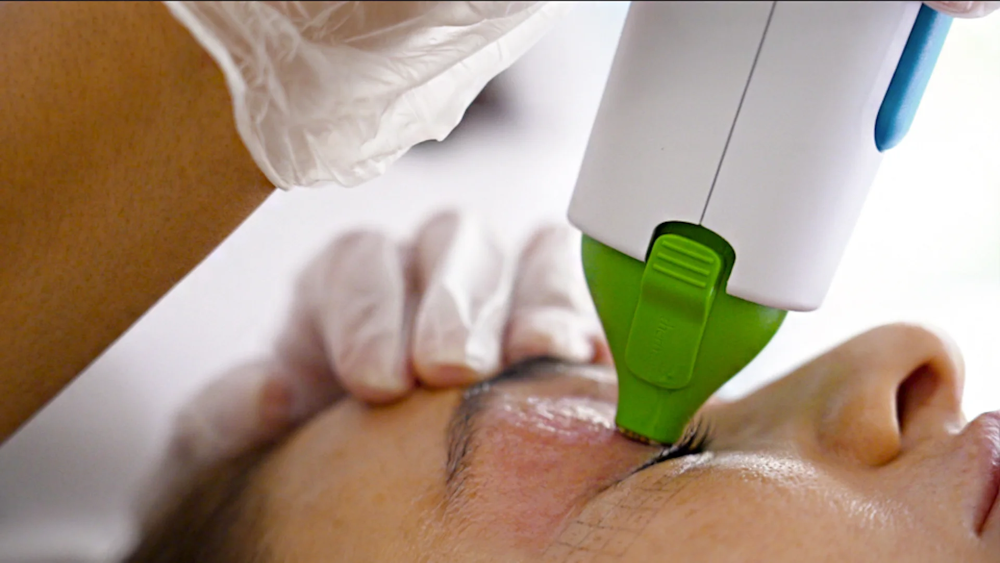

## Introduction to Cataract Treatment

Cataract surgery is the only effective treatment for cataracts, which cause blurred vision by clouding the natural lens inside the eye, resulting in a clouded lens. Australian citizens with a Medicare card may be eligible for government support or rebates for cataract surgery.

The cost of cataract surgery can vary depending on several factors, including the type of intraocular lens used and the surgeon’s expertise. During the initial consultation, the eye surgeon will assess the extent of the clouded lens and discuss treatment options.

Cataract treatment typically involves replacing the cloudy lens with an artificial lens implant to restore clear vision.

Medicare rebates and private health insurance can help cover some of the costs associated with cataract surgery.

## Types of Cataract Surgeries and Costs

There are several types of cataract surgeries, including laser assisted cataract surgery and traditional phacoemulsification.

The cost of cataract surgery can range from $2,000 to $5,000 per eye, depending on the type of surgery and lens used.

Multifocal lenses are a premium option that can provide spectacle independence and good intermediate vision, but may have side effects such as halos or glare. Extended depth of field lenses are another option designed to improve intermediate vision and reduce the need to wear glasses.

Monofocal lens implants are the most common type, typically set for distance vision, and patients may need to wear glasses for near or intermediate tasks. Some patients may use contact lenses after surgery if they do not achieve full spectacle independence.

[book appointment free assessment free checkup](/contact)

## Cataract Surgery Cost and Affordability

Many patients choose cataract surgery as a long-term solution for vision problems.

The full cost of cataract surgery includes critical components such as the surgeon fee, anaesthetist fee, anaesthetist's fees, and day hospital fee. The full cost also covers associated costs like operating costs, and these surgery costs may be only partially covered by Medicare or private health insurance. Excess payments may apply depending on the patient's insurance policy. Financial assistance may be available for eligible patients.

Out of pocket costs can vary depending on the patient’s health insurance coverage and the type of surgery.

Affordable cataract surgery options are available, including public hospital surgery and financing plans.

Patients can expect to pay a gap payment for cataract surgery, even with private health insurance.

[book appointment free assessment free checkup](/contact)

## Health Insurance and Coverage

Private health insurance can help cover some of the costs associated with cataract surgery, including the surgeon’s fee and hospital fee.

Medicare rebates can also help reduce the out of pocket cost of cataract surgery. The Medicare rebate can significantly reduce out-of-pocket costs, but some expenses may only be partially covered.

Patients should check with their health fund to see what is cataract surgery covered and what the out of pocket expenses will be, as different health funds have different policies regarding coverage and waiting periods. Most health funds require a waiting period before cataract surgery is covered, and these waiting periods can vary depending on the policy and the type of procedure.

Some health funds offer no-gap or known-gap coverage for cataract surgery, which can help reduce the cost.

[book appointment free assessment free checkup](/contact)

## Payment Options and Financing

- Patients can pay for cataract surgery upfront, or use financing options such as payment plans.
- Some clinics offer package deals that include the cost of the surgery, lens, and follow-up care.
- Patients should discuss payment options with their surgeon or clinic to find a plan that works for them.
- Medicare and health insurance can help cover some of the costs, but patients may still need to pay a gap payment.

## Finding the Right Cataract Surgeon

Patients should research and find a qualified eye surgeon who specializes in cataract surgery and has experience in the type of procedure they need.

The surgeon’s expertise and reputation can affect the cost and quality of the surgery.

Patients should ask about the surgeon’s experience with cataract surgery and the types of lenses they use.

Patients can also ask for referrals from their doctor or other patients who have had cataract surgery.

## Artificial Lens and Vision Correction

Assessing eye health and selecting the right lens are critical elements in achieving optimal results from cataract surgery.

The type of artificial lens used can affect the cost and quality of the surgery.

Multifocal intraocular lenses can provide clearer vision at all distances, but may increase the cost.

Monofocal lenses are a more affordable option, but may require the use of glasses for near vision.

Patients should discuss lens options with their surgeon to find the best choice for their needs and budget.

## Post-Operative Care and Recovery

Patients can expect to experience some discomfort and blurred vision after cataract surgery. Many patients also report improved vision in dark or shadowy conditions following the procedure.

Eye drops and follow-up care can help promote healing and reduce the risk of complications.

Patients should follow their surgeon’s instructions for post-operative care and attend all follow-up appointments.

Patients can typically return to normal activities, including driving and work, within a few days of surgery.

## Wound Care and Healing

- Patients should keep the eye clean and dry after surgery to promote healing.
- Eye drops can help reduce inflammation and promote healing.
- Patients should avoid rubbing or touching the eye after surgery to reduce the risk of complications.
- Patients can expect some redness and swelling after surgery, but this should resolve on its own.

## Returning to Normal Activities

- Most patients are able to return to their regular routines, including work and light household tasks, within a few days to a week after cataract surgery.
- It’s important to follow your eye surgeon’s advice regarding when to resume specific activities, as individual recovery times can vary.
- Avoid strenuous exercise, heavy lifting, and swimming until your surgeon confirms it is safe to do so, as these activities can increase the risk of complications after surgery.
- Wearing sunglasses outdoors and protecting your eyes from dust or irritants can help support a smooth recovery.
- Always attend scheduled follow-up appointments to ensure your eyes are healing properly and to discuss any concerns about returning to normal activities after cataract surgery.

## Advanced Cataract Surgery Techniques

- Advanced eye surgery techniques, such as laser assisted cataract surgery, can provide more precise results.
- Femtosecond laser technology can help reduce the risk of complications and improve outcomes.
- Local anaesthesia is commonly used during cataract surgery, administered by the anaesthetist to ensure patient comfort throughout the procedure.
- Patients should discuss advanced techniques with their surgeon to see if they are a good candidate.
- Advanced techniques may increase the cost of cataract surgery, but can provide better results.

## Conclusion and Summary

- Cataract surgery is a effective treatment for cataracts, and can provide clearer vision and improved quality of life.
- The cost of cataract surgery can vary depending on several factors, including the type of lens used and the surgeon’s expertise.
- Patients should research and find a qualified cataract surgeon, and discuss payment options and financing.
- Patients can expect to experience some discomfort and blurred vision after surgery, but can typically return to normal activities within a few days.
