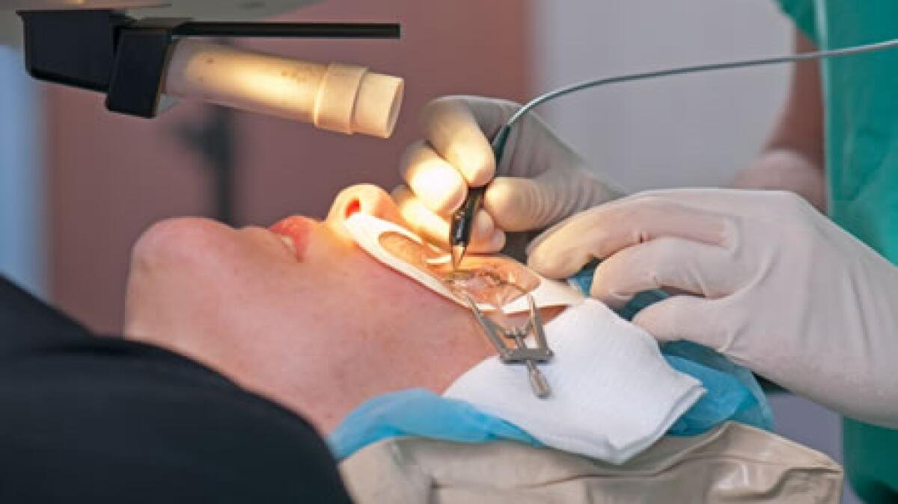
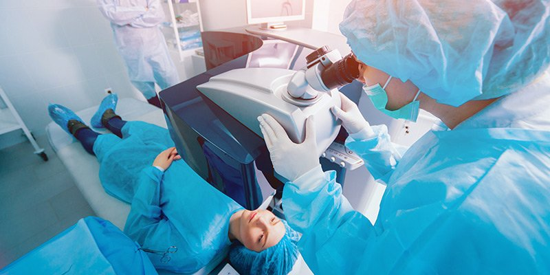
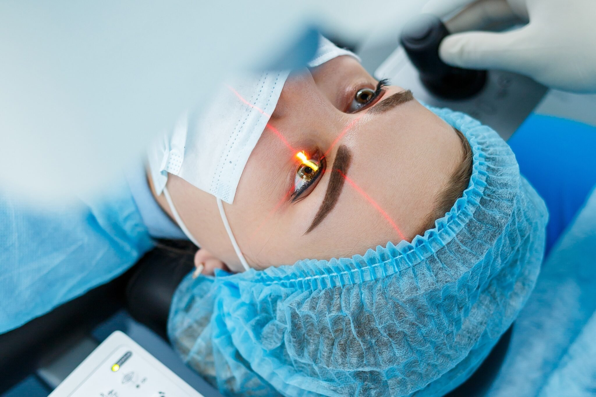
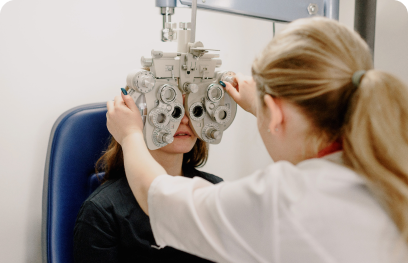
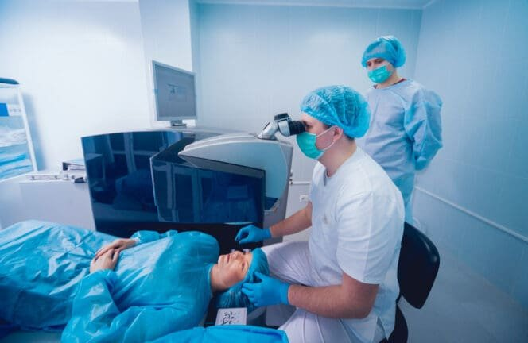

Imagine waking up every morning with crystal-clear vision, never fumbling for glasses or dealing with dry contact lenses again. For millions of people worldwide, laser eye surgery has transformed this dream into reality. With over 99% of patients achieving 20/40 vision or better through modern laser procedures, vision correction surgery has become one of the most successful elective procedures in medicine.

But with multiple surgical options available—from traditional LASIK to newer techniques like SMILE surgery—determining which eye surgery is best for you requires careful consideration of your unique circumstances. Your age, lifestyle, eye health, and vision needs all play crucial roles in selecting the most suitable procedure.

This comprehensive guide will walk you through everything you need to know about laser eye surgeries, helping you make an informed decision about your vision correction journey. We’ll explore the different procedures available, assess candidacy requirements, compare recovery experiences, and provide the tools you need to choose the right surgeon and treatment plan.

## Understanding Your Eye Surgery Options

[BOOK FREE VISIT](/contact)

Modern laser eye surgery encompasses several advanced procedures designed to correct refractive errors—primarily myopia (nearsightedness), hyperopia (farsightedness), and astigmatism. Each technique offers unique advantages depending on your specific eye anatomy, lifestyle requirements, and vision goals.

### Laser Vision Correction Procedures

The most common laser surgeries include **LASIK (Laser-Assisted in Situ Keratomileusis)**, **PRK (Photorefractive Keratectomy)**, **SMILE (Small Incision Lenticule Extraction)**, and **TransPRK (Transepithelial PRK)**. These procedures use precise excimer laser technology to reshape the corneal surface, allowing light to focus properly on the retina for improved vision.

LASIK involves creating a thin corneal flap and reshaping the underlying tissue, offering rapid visual recovery with most patients seeing clearly within 24-48 hours. PRK and its advanced counterpart, TransPRK, skip the flap creation entirely, instead ablating directly on the corneal surface. While these procedures require longer recovery times, they eliminate flap-related complications and are preferred for patients with thin corneas or those who play contact sports.

SMILE surgery represents a minimally invasive approach that removes a lens-shaped piece of tissue through a small incision. This technique treats myopia and astigmatism effectively but cannot correct hyperopia, unlike LASIK or PRK procedures.

### Non-Laser Alternatives

[BOOK FREE VISIT](/contact)

For patients who aren’t suitable candidates for corneal laser procedures, several alternatives exist. Refractive lens exchange (RLE)—essentially cataract surgery adapted for vision correction—involves replacing the eye’s natural lens with an artificial lens. This procedure is particularly effective for severe refractive errors or patients developing presbyopia.

Phakic intraocular lens (IOL) implants add a corrective lens without removing the natural lens, making them ideal for younger patients with extreme myopia or hyperopia who want to preserve their accommodation ability for close up vision.

### Key Differences in Procedure Techniques and Recovery Times

Understanding the fundamental differences between these procedures helps determine which might be most suitable for your situation:

| Procedure    | Technique                           | Recovery Time | Best For                                      |
| ------------ | ----------------------------------- | ------------- | --------------------------------------------- |
| LASIK        | Flap created, laser reshaping       | 1-2 days      | Most refractive errors, quick recovery needed |
| PRK/TransPRK | Surface ablation, no flap           | 1-2 weeks     | Thin corneas, contact sports athletes         |
| SMILE        | Small incision lenticule extraction | 3-7 days      | Myopia/astigmatism, dry eye concerns          |
| RLE          | Natural lens replacement            | 1-2 weeks     | High refractive errors, presbyopia            |

### Success Rates and Visual Outcomes

All modern laser vision correction procedures boast excellent success rates. Studies consistently show that over 95-99% of patients achieve 20/40 or better uncorrected vision—the legal standard for driving in most regions. Many patients reach 20/20 vision or better, significantly reducing their dependence on glasses or contact lenses.

Long-term patient satisfaction rates exceed 95% across all major procedures, with most patients reporting dramatic improvements in their quality of life and daily activities.

## LASIK Eye Surgery

LASIK eye surgery remains the most popular laser vision correction procedure worldwide, combining proven effectiveness with rapid recovery times. This laser assisted in situ keratomileusis technique has helped millions of people achieve clear vision without the need to wear glasses or contact lenses daily.

### How LASIK Works

During LASIK surgery, the surgeon creates a thin flap in the cornea using either a femtosecond laser or a precision blade called a microkeratome. This flap is gently lifted to expose the underlying corneal tissue, where an excimer laser precisely removes microscopic amounts of tissue to reshape the cornea. The laser procedure typically takes less than 30 seconds per eye, with the entire surgery completed in about 15 minutes for both eyes.

The flap created during surgery acts as a natural bandage, eliminating the need for a bandage contact lens and contributing to the rapid healing process that LASIK is known for.

### Best Candidates for LASIK

[BOOK FREE VISIT](/contact)

Good candidates for LASIK surgery typically share several characteristics. They must be at least 18 years old with stable vision for 1-2 years, ensuring that any vision changes have stabilized. Healthy corneas with adequate thickness are essential, as the procedure requires removing a small amount of corneal tissue.

LASIK effectively treats a broad range of refractive errors, including myopia up to -12 diopters, hyperopia up to +4 diopters, and astigmatism up to 5 diopters. However, not everyone is a suitable candidate—those with certain medical conditions like autoimmune diseases, corneal abnormalities such as keratoconus, or severe dry eyes may need alternative treatments.

### Recovery and Visual Outcomes

LASIK surgery offers one of the fastest recovery experiences in vision correction. Most patients notice significant vision improvement within hours, with functional vision typically restored within 24-48 hours. The initial healing occurs rapidly because the corneal flap protects the treated area, minimizing discomfort and light sensitivity.

Over 99% of LASIK patients achieve 20/40 vision or better, with the majority reaching 20/20 vision or superior. This success rate, combined with the quick recovery time, makes LASIK an attractive option for people with busy lifestyles who need to return to work quickly.

Some patients may experience temporary side effects like dry eyes, glare, or halos around lights, particularly at night. These symptoms typically resolve within a few weeks to months as the eyes complete their healing process.

Here are the key points from your text on **Recovery and Visual Outcomes** of LASIK:

### Fast Recovery Time:

- Significant vision improvement is often noticeable within hours after surgery.
- Most patients achieve functional vision within 24–48 hours.
- The corneal flap created during surgery helps protect the treated area and speeds up healing.

### High Success Rate:

- Over 99% of patients achieve at least 20/40 vision or better.
- The majority of patients reach 20/20 vision or even better.
- This makes LASIK suitable for those with busy schedules needing a quick return to daily activities.

### Temporary Side Effects:

- Some patients may experience dry eyes, glare, or halos around lights, especially at night.
- These symptoms are generally temporary and improve over several weeks or months as healing completes.

## PRK and TransPRK Surgery

PRK surgery represents the original laser vision correction technique and remains an excellent choice for many patients, particularly those who aren’t ideal candidates for LASIK. Unlike procedures that involve creating a flap, PRK surgery works by directly reshaping the corneal surface.

### How PRK and TransPRK Work

During traditional PRK, the surgeon gently removes the thin top layer of the cornea (epithelium) before using the excimer laser to reshape the underlying tissue. The epithelium naturally regenerates over the following days, requiring a bandage contact lens for comfort during initial healing.

TransPRK advances this technique by using the laser to remove the epithelium as well, creating a completely bladeless, touchless procedure. This automated approach can improve precision and reduce the risk of complications associated with manual epithelium removal.

### Ideal Candidates for Surface Ablation

PRK and TransPRK are particularly well-suited for specific patient groups. Athletes who play contact sports, military personnel, police officers, and firefighters often prefer these procedures because they eliminate the risk of flap complications that could occur with eye trauma.

Patients with thin corneas, irregular corneal surfaces, or those who work in dusty environments also benefit from surface ablation techniques. Since no flap is created, there’s no risk of flap dislocation or infection under the flap—concerns that can affect certain professions or activities.

The procedure effectively treats the same range of refractive errors as LASIK, making it a suitable alternative for most patients seeking laser vision correction.

### Recovery Experience and Timeline

[BOOK FREE VISIT](/contact)

The recovery process for PRK surgery differs significantly from LASIK, requiring more patience but ultimately delivering excellent results. The first few days typically involve discomfort, light sensitivity, and blurred vision as the epithelium heals. A bandage contact lens protects the eye during this critical healing period.

Functional vision usually returns within 5-7 days, though complete visual clarity may take several weeks to develop. During the first week, patients often need to limit activities and avoid bright lights. The healing process continues for several weeks, with vision gradually improving as the corneal surface smooths and stabilizes.

Despite the longer recovery time, PRK surgery delivers vision outcomes comparable to LASIK, with over 95% of patients achieving 20/40 or better vision. The absence of flap-related complications makes this an attractive long-term choice for many patients.

## SMILE Surgery

Small incision lenticule extraction represents one of the newest advances in laser vision correction, offering a minimally invasive approach that combines the benefits of surface ablation with faster recovery times.

### The SMILE Technique

SMILE surgery uses a femtosecond laser to create a lens-shaped piece of tissue (lenticule) within the corneal stroma. The surgeon removes this lenticule through a small incision of just 2-4 millimeters, eliminating the need for a large flap or complete surface removal.

This innovative approach preserves more of the cornea’s natural biomechanics and nerve structure compared to other laser procedures. The small incision heals quickly while maintaining corneal strength and stability.

### SMILE Candidacy and Limitations

Currently, SMILE surgery is FDA-approved specifically for treating myopia and astigmatism but cannot correct farsightedness. This limitation makes it unsuitable for patients with hyperopia, who would need to consider LASIK, PRK, or alternative procedures.

The technique is particularly valuable for patients concerned about dry eyes, as studies show SMILE causes less disruption to corneal nerves responsible for tear production. Young athletes and those with active lifestyles also appreciate the reduced trauma risk due to the small incision.

### Recovery and Results

SMILE surgery offers a recovery experience between LASIK and PRK. Most patients experience minimal discomfort and see significant vision improvement within 3-7 days. While not quite as rapid as LASIK, the recovery is considerably faster than surface ablation techniques.

Clinical studies demonstrate that over 99% of SMILE patients achieve 20/40 or better vision, with approximately 88-92% reaching 20/20 vision. The procedure shows excellent long-term stability with high patient satisfaction rates.

## Determining Your Candidacy

Understanding whether you’re a good candidate for eye surgery requires a comprehensive assessment of multiple factors. The evaluation process goes far beyond simply checking your prescription—it involves examining your overall health, lifestyle, and realistic expectations about surgery outcomes.

### Age Requirements and Vision Stability

Most eye surgeons require patients to be at least 18 years old before considering laser vision correction, though many prefer waiting until age 21 or older. This age requirement ensures that your vision has stabilized, as eyes continue developing through the teenage years.

Beyond age, your prescription must remain stable for at least 12-24 months before surgery. Significant changes in your glasses or contact lens prescription indicate that your eyes are still changing, which could affect surgical outcomes. Patients experiencing ongoing vision changes may need to wait longer before becoming suitable candidates.

### Vision Requirements and Stability

Different procedures can treat varying degrees of refractive error, but all have limits. Most laser surgeries can correct myopia up to -10 to -12 diopters, hyperopia up to +4 diopters, and astigmatism up to 3-5 diopters. Extreme refractive errors beyond these ranges typically require alternative treatments like refractive lens exchange or phakic IOL implants.

Hormonal fluctuations during pregnancy and breastfeeding can cause temporary vision changes, making these periods unsuitable for surgery. Women should wait at least 3 months after finishing breastfeeding before considering laser vision correction.

If you currently wear contact lenses, you’ll need to discontinue them before your surgical evaluation. Soft contact lenses should be stopped 1-2 weeks prior, while rigid gas permeable lenses may require 2-4 weeks or longer. Contact lens wear can temporarily alter corneal shape, affecting the accuracy of preoperative measurements.

### Eye Health Assessment

A thorough eye examination is essential to determine surgical candidacy. Your eye doctor will perform detailed diagnostic imaging to check for corneal irregularities, diseases like keratoconus, or scarring that could affect surgery safety or outcomes.

Corneal thickness measurements are particularly important, as insufficient tissue could increase the risk of complications like corneal ectasia. Patients with thin corneas may be better candidates for PRK, SMILE, or lens-based procedures rather than LASIK.

Dry eye syndrome requires careful evaluation and often treatment before surgery. Existing moderate to severe dry eyes may worsen after laser procedures, particularly LASIK. Patients with significant dry eye problems might be better suited for SMILE surgery or non-laser alternatives.

Previous eye injuries, infections, or surgeries can impact candidacy depending on their severity and location. Certain retinal conditions, glaucoma, or optic nerve disorders may be relative contraindications to surgery.

Pupil size measurements in different lighting conditions help predict potential side effects. Large pupils in low light can increase the risk of experiencing glare, halos, or reduced night vision after surgery.

### General Health Considerations

Your overall health significantly impacts healing and surgery outcomes. Autoimmune diseases like rheumatoid arthritis or lupus can affect wound healing and may disqualify you from certain procedures. Uncontrolled diabetes can also impair healing and increase complication risks.

Certain medications, particularly immunosuppressants or long-term steroids, can interfere with proper healing. Your surgeon will review all medications and supplements during your consultation to identify any potential issues.

Allergies and their treatments also require consideration, as some allergy medications can affect tear production or healing. Severe allergies might need management before surgery to optimize outcomes.

## Special Considerations by Lifestyle

Your daily activities, profession, and hobbies play crucial roles in determining which eye surgery is best for you. Different procedures offer varying advantages depending on your lifestyle needs and risk factors.

### Athletes and Contact Sports

If you play contact sports or participate in activities with high trauma risk, PRK or TransPRK may be your best options. These surface ablation procedures eliminate the possibility of flap complications that could occur if you receive a blow to the eye.

Sports like boxing, martial arts, football, basketball, and rugby pose particular risks for flap dislocation in LASIK patients. While serious complications are rare, many athletes prefer avoiding this risk entirely by choosing flapless procedures.

SMILE surgery also offers advantages for active individuals, as the small incision is less likely to cause problems than a full LASIK flap. However, PRK remains the gold standard for high-contact activities.

### Professional Requirements

Certain professions have specific vision requirements that may influence your surgical choice. Military personnel, police officers, firefighters, and pilots often prefer PRK due to its superior resistance to trauma and the absence of flap-related restrictions.

Some occupations require specific waiting periods after surgery before returning to full duties. Commercial pilots, for example, may need several months of stable vision before resuming flight duties. Emergency responders might have similar requirements to ensure optimal visual performance in critical situations.

Professional drivers and those operating heavy machinery should discuss their specific visual demands with their surgeon to ensure the chosen procedure meets their occupational needs.

### Age-Related Presbyopia and Reading Vision Needs

Presbyopia—the age-related loss of near vision—typically begins affecting people in their 40s. Standard laser eye surgery cannot reverse presbyopia, though several strategies can help manage this condition.

Monovision correction involves treating one eye for distance vision and the other for near vision. This approach can reduce dependence on reading glasses, though not everyone adapts well to the difference between eyes. A trial with contact lenses can help determine if monovision is suitable for you.

Some patients choose to have both eyes corrected for distance vision and accept the need for reading glasses for close work. This approach often provides the best distance vision and depth perception.

Newer presbyopia treatments, including corneal inlays and presbyopia-correcting IOLs, offer additional options for patients seeking both distance and near vision correction.

### High Visual Demands

Patients with demanding visual requirements need special consideration when choosing surgical procedures. Night shift workers, professional drivers, and those working in low-light conditions should understand the potential for temporary night vision changes after surgery.

Some patients experience glare, halos, or reduced contrast sensitivity, particularly in the weeks following surgery. While these effects usually resolve, they can impact activities requiring precise vision in challenging conditions.

Individuals working with fine details, such as jewelers, watchmakers, or surgeons, should discuss their specific visual needs to ensure the chosen procedure supports their professional requirements.

## Comparing Recovery and Outcomes

Understanding what to expect during recovery helps you plan for surgery and choose the procedure that best fits your schedule and lifestyle needs. While all modern laser procedures deliver excellent long-term results, the path to clear vision varies significantly between techniques.

### LASIK Recovery Experience

LASIK offers the most rapid visual recovery of all laser eye surgeries. Most patients notice significant improvement within hours of surgery, with functional vision typically restored by the next day. The corneal flap acts as a natural bandage, protecting the treated area and minimizing discomfort.

The first 24-48 hours may involve mild irritation, light sensitivity, and tearing. Most patients can return to work within 1-2 days, though activities like swimming or contact sports require waiting several weeks. Computer work is usually comfortable within a day or two, making LASIK attractive for office workers and students.

Night vision may be temporarily affected, with some patients experiencing glare or halos around lights for the first few weeks. These symptoms typically resolve as healing progresses, though a small percentage of patients may have persistent minor night vision changes.

### PRK and TransPRK Recovery Timeline

Surface ablation procedures require significantly more patience during recovery, but ultimately deliver results comparable to LASIK. The first 3-5 days are typically the most challenging, with moderate discomfort, light sensitivity, and blurred vision as the corneal epithelium regenerates.

A bandage contact lens protects the eye during initial healing and is usually removed after 3-5 days. Vision gradually improves over the following weeks, with functional clarity typically achieved by 1-2 weeks and continued improvement over several months.

The extended recovery period can be challenging for patients with demanding work schedules, but many find the long-term benefits worth the temporary inconvenience. Surface ablation eliminates concerns about flap complications and may provide better long-term corneal stability.

### SMILE Recovery Experience

SMILE surgery offers a recovery experience between LASIK and surface ablation procedures. Most patients experience minimal discomfort and see improvement within a few days, though full stabilization may take up to a week.

The absence of a large flap means less initial dryness compared to LASIK, while the intact corneal surface heals faster than after PRK. Many patients find SMILE recovery more comfortable than expected, with most returning to normal activities within 3-7 days.

Light sensitivity and mild irritation are common for the first day or two, but these symptoms typically resolve quickly. Night vision stabilizes somewhat more slowly than with LASIK but faster than with surface ablation.

### Long-Term Visual Outcomes

All major laser vision correction procedures deliver excellent long-term results. Studies consistently show that over 95% of patients achieve 20/40 or better vision—the legal driving standard—with most reaching 20/20 or superior acuity.

Patient satisfaction rates exceed 95% across all procedures, with most reporting significant improvements in quality of life. The ability to participate in sports, travel without glasses, and wake up with clear vision provides benefits that extend far beyond simple vision correction.

Enhancement procedures may be needed in 5-10% of cases, typically for mild undercorrection or regression. Most enhancements can be performed using the same technique as the original surgery, though some patients may require switching to a different procedure.

### Potential Complications and Side Effects

While serious complications are rare with modern laser surgery—occurring in less than 1% of cases with experienced surgeons—understanding potential risks helps you make an informed decision.

Dry eyes are the most common temporary side effect, affecting a significant percentage of patients initially but usually resolving within a few months. SMILE surgery shows lower rates of chronic dry eye compared to LASIK.

Night vision disturbances, including glare and halos, can occur with any procedure but are usually temporary. Large pupils and higher degrees of correction may increase this risk.

Undercorrection or overcorrection can occur with any technique, sometimes requiring enhancement procedures or continued use of glasses for certain activities.

Serious complications like infection, corneal ectasia, or significant vision loss are extremely rare when surgery is performed by qualified surgeons using modern equipment.

## Financial Considerations

Understanding the costs associated with laser eye surgery helps you budget appropriately and compare different options. While the initial expense may seem significant, many patients find the long-term savings and lifestyle benefits justify the investment.

### Insurance Coverage and Out-of-Pocket Costs

Most insurance plans classify laser eye surgery as elective and don’t provide coverage for the procedure. However, some plans offer discounts through preferred provider networks, and vision insurance may provide modest benefits toward surgery costs.

Flexible Spending Accounts (FSAs) and Health Savings Accounts (HSAs) can be used to pay for laser surgery with pre-tax dollars, effectively reducing the cost by your marginal tax rate. This benefit can provide substantial savings for many patients.

Cost variations depend on several factors, including the specific technology used, surgeon experience, geographic location, and the complexity of your case. Typical U.S. pricing ranges from $2,000-$3,000 per eye for standard procedures, with custom treatments and newer technologies commanding higher fees.

### Comparing Value Across Procedures

When evaluating costs, consider the total value proposition rather than just the initial price. More expensive procedures using advanced technology may offer better outcomes, faster recovery, or reduced complication rates that justify the additional cost.

Lifetime costs of glasses and contact lenses can be substantial. Many patients spend $2,000-$4,000 or more over 10-20 years on vision correction, making surgery a cost-effective long-term investment.

Factor in the hidden costs of poor vision, including limitations on activities, career impacts, and reduced quality of life. For many patients, the freedom to participate fully in sports, travel, and daily activities provides value that extends far beyond simple financial calculations.

### Financing Options

Many surgery centers offer financing plans that make laser vision correction more accessible. These plans often feature low or no interest rates for qualified patients, allowing you to spread the cost over several months or years.

Third-party medical financing companies provide additional options, sometimes offering promotional rates or extended payment terms. Compare interest rates and terms carefully to find the option that best fits your budget.

Some employers offer vision benefits or flexible spending arrangements that can help offset surgery costs. Check with your human resources department to understand available options.

## Choosing the Right Surgeon

Selecting the right surgeon is perhaps the most critical decision in your vision correction journey. The surgeon’s skill, experience, and technology directly impact your safety, outcomes, and overall satisfaction with the procedure.

### Qualifications and Training

Your surgeon should be board-certified in ophthalmology with specialized training in refractive surgery. Look for surgeons who have completed fellowship training specifically in corneal and refractive surgery, as this additional training provides expertise in the latest techniques and technologies.

Experience matters significantly in laser surgery. Surgeons who have performed thousands of procedures tend to have better outcomes and lower complication rates. Ask about the surgeon’s volume and specific experience with the procedure you’re considering.

Membership in professional organizations like the American Academy of Ophthalmology or the International Society of Refractive Surgery indicates ongoing education and commitment to staying current with advances in the field.

### Technology and Equipment

State-of-the-art equipment can significantly impact surgery outcomes. Look for surgeons using the latest generation femtosecond lasers for flap creation and advanced excimer lasers with eye tracking and customization capabilities.

Comprehensive preoperative testing equipment, including corneal topography, pachymetry, and aberrometry, ensures accurate measurements and appropriate surgical planning. Surgeons with access to multiple laser platforms can choose the best technique for your specific needs.

Ask about the age and maintenance of equipment, as well as backup systems in case of equipment failure during surgery. Well-equipped facilities demonstrate a commitment to safety and optimal outcomes.

### Outcomes and Patient Satisfaction

Research the surgeon’s track record by asking about complication rates, enhancement rates, and patient satisfaction scores. Reputable surgeons should be willing to share this information and discuss their results openly.

Read patient reviews and testimonials, but remember that online reviews may not represent the full picture. Ask the surgeon for references from recent patients who had similar procedures and vision corrections.

Professional awards and recognition from peers can indicate exceptional skill and dedication to the field. However, focus primarily on the surgeon’s direct experience and outcomes rather than marketing claims.

### Consultation Process

A thorough consultation demonstrates the surgeon’s commitment to appropriate patient selection and realistic expectation setting. The consultation should include a comprehensive eye examination, detailed discussion of your goals and lifestyle needs, and honest assessment of expected outcomes.

Be wary of surgeons who rush through consultations or seem to have a one-size-fits-all approach. The best surgeons take time to understand your unique situation and recommend the most appropriate procedure for your needs.

The surgeon should clearly explain the risks and benefits of different procedures, answer all your questions, and provide written information to review at home. High-pressure sales tactics or unrealistic promises are red flags.

### Facility and Support Staff

The quality of the surgical facility and support staff contributes significantly to your overall experience. Look for facilities that are clean, well-organized, and staffed by knowledgeable professionals who can answer your questions and provide support throughout the process.

Accredited surgical centers must meet strict safety and quality standards. While not all excellent surgeons operate in accredited facilities, accreditation provides additional assurance of safety protocols.

Consider the availability of post-operative care and the surgeon’s policy on enhancements or complications. You want a surgeon who will be available for follow-up care and committed to your long-term satisfaction.

## Making Your Final Decision

After gathering information about different procedures, assessing your candidacy, and consulting with qualified surgeons, it’s time to make your final decision. This choice should be based on a careful weighing of all factors specific to your situation.

### Comprehensive Assessment of Personal Factors

Review all the factors that influence which eye surgery is best for you: your refractive error, corneal thickness, lifestyle demands, age, overall health, and personal preferences. No single factor should dominate your decision—instead, consider how all elements work together to point toward the most suitable procedure.

Your eye health and anatomy are primary considerations that may limit your options. If you have thin corneas, dry eyes, or other anatomical considerations, your surgeon may recommend specific procedures that work best with your eye structure.

Lifestyle factors often serve as the deciding factor between technically suitable procedures. Athletes might choose PRK for safety, while busy professionals might prefer LASIK for rapid recovery. Consider your work demands, hobbies, and long-term goals when making your choice.

### Understanding Realistic Expectations

Successful laser surgery outcomes depend heavily on having a realistic understanding of what to expect. While most patients correct vision significantly and achieve excellent results, not everyone will reach perfect 20/20 acuity without any need for glasses or contact lenses.

Most patients reduce their dependence on vision correction, but some may still need glasses for specific activities like night driving or reading small print. Understanding these possibilities before surgery helps ensure satisfaction with outcomes and shows that surgery depends on individual factors and patient suitability.

Some patients require enhancement procedures to achieve optimal results. This possibility should factor into your planning and budget considerations, though most surgeons include enhancements in their initial pricing. Having a good understanding of potential outcomes and risks helps you prepare mentally and emotionally.

### Seeking Second Opinions

If you’re uncertain about recommendations or feel rushed to make a decision, consulting an eye specialist for a second opinion is always appropriate. Different surgeons may have varying perspectives on the best approach for your vision problems.

A second consultation can provide valuable confirmation of your candidacy and procedure choice, or it might reveal additional options like clear lens extraction or alternative treatments you hadn’t considered. Most surgeons respect patients who seek multiple opinions before making such an important decision.

Use second opinions to ask additional questions, clarify concerns, or explore alternative treatments. The goal is to feel confident and informed about your choice before proceeding, knowing that surgery depends on a thorough evaluation and discussion of your unique needs.

### Final Preparation and Commitment

Once you’ve chosen your surgeon and procedure, follow all preoperative instructions carefully. This includes stopping contact lens wear as directed, arranging transportation for surgery day, and planning for recovery time — all of which contribute to patient suitability for the procedure.

Prepare your home environment for recovery with necessary supplies like sunglasses, artificial tears, and any prescribed medications. Having everything ready in advance reduces stress and supports optimal healing, reflecting your good understanding of the recovery process.

Communicate any last-minute concerns or questions with your surgical team. It’s normal to feel nervous before surgery, but you should feel confident in your decision and trust in your eye specialist’s expertise.

Remember that laser vision correction is one of the most successful elective procedures in medicine. With proper patient suitability, experienced surgeons, and realistic expectations, the vast majority of patients correct vision effectively and enjoy dramatically improved quality of life.

The decision of which eye surgery is best for you ultimately comes down to a personalized assessment of your unique circumstances. By understanding your options — including LASIK, PRK, SMILE, or clear lens extraction for special cases — and working with qualified professionals, you can make an informed decision that provides you with the clear vision and freedom you’re seeking.

Whether you choose LASIK for its rapid recovery, PRK for its safety profile, SMILE for its minimal invasiveness, or an alternative procedure for specific vision problems, the journey to better vision begins with education and ends with the confidence that comes from making the right choice for your individual needs.

[BOOK FREE VISIT](/contact)

### Outcomes we measure, not just promise

Whichever procedure you choose, the results should be measured — not assumed. Dr Brendan Cronin and Dr David Gunn audit their refractive outcomes with the free [Refractive Outcomes Analyzer](/free-refractive-outcomes-analyzer) they built and shared with the global ophthalmology community — benchmarking every result against published international standards.
