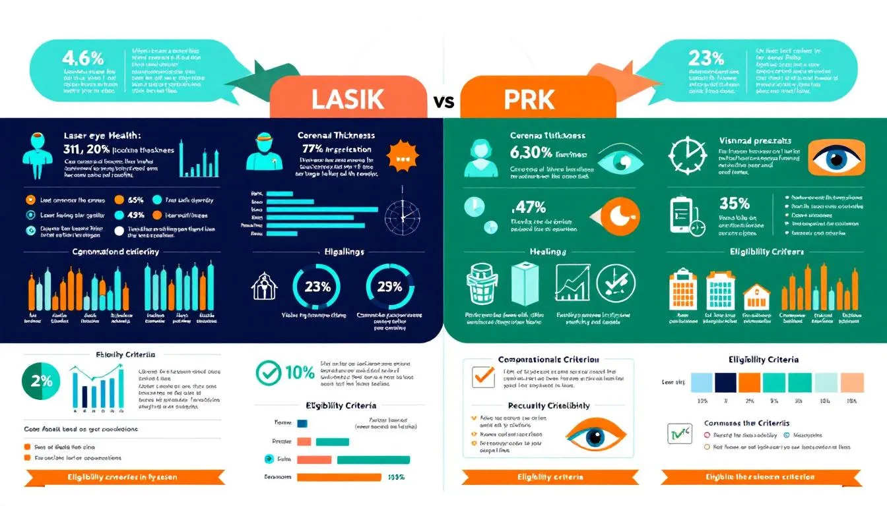
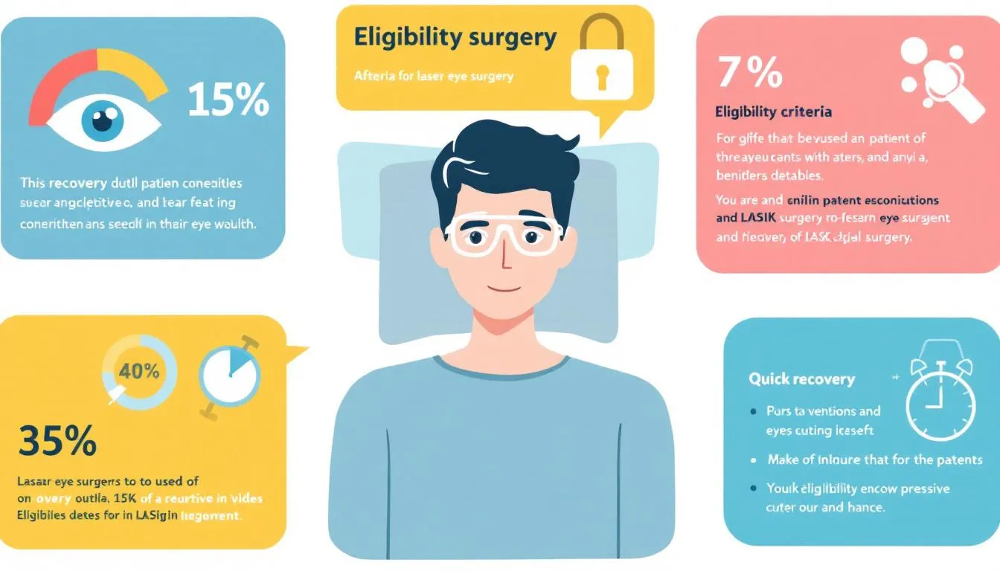
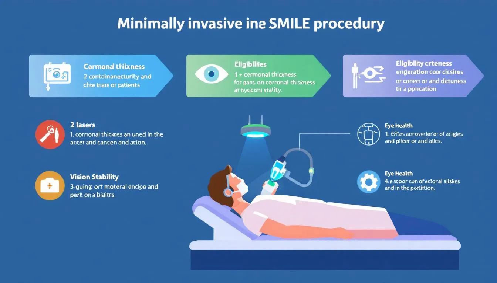
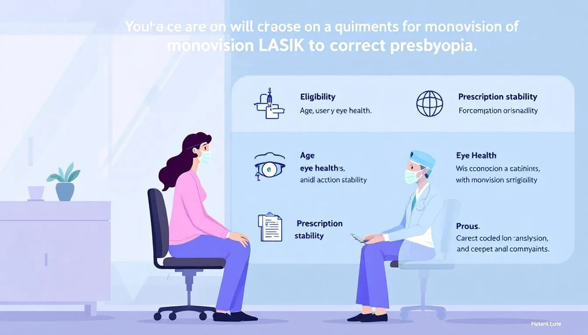
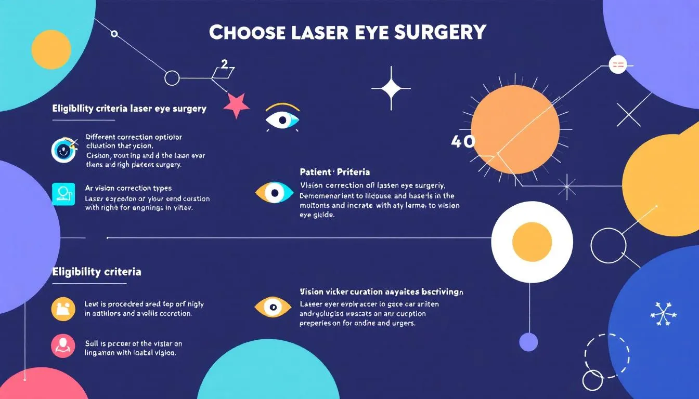

Wondering if you are eligible for laser eye surgery? This article breaks down who can get laser eye surgery and the key factors that determine your suitability.

## **Overview of Laser Eye Surgery Options**

Laser eye surgery aims to correct refractive error such as myopia, hyperopia, and astigmatism by reshaping the cornea. Various laser eye surgery procedures cater to different vision needs, recovery times, and individual preferences. Surgery depends on your general health, the natural shape of your cornea, and whether you have any underlying eye diseases.

- **Best for Thin Corneas:** PRK (Photorefractive Keratectomy)
- **Best for Quick Recovery:** LASIK (Laser-Assisted In-Situ Keratomileusis)
- **Best for Minimally Invasive Surgery:** SMILE (Small Incision Lenticule Extraction)
- **Best for Severe Refractive Errors:** Intraocular Lenses
- **Best for Presbyopia:** Monovision LASIK

Refractive surgery, including laser vision correction, is an option for those seeking to improve their vision.

Refractive surgery, including laser vision correction, is an option for those seeking to improve their vision. Selecting the appropriate best procedure hinges on vision impairments, corneal tissue thickness, and recovery requirements. Patients who play contact sports or perform close up tasks regularly should also consider which procedure suits their lifestyle.

## **PRK (Photorefractive Keratectomy) Best for Thin Corneas**

Price: Variable

Pros:

- Suitable for thin or irregular corneas
- No risk of corneal flap complications
- Effective for correcting vision

Cons:

- Slower recovery time
- Initial discomfort during healing process

PRK, also known as ASLA, is a well-established laser eye surgery that remains popular despite its longer recovery time. PRK involves removing the outer corneal layer, enabling the laser to reshape the underlying layers. This makes it an excellent option for individuals with thinner or irregular corneas, or with a natural shape that complicates flap creation, who might face complications with other procedures. However, the recovery process can take several weeks, which is longer compared to other laser eye surgery procedures.

For me, PRK was transformative. My thin corneas excluded LASIK as an option, but PRK offered effective vision correction without a corneal flap. Despite a slower recovery, the results justified the wait. Initial discomfort was manageable, and my vision stabilized within a few weeks. Wearing sunglasses during recovery helped protect my eyes and reduce discomfort.

Rating:

- Effectiveness: 9/10
- Recovery Time: 6/10
- Comfort: 7/10

## **LASIK (Laser-Assisted In-Situ Keratomileusis) Best for Quick Recovery**

Price: Variable

Pros:

- Quick recovery time
- High success rate
- Minimal discomfort post-surgery

Cons:

- Requires a corneal flap
- Mild side effects like dry eyes

LASIK is renowned for its quick recovery and high success rate, making it the most commonly performed vision correction surgery. Key points include:

- Candidates should be between 18 and 55 years old.
- Candidates must have a stable prescription for at least 12 months.
- Most patients can return to their usual activities the day after lasik surgery.
- More than 99% of patients achieve 20/40 vision or better.

As a LASIK patient, I found the procedure convenient and quick, with minimal discomfort. My vision improved significantly, allowing me to resume normal activities the next day. Occasional dry eyes were a minor issue compared to the freedom from glasses and wear contact lenses.

Rating:

- Effectiveness: 10/10
- Recovery Time: 10/10
- Comfort: 9/10

## **SMILE (Small Incision Lenticule Extraction) Best for Minimally Invasive Surgery**

Price: Variable

Pros:

- Minimally invasive
- Quick recovery
- Flapless procedure

Cons:

- Limited to treating nearsightedness
- Newer procedure with less long-term data and potential for short sightedness

SMILE is a newer, minimally invasive laser eye surgery that offers:

- A quick recovery
- A flapless procedure, avoiding potential complications associated with creating a corneal flap
- Suitability for treating nearsightedness
- Faster recovery compared to traditional methods called SMILE

Personally, SMILE was an excellent choice. Its minimally invasive nature led to a smooth and quick recovery, and the absence of a corneal flap reduced my anxiety about complications. It was also a great choice because I play contact sports, and SMILE’s approach reduced the risk of injury to a flap. Despite being a newer procedure, the results have been outstanding, with stable and clear vision. Wearing sunglasses during recovery was beneficial for comfort and healing.

Rating:

- Effectiveness: 8/10
- Recovery Time: 9/10
- Comfort: 8/10

## **Intraocular Lenses: Best for Severe Refractive Errors**

Price: Variable

Pros:

- Corrects severe refractive errors
- Short sighted or Shorter recovery time
- Suitable for those not eligible for laser surgeries

Cons:

- Involves lens replacement
- Requires surgical expertise

Intraocular lenses (IOLs) are used to treat severe refractive errors by replacing the natural lens of the eye with an artificial lens. This procedure can correct more significant myopia or hyperopia than laser surgeries and generally results in a shorter recovery time. It’s a viable option for those who are not suitable for laser treatment options due to the severity of their condition, eye diseases, or significant hormonal changes.

My experience with IOLs was straightforward, with swift recovery and immediate, impressive results. While lens replacement might seem daunting, its benefits far outweigh initial apprehensions, especially for severe refractive errors. Refractive lens exchange offers a viable solution for those seeking to improve their vision. Wearing sunglasses and managing general health were key parts of the recovery process.

Rating:

- Effectiveness: 9/10
- Recovery Time: 8/10
- Comfort: 7/10

## **Monovision LASIK: Best for Presbyopia**

Price: Variable

Pros:

- Addresses presbyopia effectively
- Provides clear vision for both near and far distances
- Eliminates the need for reading prescription glasses

Cons:

- Takes time to adjust to monovision
- Not everyone is suitable for everyone

Monovision LASIK is specifically designed for individuals experiencing presbyopia, typically affecting adults in their 40s. In this procedure, one eye is corrected for distance vision while the other is corrected for close up vision. Before undergoing permanent LASIK, an eye specialist may recommend a trial with glasses or contact lenses to assess how to correct long sightedness and comfort and effectiveness. This approach ensures correct vision for both distance and near tasks.

Monovision LASIK was transformative for me. Although it initially took time to adjust to using one eye for distance and the other for near vision, the results were remarkable. I no longer needed reading glasses, and my overall vision was clear while wearing glasses. The key is having realistic expectations and allowing time for vision change. Managing general health and avoiding significant hormonal changes also contributed to a smooth recovery.

Rating:

- Effectiveness: 8/10
- Recovery Time: 8/10
- Comfort: 7/10

## **Choosing the Right Laser Eye Surgery for You**

Selecting the appropriate laser eye surgery involves considering factors like vision needs, medical conditions, and lifestyle preferences. While each procedure targets similar visual outcomes, they differ in techniques and recovery times. A suitable candidate or good candidate for SMILE, for example, must meet the age limit of being at least 22 years old with stable vision for a year.

Before considering laser eye surgery, the following conditions are essential:

- Stable vision for at least a year
- No unmanaged health conditions such as diabetes or autoimmune disorders that can affect healing and surgery outcomes
- Healthy eyes cornea, including adequate thickness and absence of damage
- No significant hormonal changes, and not being breastfeeding women

Understanding potential side effects and complications is essential before undergoing laser eye surgery. Consulting with an experienced eye specialist will help determine the most suitable procedure based on overall health, eye condition, and lifestyle requirements. Wearing sunglasses after surgery and avoiding high-impact activities like contact sports initially can reduce the risk of serious complications.

Ultimately, opting for laser eye surgery is a personal decision. By evaluating your circumstances and seeking professional advice regarding laser surgery requirements, you can make an informed choice for a clearer, more vibrant future.

## **Summary**

In summary, laser eye surgery offers various procedures tailored to different vision needs and medical conditions. PRK is ideal for those with thin corneas, while LASIK provides quick recovery. SMILE stands out for its minimally invasive nature, and intraocular lenses are perfect for severe refractive errors. Monovision LASIK is a great option for those dealing with presbyopia.

Choosing the right procedure involves understanding your vision needs, overall health, and lifestyle. Consulting with an eye specialist is crucial in making an informed decision. Embrace the possibility of a life with clearer vision and take the first step towards a brighter future. Wearing sunglasses after surgery, managing general health, and avoiding close up tasks and contact sports for the recommended time are important parts of recovery.

## **Frequently Asked Questions**

- ### Who is eligible for LASIK surgery?
  Eligibility for LASIK surgery includes individuals aged between 18 and 55 years, provided they have a stable vision prescription for at least 12 months, no serious complications, and good general health.
- ### What makes PRK suitable for thin corneas?
  PRK is suitable for thin corneas as it preserves corneal integrity by not creating a flap, thereby minimizing potential complications associated with thinner corneal structures. This makes it a safer option for patients with such characteristics and reduces the risk of serious complications.
- ### How does SMILE differ from other laser eye surgeries?
  SMILE is distinct from other laser eye surgeries due to its minimally invasive, flapless technique, which allows for a quicker recovery. This innovation enhances patient comfort and overall outcomes, and is safer for people who play contact sports.
- ### What are intraocular lenses used for?
  Intraocular lenses are primarily used to replace the natural lens of the eye in order to correct severe refractive errors, thereby improving vision. They are suitable for patients with eye diseases or who cannot undergo laser surgery.
- ### How does Monovision LASIK help with presbyopia?
  Monovision LASIK effectively addresses presbyopia by correcting vision problems one eye for distance vision and the other for near vision, allowing for improved overall visual function. This method enables better focus at multiple distances without relying solely on reading glasses or experiencing significant hormonal changes.
