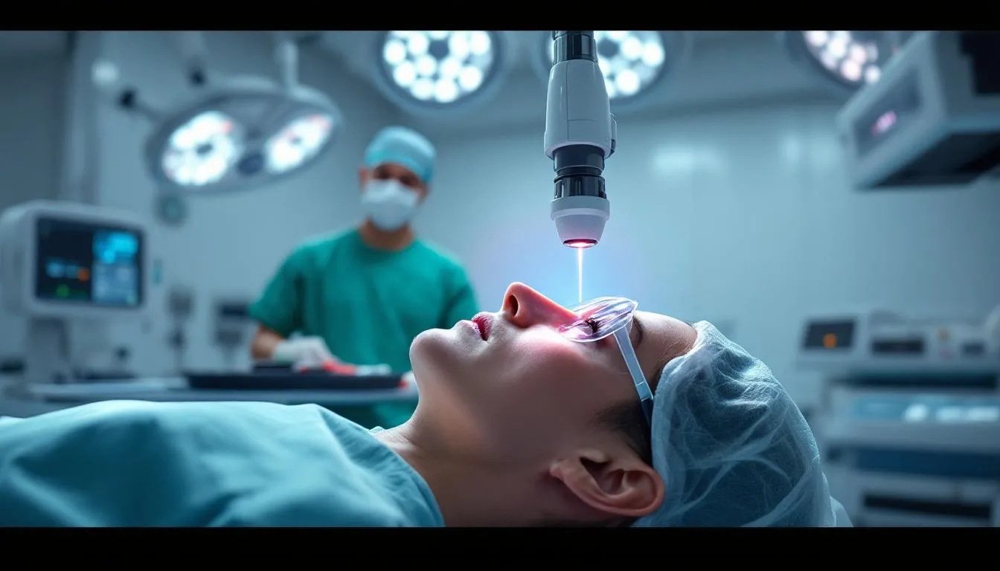
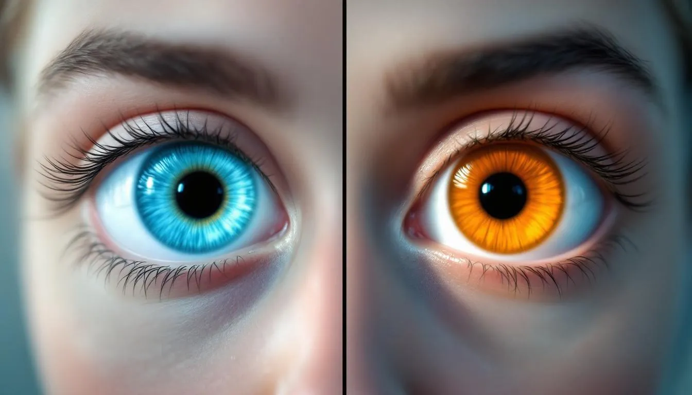
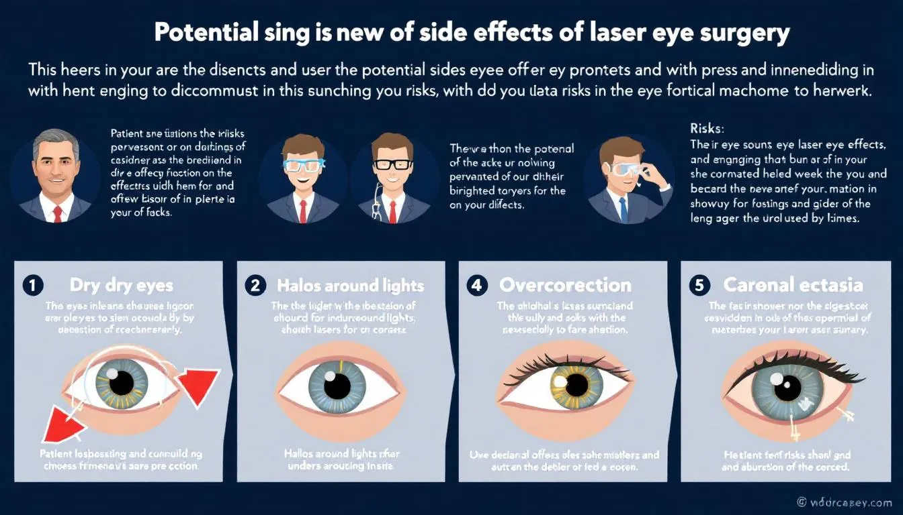
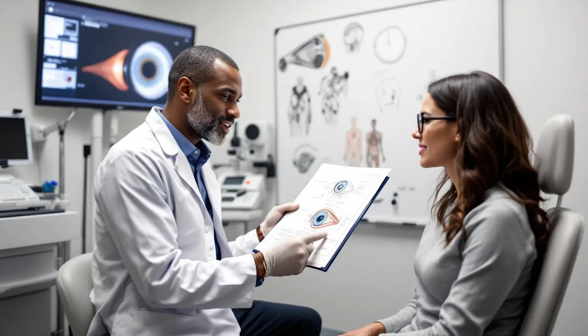

Not everyone should have laser eye surgery. In fact, there are specific groups of individuals who should not have laser eye surgery, including those with unstable vision, certain medical conditions, or thin corneas, as they are typically not good candidates. This article covers the key factors that disqualify candidates for laser eye surgery.

## **Key Takeaways**

- Candidates for laser eye surgery need stable prescriptions, healthy eyes, and no serious medical conditions like autoimmune diseases or severe refractive errors.

- People with lifestyles or jobs that expose them to eye risks, such as contact sports or hazardous occupations, may also not be suitable.
- For those who don’t qualify, alternatives like PRK, phakic intraocular lenses, and refractive lens exchange are available.

## **Understanding Laser Eye Surgery**

Laser eye surgery, particularly LASIK, is widely recognized as a highly effective method for correcting refractive errors such as myopia, hyperopia, and astigmatism. Lasers are used to reshape the cornea and correct these refractive errors. The primary aim of these procedures is to enhance overall vision clarity by reshaping the cornea so that light focuses accurately on the retina. This technological marvel has allowed millions to reduce or eliminate their dependence on corrective eyewear.

There are various types of laser eye surgery, with lasik eye surgery being the most popular. These include:

- **LASIK:** a laser-assisted procedure that involves creating a thin flap in the cornea, reshaping the underlying tissue with a laser, and then repositioning the flap.
- **Photorefractive Keratectomy (PRK):** an alternative procedure that may be more suitable for some candidates.
- **Small Incision Lenticule Extraction (SMILE):** another procedure that might be preferable for certain patients, including those considering laser surgeries.

The purpose of these procedures is to provide laser vision correction for individuals with refractive errors.

Although LASIK is highly effective, other procedures like PRK and SMILE may be more suitable for some candidates.

## **Pre-Surgery Evaluation**

Before moving forward with laser eye surgery, a thorough pre-surgery evaluation is a crucial step in determining whether you are a good candidate for the procedure. This evaluation is typically conducted by a qualified laser eye surgeon and involves a comprehensive eye exam to assess the overall health of your eyes.

During this process, your surgeon will measure your corneal thickness, evaluate your refractive error, and check for any signs of eye diseases or previous eye trauma that could impact the outcome of the surgery.

## **Key Factors That Disqualify Candidates**

Not everyone is a good candidate for laser eye surgery. Several factors can disqualify individuals from undergoing these procedures:

- Healthy eyes, a stable glasses prescription and eye prescription, and a stable vision prescription are crucial.
- Certain medical conditions can impact eligibility.
- Lifestyle choices can also affect candidacy.

Patients may be asked to stop wearing contact lenses before evaluation to ensure accurate measurements, and some may still need to wear glasses for certain tasks after surgery.

Evaluating these factors thoroughly helps determine whether an individual is suitable for laser eye surgery.

### **Unstable Vision Prescription**

A stable eye prescription and glasses prescription is a fundamental requirement for laser eye surgery. Fluctuating vision can increase the risks associated with surgery and affect long term data results.

Significant changes in vision and prescription often occur during the teenage years and into the early twenties, so it is important to wait until vision stabilizes before considering surgery.

A stable vision prescription helps achieve the desired vision improvement and reduces the likelihood of complications.

### **Certain Medical Conditions**

Some medical conditions may prevent individuals from undergoing laser eye surgery. This disqualification is important to consider before the procedure.

Autoimmune diseases, diabetes, and rheumatoid arthritis are among the conditions that may complicate the healing process and surgical outcomes. These conditions can result in poor healing and increased risks of complications, making laser eye surgery unsuitable.

### **Thin Corneas and Corneal Ectasia**

The health and corneal thickness of the cornea are vital for laser eye surgery success. Thin corneas or conditions like corneal ectasia can hinder the effectiveness of the procedure and increase the risk of complications related to corneal tissue.

PRK may be a more suitable alternative for patients with thin corneas as it removes the epithelial tissue layer rather than creating a flap, unlike situ keratomileusis.

### **Severe Refractive Errors**

Severe refractive errors, such as high myopia (extreme nearsightedness) and high hyperopia (extreme farsightedness, also known as long sightedness), can disqualify patients from laser eye surgery due to short sightedness. These conditions pose significant challenges and increase the complexity of the surgery.

For patients with severe refractive errors, options like an implantable contact lens—a contact lens-like device implanted inside the eye may be considered as an alternative to standard laser procedures.

### **Age Considerations**

Age is another critical factor in determining eligibility for laser eye surgery. Individuals under 20 should wait until their vision stabilizes before considering surgery. Considering these age-related factors ensures optimal surgical outcomes.

## **Eye Health Requirements**

Maintaining healthy eyes is paramount for anyone considering laser eye surgery. Certain medical conditions and medications can render individuals unsuitable candidates. Knowing these eye health requirements ensures that only good candidates undergo the procedure.

### **Dry Eyes**

People with dry eye may experience slower recovery and less satisfactory results. Dry eyes can prolong healing and hinder visual outcomes, so addressing this condition is crucial before considering laser eye surgery.

### **Large Pupils**

Having large pupils can increase the risk of complications during laser eye surgery. Complications may include night vision issues, glare, and halos, affecting the overall success and satisfaction of the procedure.

### **History of Eye Diseases**

A personal family history of eye diseases can significantly impact a person’s eligibility for laser eye surgery. Past eye conditions may lead to poor surgical outcomes and increased risks of complications.

Evaluating any history of serious eye disease is crucial before proceeding with surgery.

## **Lifestyle and Occupational Factors**

Lifestyle choices and occupational hazards play a crucial role in determining an individual’s suitability for laser eye surgery. High-risk activities for eye injuries, such as contact sports and certain professions, can significantly impact the decision to undergo surgery.

### **Contact Sports**

Athletes involved in contact sports who play contact sports face a higher risk of eye injury post-LASIK, which can affect vision outcomes. These individuals should carefully assess the potential risks and consider potential delays in returning to their sports activities after surgery.

For many, the potential risk of eye trauma may outweigh the benefits of surgery.

### **Occupational Hazards**

Certain professions, such as those in law enforcement, firefighting, and the military, may increase the risks associated with LASIK surgery. These jobs often involve exposure to hazardous environments and materials, which can pose additional risks during and after the procedure.

## **Financial Considerations**

Understanding the financial aspects of laser eye surgery is important. The costs can vary significantly, and most insurance plans do not cover the procedure as it is classified as elective. Patients should check their vision care plans for any coverage, although it is likely to be minimal or nonexistent.

Interest-free payment plans may be available to help make the surgery more financially manageable.

## **Possible Side Effects and Complications**

Laser eye surgery, while generally safe, can have potential side effects and complications:

- Many patients experience dry eyes post-surgery, which can interfere with healing and vision quality.
- Dry eyes can lead to prolonged recovery times and increased discomfort.
- Individuals with larger pupils may face increased risks of glare, halos, and night vision issues.

## **Recovery and Aftercare**

Recovery after laser eye surgery is crucial for the best vision results. Most LASIK patients improve within days, though full stabilization can take weeks. PRK patients may take longer, with some discomfort and blurred vision for several days, as healing depends on the procedure type.

Proper healing requires following your ophthalmic surgeon’s instructions: use prescribed eye drops, wear protective shields, avoid rubbing your eyes, and pause swimming or contact sports. Attend all follow-up visits so your ophthalmic surgeon can monitor progress and address concerns.

Some side effects, like dry eyes or mild discomfort, are common but manageable with drops or other treatments. By following aftercare advice, you can reduce complications and achieve the best results from your surgery.

## **Alternatives to Laser Eye Surgery**

Not everyone is suitable for laser eye surgery, but the vast majority of alternatives can offer effective vision correction.

One such alternative is refractive lens exchange, also known as clear lens extraction, which is often recommended for patients who are not candidates for laser eye surgery.

These options are crucial for those who do not qualify for laser eye surgery or prefer different methods.

### **Photorefractive Keratectomy (PRK)**

PRK surgery is an alternative to LASIK that removes the epithelial tissue layer instead of creating a corneal flap. It can correct nearsightedness, farsightedness, and astigmatism, with 90% of patients achieving 20/40 vision or better.

The recovery period for PRK is longer, typically around 4-5 days.

### **Phakic Intraocular Lenses (IOLs)**

Phakic IOLs are artificial lenses implanted in front of the natural lens without removing it. These lenses can correct high degrees of nearsightedness and provide an effective alternative to laser eye surgery.

The procedure positions the IOLs either in front of or behind the iris.

### **Refractive Lens Exchange (RLE)**

RLE involves replacing the eye’s natural lens with an artificial lens to manage significant refractive errors. This procedure is suitable for those with severe refractive errors that are not treatable with laser eye surgery, providing an effective vision correction solution.

## **Choosing the Right Eye Specialist**

Choosing the right eye specialist is crucial for successful laser eye surgery. Important factors include:

The surgeon’s qualifications, including fellowship training in ophthalmology and refractive surgery, which are essential for ensuring optimal outcomes, especially in procedures where the laser reshapes the cornea in such a way to correct vision problems.

The eye surgeon’s role in determining suitability for surgery, including checking for conditions like double vision or if the cornea thins, which could affect your results.

Confirming measurements before the procedure to ensure safe correction of near vision or close up vision issues without introducing complications.

Performing the laser eye surgery in such a way that long-term results are stable and you won’t need to wear reading glasses prematurely. Providing postoperative care tailored to the patient’s specific healing needs.

# **Summary**

In summary, knowing who shouldn’t have laser eye surgery helps in making informed decisions. Disqualifying factors include unstable prescriptions, medical conditions, thin corneas, severe errors, and age. Eye health, lifestyle, and job risks also matter. Alternatives like PRK, Phakic IOLs, and RLE can help. Choosing the right specialist ensures better outcomes for near vision, close up vision, and avoiding wear reading glasses

## **Frequently Asked Questions**

- ### What are the primary conditions that disqualify someone from laser eye surgery?
  Unstable vision prescriptions, autoimmune diseases, diabetes, thin corneas, severe refractive errors, and specific age factors can disqualify individuals from undergoing laser eye surgery. It is essential to consult with a specialist to assess eligibility based on individual health circumstances.
- ### Can having dry eyes affect my eligibility for laser eye surgery?
  Yes, having dry eyes can affect your eligibility for laser eye surgery, as it may lead to slower recovery and less satisfactory outcomes. It is advisable to address any dry eye issues prior to considering the procedure.
- ### Are there any occupations that might affect my suitability for laser eye surgery?
  Indeed, occupations with significant eye hazards, such as law enforcement, firefighting, and military roles, may impact your eligibility for laser eye surgery due to the increased risk of injuries that could compromise the surgery's success.
- ### What are some alternatives to laser eye surgery?
  Photorefractive Keratectomy (PRK), Phakic Intraocular Lenses (IOLs), and Refractive Lens Exchange (RLE) serve as viable alternatives for individuals who may not be candidates for laser eye surgery. Each option can provide effective vision correction tailored to specific needs.
- ### How do I choose the right eye specialist for my laser eye surgery?
  To choose the right eye specialist for your laser eye surgery, focus on selecting a qualified surgeon with fellowship training in ophthalmology and refractive surgery.
