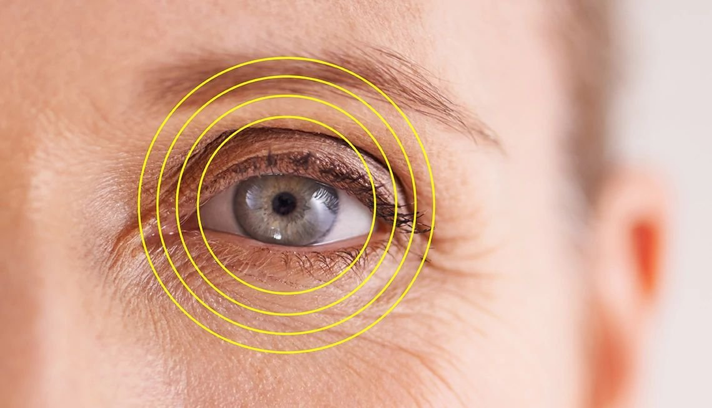
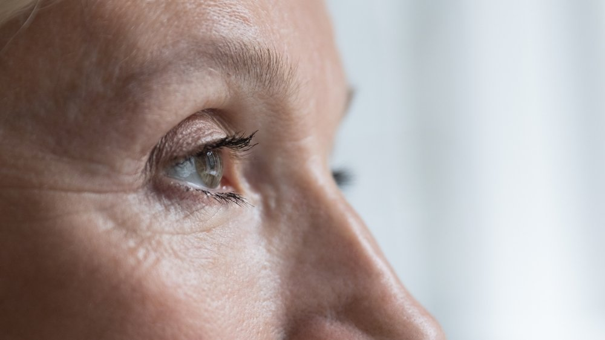
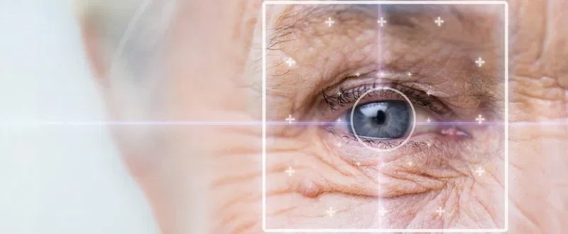
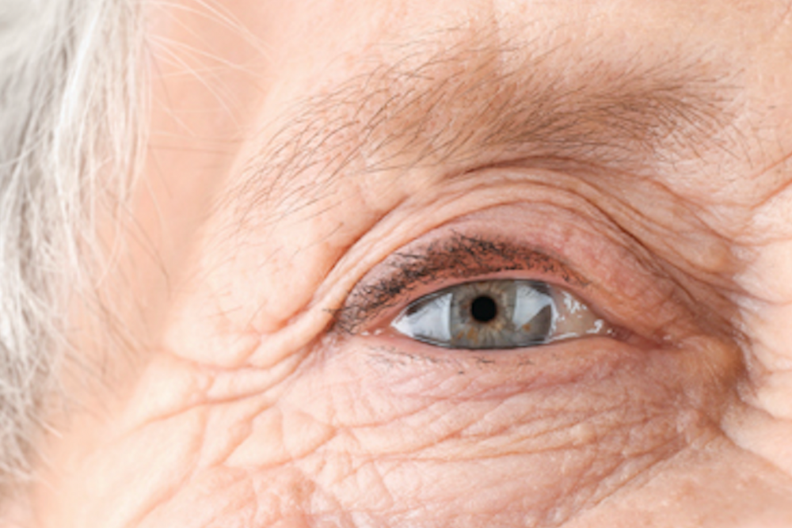

Astigmatism is one of the most common refractive errors, often causing blurred or distorted vision due to an irregular curvature of the cornea or lens. This condition, known as corneal astigmatism or lenticular astigmatism, can lead to chronic eye strain, headaches, and difficulty focusing, especially in low light

While prescription glasses, toric lenses, or soft contact lenses can help correct astigmatism, they don't always provide the sharpest or most natural vision. Fortunately, modern laser vision correction procedures offer a more permanent and precise solution.

## **Understanding How Astigmatism Occurs**

Astigmatism occurs when the corneal tissue or natural lens has an irregular shape, preventing light from focusing properly on the light-sensitive tissue at the back of the eye (the retina). As a result, vision may appear fuzzy, warped, or doubled, especially at certain distances.

A routine eye test can easily diagnose the condition, and depending on your specific case, your doctor may recommend laser eye surgery astigmatism treatment as a more effective and lasting solution compared to glasses or contact lenses.

## **How Laser Eye Surgery Fixes Astigmatis**

Advanced refractive surgery techniques, including LASIK, photorefractive keratectomy (PRK), and refractive lens exchange (RLE), have transformed how we treat astigmatism.

Among these, topography-guided LASIK and ray-tracing LASIK (sometimes referred to as [Wavelight](https://www.myalcon.com/international/professional/wavelight-plus/) Plus) are two of the most promising options for individuals with myopic astigmatism or complex refractive errors.

### **Ray-Tracing LASIK: Individualized Vision Correction**

This method uses highly detailed scans of the entire optical system, from the front of the corneal surface to the inner lens structures, to map visual distortions with extreme accuracy. By accounting for higher-order aberrations, ray-tracing LASIK offers a level of customization that glasses and standard contacts cannot match.

It adjusts for imperfections in the way your eye processes light, delivering smoother and more natural vision. Many patients report that their blurry vision is replaced with clarity they’ve never experienced before—even when wearing their prescription glasses.

### **Topography-Guided LASIK: Customized for Every Corneal Curv**

Topography-guided LASIK takes precision a step further by analyzing thousands of elevation points across the corneal surface. This makes it especially beneficial for those with uneven or irregular astigmatism.

By reshaping the cornea to a more regular curvature, this method improves the eye’s ability to focus light properly, reducing blurred vision and improving contrast sensitivity, especially in low-light conditions.

## **Is Laser Surgery Right for You?**

If you're struggling with vision problems related to astigmatism, you're not alone. Many people with corneal astigmatism or lenticular astigmatism find that laser surgery offers better long-term results than glasses or contacts. The suitability of laser-assisted procedures depends on factors such as your corneal thickness, overall eye health, and stability of your current glasses prescription.

In some cases, where laser correction isn’t suitable, such as with severe astigmatism or age-related lens changes, your ophthalmologist may recommend refractive lens exchange using an artificial lens. These toric lenses are specially designed to correct astigmatism from within the eye.

## **The Role of Excimer and Femtosecond Lasers**

Modern laser [surgery to fix astigmatism](https://www.focusvision.com.au/about-focus-vision) involves two key tools: the femtosecond laser and the excimer laser. The femtosecond laser is used to create a thin flap in the cornea with extreme precision. Then, the excimer laser reshapes the underlying corneal tissue based on your custom eye map.

This process is fast, virtually painless, and delivers lasting improvements for most patients within a short period of recovery.

## **See the World More Clearly**

Today’s laser eye surgery for astigmatism isn’t just about removing the need for glasses, it's about unlocking your full visual potential. With precise mapping, personalized treatment plans, and breakthrough technologies, it’s possible to achieve vision that's clearer and more stable than you ever thought possible.

Whether you're exploring laser eye surgery, lens exchange surgery, or other treatment options, our experienced team can help determine the most suitable treatment for your eyes.
